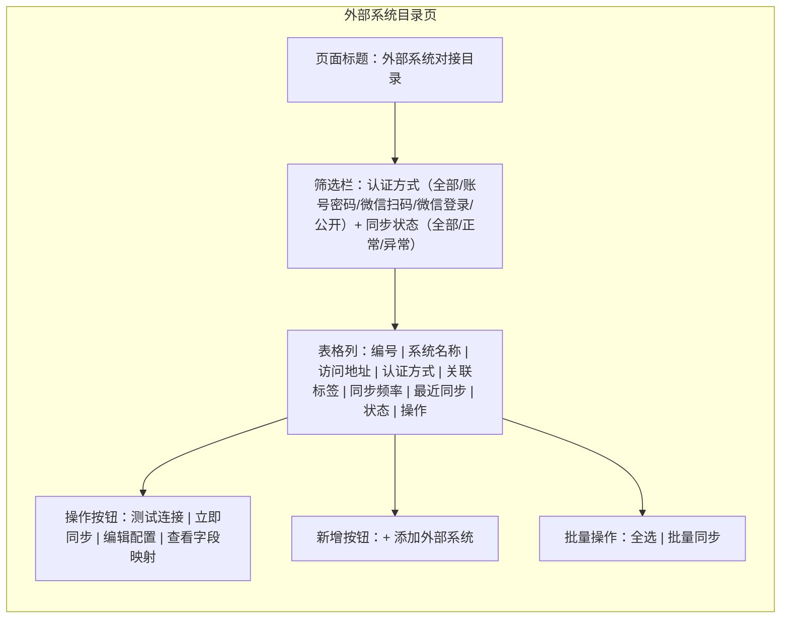
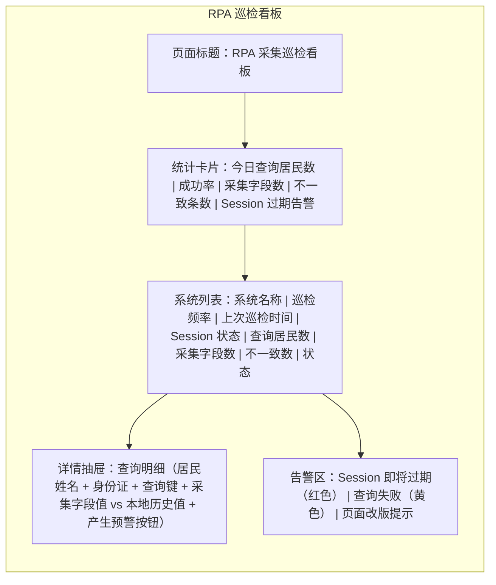
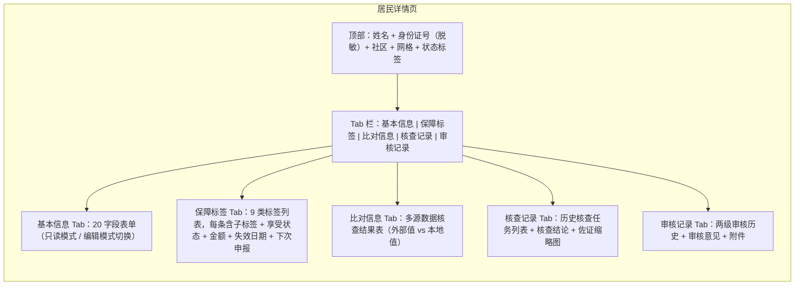
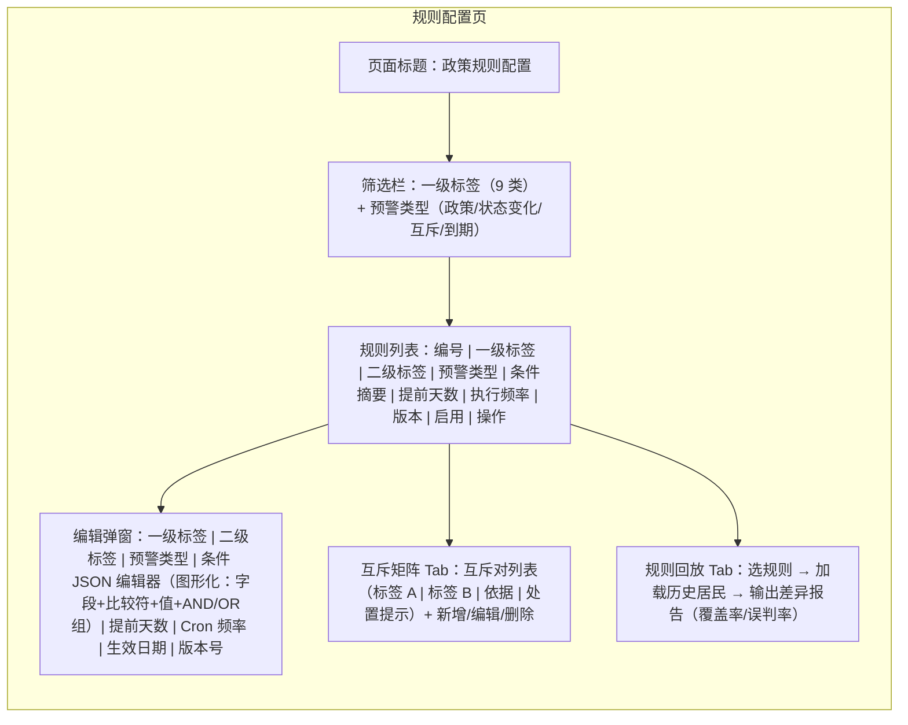
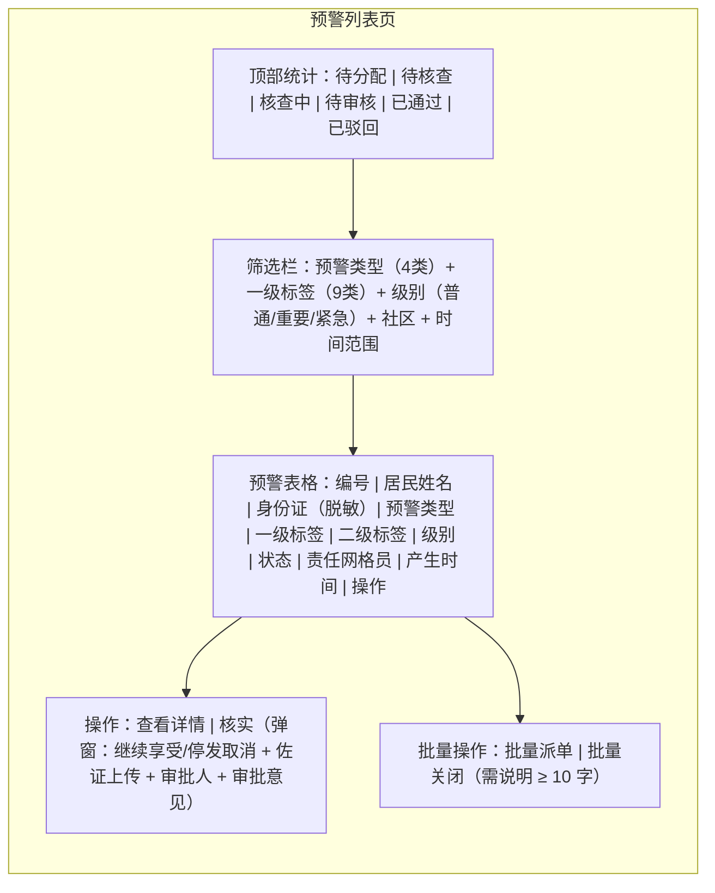
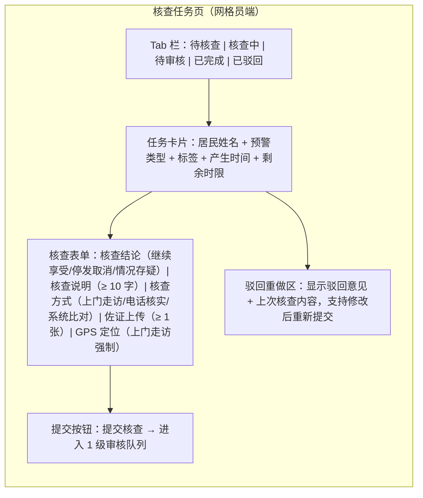
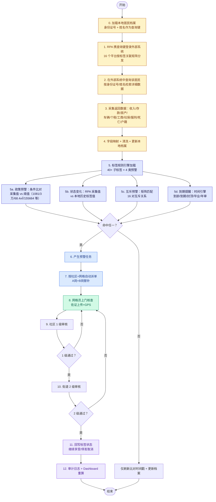
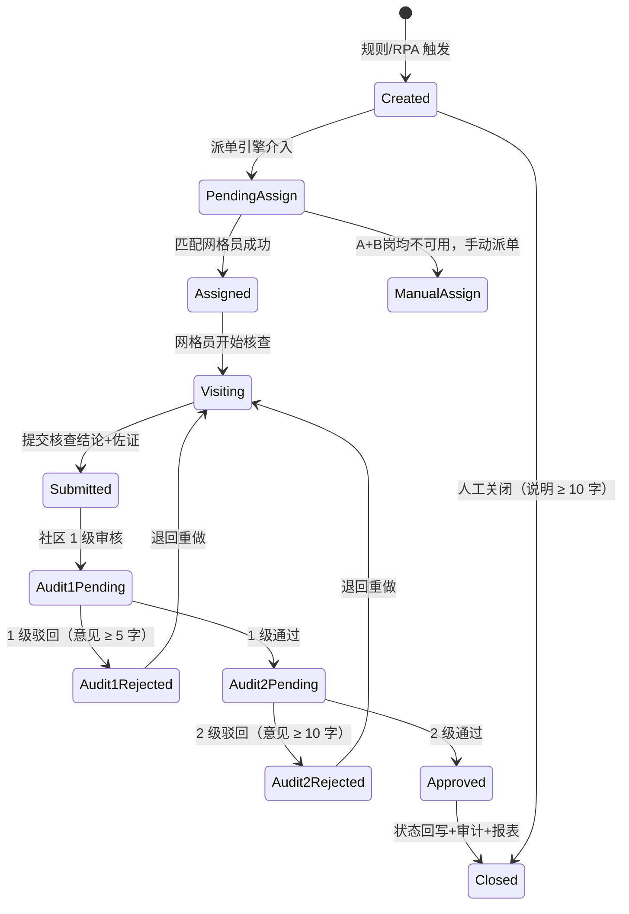
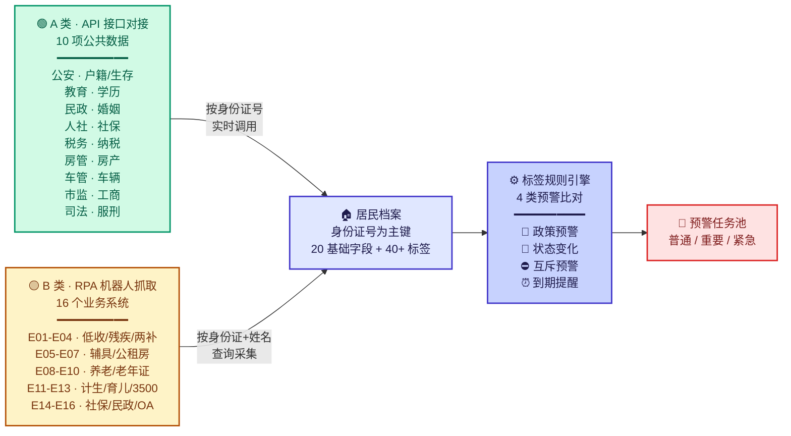
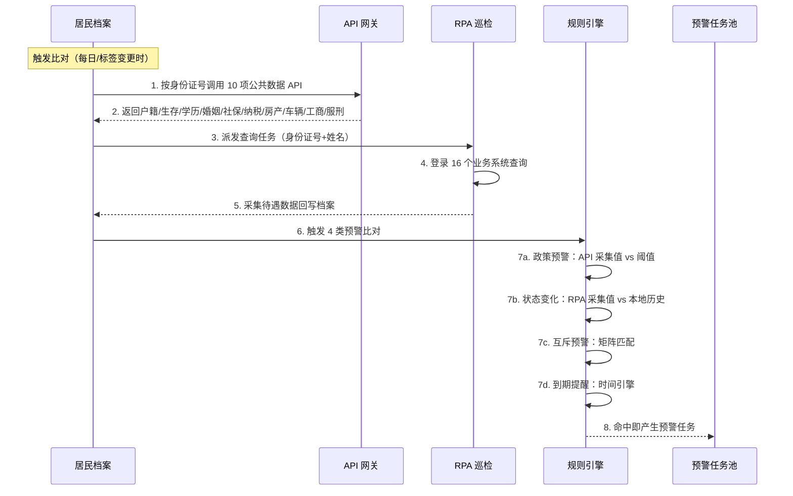

# 六角亭智慧街道民政业务一体化平台 PRD（优化版）

> 场景路由：Government project → Heavyweight  
> 必须模块：政策背景 / 建设目标 / 建设范围 / 组织分工 / 实施方案 / 验收标准 / 运维保障

| 文档版本 | v2.0（优化合并版） |
| --- | --- |
| 创建日期 | 2026-08-24 |
| 关联文档 | liujiaoting-civil-affairs-PRD-0811.md v1.0 / liujiaoting-data-source-PRD.md v1.0 |
| 依据 | 《平台规则、任务0811(1).xlsx》3 工作表 + 系统数据来源整理（2026-08-24） |

---

## 1 需求背景

六角亭街道民政办管理 5 社区（学堂、荣东、六角、由义、民意）、14 网格、2600+ 户籍人口，涉及 9 大类保障政策共 40+ 子标签。当前社工每月需人工翻查 16 个外部业务系统（湖北省低收入人口监测平台、残疾人信息系统、全国残联平台、武汉市住房保障系统、市/区养老系统、计生系统、湖北就业服务系统、全国民政政务信息系统等），登录方式涵盖账号密码、微信扫码、微信登录三种，漏报/错报率约 15%。`[Research-backed]`

政策规则细碎：每个子标签有 2–8 条政策预警 + 1–4 条状态变化预警 + 0–2 条互斥预警 + 0–2 条到期取消预警，合计 200+ 规则节点。互斥关系跨 9 大类标签（如特困与计生特扶死亡互斥、残疾居家与计生特扶居家与特殊困难老人与 365 四选一），共 16 对。不解决此问题，2026 年市民政局"社会救助精准认定试点"9 月 30 日基础能力验收无法通过。

`[Expert judgment]` 现有原型已具备 UI 骨架（Dashboard / ResidentList / WarningList / CheckTask / Import 等），可在此基础上补齐数据来源配置与预警规则引擎。

---

## 2 建设目标

| 维度 | 指标 | 当前基线 | 1.0 目标 |
| --- | --- | --- | --- |
| 对接覆盖 | 16 个外部系统接入完成率 | 0 | ≥ 95% |
| RPA 巡检 | 状态变化预警自动触发率 | 0 | ≥ 90% |
| 预警准确率 | 政策预警条件比对准确率 | — | ≥ 95% |
| 互斥拦截 | 互斥对命中拦截率 | — | 100% |
| 派单时效 | 预警产生到派单完成 | 人工 1-2 天 | ≤ 5 分钟 |
| 核查时效 | 核查到审核平均耗时 | 5 天 | ≤ 2.5 天 |
| 排期触发 | 年审/季度/月度提醒按时触发率 | — | ≥ 98% |
| 覆盖率 | 应享受居民建档覆盖率 | 约 92% | ≥ 98% |

---

## 3 用户与场景

### 3.1 角色 Persona

| 角色 | 所属 | 熟练度 | 使用频率 | 决策权 | 核心诉求 |
| --- | --- | --- | --- | --- | --- |
| 街道分管领导 | 街道办 | 中 | 每日 1 次 | 全街资源调配 | Dashboard 全街概览、审计合规 |
| 民政办主任 | 民政办 | 高 | 全日 | 审核把关、异常审批 | 2 级审核、跨系统冲突兜底 |
| 条线社工（10 人） | 民政办 | 高 | 全日 | 规则配置、录入申报 | 规则引擎配置、批量派单 |
| 社区书记（5 人） | 社区 | 中 | 每日 | 本社区核查分配 | 1 级审核、互斥处置 |
| 网格员（14 人） | 网格 | 低-中 | 移动+PC | 核查处置 | 接收派单、上门核查、上传佐证 |
| 系统管理员 | 信息中心 | 高 | 每日 | 平台配置 | 外部系统对接、RPA 脚本、密码管理 |

### 3.2 核心场景

| 场景 | 优先级 | 描述 |
| --- | --- | --- |
| 外部系统定时巡检 | P0 | RPA 每日/每周/每月登录 16 个外部系统，抓取居民状态，与本地标签比对 |
| 政策预警自动产生 | P0 | 收入/存款/车/房/个税/工商/服刑/死亡/户籍迁出等条件比对命中即产生预警 |
| 互斥拦截 | P0 | 16 对互斥关系在比对阶段命中即产生紧急预警 |
| 到期提醒 | P0 | 到龄/证件到期/封顶月数/毕业/年审等时间驱动型提醒 |
| 核查派单 | P0 | 按居民所属社区+网格自动分配网格员（A 岗 + B 岗替补） |
| 上门核查 | P0 | 网格员接收任务、上门走访、拍照佐证、提交核查结论 |
| 两级审核 | P0 | 社区 1 级 → 街道 2 级，驳回退回网格员重做 |
| 状态回写 | P0 | 审核通过后更新标签状态（继续享受/停发），写审计日志 |
| 排期核查 | P1 | 6 月大年审、12 月小年审、季度末月核实、3/6/9/12 月申报提醒 |

---

## 4 功能需求

> 本模块包含功能总览表 + 逐模块详细描述 + 页面级线框原型。

### 4.1 功能总览表

| # | 模块 | 功能描述 |
|---|------|---------|
| F1 | 外部系统目录 | 统一管理 16 个外部平台的 URL、认证方式（账号密码/微信扫码/微信登录/公开）、账号密码（AES-256 加密存储）、同步频率（每日/每周/每月）、字段映射规则。支持"测试连接"和"立即同步"按钮。页面脱敏显示密码为 `****`，仅系统管理员可查看明文（需二次身份验证）。 |
| F2 | RPA 巡检引擎 | 定时模拟登录外部系统 → **以本地居民身份证号 + 姓名作为查询键**，到 16 个外部系统查询该居民的详细数据（收入/存款/房产/车辆/个税/工商/社保/服刑/死亡/户籍等）→ 采集回数据更新本地档案 → 与本地标签历史值比对 → 不一致即触发状态变化预警。账号密码类系统全自动登录；微信扫码/登录类系统人工辅助获取 Session（约 2-4 小时有效），RPA 在 Session 有效期内自动巡检。模拟人类操作间隔（随机 3-10 秒）避免 IP 封禁。 |
| F3 | 居民档案 | 基本信息 20 字段（所属社区/小区/网格、姓名、身份证号、文化程度、户籍地址、居住地址、联系方式、人员类别、政治面貌、婚姻状态、刑事信息、涉毒、生存状态、去世时间、近亲属备案、最近更新时间等）+ 9 类 40+ 保障标签。身份证号为主键。字段完整率 < 90% 自动产生"档案补全"任务。 |
| F4 | 标签规则引擎 | 40+ 子标签可配置：展示字段、政策预警条件（收入/存款/车/房/个税/工商/服刑/死亡/户籍迁出）、状态变化比对源（外部系统 ID 数组，可一对多）、互斥对、到期规则（到龄/封顶月数/毕业/6 个月/14 周岁/18 周岁/16 周岁）、核查排期（6 月大审/12 月小审/季度/月度/3-6-9-12 月申报）。规则版本号 + 生效日期。 |
| F5 | 四类预警产生 | 政策预警（条件比对型，200+ 规则节点）；状态变化预警（RPA 比对型，16 个外部系统）；政策互斥预警（矩阵匹配型，16 对）；到期取消预警（时间引擎型，20+ 节点）。预警级别：普通/重要/紧急，紧急短信通知民政办主任。 |
| F6 | 智能派单 | 居民所属社区+网格 → 匹配网格员 A 岗（主岗）。A 岗当月在途 > 20 改派 B 岗。A+B 均不可用 → 派社区书记 + Dashboard 红条告警。民政办主任可手动覆盖派单。同一居民同一标签 30 天内不重复派单（2 级驳回重做除外）。 |
| F7 | 核查任务 | 网格员接收任务 → 上门走访/电话核实/系统比对 → 填写核查结论（继续享受/停发取消/情况存疑）+ 核查说明（≥ 10 字）+ 上传佐证（≥ 1 张图片或 PDF）。上门走访强制 GPS 定位，时间限工作日 08:00-20:00。 |
| F8 | 两级审核 | 社区 1 级：驳回意见 ≥ 5 字，时限 ≤ 1 工作日。街道 2 级：驳回意见 ≥ 10 字，支持上传审批附件，时限 ≤ 1.5 工作日。超时限 Dashboard 黄/红灯告警并通知上级。2 级"规则例外通过"需 ≥ 20 字说明 + 规则版本号。 |
| F9 | 状态回写 | 2 级审核通过 → 1 个事务内写标签状态（enjoyStatus / enjoyMonths / expireDate / nextDeclareDate / totalAmount）+ 审计日志。居民触发死亡 → 下一发放周期前自动停发所有标签 + 24h 内必须审核。 |
| F10 | 核查排期 | 按子标签配置排期：6 月大年审/12 月小年审（低保、特困）、临时任务（低边）、季度末月 1-10 日核实（高龄津贴）、每年 7 月审核（独生子女保健费）、3/9 月申报（4050 残疾）、3/6/9/12 月申报（4050 社保）、9 月申报（残疾学费补贴）、春节八一前核查（涉军）。排期到期自动产生核查任务并派单。 |
| F11 | Dashboard 统计 | 四口径：社区口径（5 社区）、网格口径（14 网格）、保障类别（7 项）、特殊人群（8 项）。合并柱状图支持图例点击筛选。核查完成率/发放台账/互斥命中/档案完整率看板。 |
| F12 | 报表导出 | 核查工作台账、政策发放台账、预警处置报表、档案质量报表、互斥命中台账、审计日志查询、区局报表（按市民政局标准模板）。xlsx/csv 格式，限导出 1 万行内。 |

### 4.2 逐模块详细描述

#### M1 外部系统目录

**页面线框原型**

**功能描述**

- **业务逻辑**：系统管理员配置外部系统 URL、认证方式、账号密码后，RPA 引擎按配置的同步频率自动登录并抓取数据。16 个系统分属民政部、省民政厅、市房管、区养老、卫健计生、人社、残联等不同条线。
- **交互逻辑**：点击"测试连接"→ 系统模拟登录并返回成功/失败状态；点击"立即同步"→ 触发一次 RPA 巡检，完成后刷新"最近同步"和"状态"列；点击"编辑配置"→ 弹窗修改 URL/账号/密码/频率/字段映射。
- **规则约束**：密码字段 AES-256 加密存储，页面显示 `****`，仅系统管理员可查看明文（需二次身份验证）。微信扫码/登录类系统（E03 全国残联、E04 两补）需人工辅助获取 Session，系统提前 30 分钟告警社工重新登录。
- **权限**：仅系统管理员可 C/U/D；民政办主任可 R + 立即同步；其他角色无访问。

#### M2 RPA 巡检引擎

**页面线框原型**

**功能描述**

- **业务逻辑**：RPA 按同步频率（每日 02:00 / 每周日 03:00 / 每月 1 日 03:00）自动登录外部系统，**以本地居民档案的身份证号 + 姓名作为查询键**，到 16 个外部系统中查询该居民的详细数据（收入、存款、房产、车辆、个税、工商、社保、服刑、死亡、户籍等），采集回来后更新本地档案，并与本地 POLICY_TAG 表历史值比对。不一致即产生状态变化预警，级别映射为"重要"。
- **交互逻辑**：点击不一致条目 → 抽屉展示"查询键 + 采集到的外部值 vs 本地历史值"对比 → 确认后点击"产生预警"按钮 → 自动创建预警任务并派单。
- **规则约束**：模拟人类操作间隔（随机 3-10 秒）；每系统每日巡检 ≤ 1 次；连续 3 天同步失败发送短信告警至系统管理员 + 民政办主任；RPA 脚本版本化管理，页面结构变更自动告警。
- **采集字段矩阵**：每个外部系统按标签关联矩阵决定采集哪些字段（如 E01 采集收入/存款/户籍状态/生存状态；E06 采集房产数量/面积；E02 采集残疾证类别/等级等）。
- **边界**：外部系统维护期间查询返回空 → 标记 syncStatus=empty，不产生误报；连续 2 次空 → 告警；查询不到该居民（身份证号未命中）→ 记录"未查到"日志，不触发预警。

#### M3 居民档案

**页面线框原型**

**功能描述**

- **业务逻辑**：居民档案以身份证号为主键，变更需走"居民合并"流程（民政办主任权限 + 说明 ≥ 20 字）。人员类别变化（人在户在→空挂、流动→入户）自动触发状态变化预警。生存状态从在世→去世时，所有标签在下一发放周期自动置为"已停发"。
- **规则约束**：字段完整率 = 20 个基础字段 + 8 个标签业务字段中已填数 ÷ 应填数。< 90% 的档案网格员须当月补齐（Dashboard 有补全任务列表）。

#### M4 标签规则引擎

**页面线框原型**

**功能描述**

- **业务逻辑**：所有阈值（收入 1081/2162、存款 30000/51888、面积 68.4㎡、车价 155664、认缴 15 万等）做成可配置字段，阈值变化不发版。规则版本号 + 生效日期管理。上线前规则回放测试要求误判率 ≤ 5%。
- **权限**：民政办主任可 R/U/C/X（发布前审核）；系统管理员可版本/回放/灰度。

#### M5 预警列表

**页面线框原型**

#### M6 核查任务

**页面线框原型**

**功能描述**

- **业务逻辑**：网格员打开任务 → 填写核查结论 + 说明 + 上传佐证 → 提交进入 1 级审核。驳回退回核查人重做，附驳回意见。1 级通过 → 2 级审核。2 级通过 → 写回标签状态 + 审计日志 + Dashboard 重算。
- **规则约束**：核查结论为"继续享受"时，标签状态保持不变但记录核查通过时间。核查结论为"停发取消"时，2 级审核通过后标签 enjoyStatus 改为"已停发"。上门走访类型 GPS 定位为必填。

### 4.3 核心业务流程图

> 关键说明：RPA 不是被动全量抓取外部系统所有数据，而是**以本地居民的身份证号 + 姓名作为查询键**，主动到 16 个外部系统中查询该居民的详细数据（收入、存款、房产、车辆、个税、工商、社保、服刑、死亡、户籍等），采集回来后更新本地档案并触发比对。

### 4.4 预警任务状态机

---

## 5 数据交互架构（DataExchangeArchitecture）

> 💡 关键区分：智汇亭平台的数据来源分两类。**A 类公共数据**（户籍、生存状态、学历、婚姻、社保、纳税、房产、车辆、工商、服刑）通过 **API 接口对接**政府各部门数据共享交换平台，按身份证号实时调用；**B 类待遇数据**（低保、特困、残疾两补、公租房、高龄津贴等 40+ 标签）通过 **RPA 机器人**到 16 个外部业务系统中按身份证号+姓名查询并采集。两类数据汇入居民档案后共同驱动规则引擎比对。

### 5.1 数据交互架构总览图

### 5.2 A 类：API 接口对接清单（10 项公共数据）

| 编号 | 数据项 | 对接部门 | 调用方式 | 查询键 | 用途 |
| --- | --- | --- | --- | --- | --- |
| A01 | 户籍 | 公安部门 | API 实时调用 | 身份证号 | 户籍迁出预警 |
| A02 | 生存状态 | 公安部门 | API 实时调用 | 身份证号 | 死亡停发预警 |
| A03 | 学历 | 教育部门 | API 实时调用 | 身份证号 | 助学金毕业取消 |
| A04 | 婚姻状态 | 民政部门 | API 实时调用 | 身份证号 | 独生子女保健费 |
| A05 | 社保信息 | 人社部门 | API 实时调用 | 身份证号 | 收入超标预警（>1081元/人） |
| A06 | 纳税信息 | 税务部门 | API 实时调用 | 身份证号 | 有个税预警 |
| A07 | 房产情况 | 房管部门 | API 实时调用 | 身份证号 | 房产数>2 / 面积>68.4㎡/人 |
| A08 | 车辆信息 | 车管部门 | API 实时调用 | 身份证号 | 有车 / 车价>155664元 |
| A09 | 工商注册 | 市场监管部门 | API 实时调用 | 身份证号 | 有工商预警 |
| A10 | 服刑状态 | 司法部门 | API 实时调用 | 身份证号 | 有服刑预警 |

> API 调用约束：统一走市/区数据共享交换平台；调用频次遵循各委办局限流（默认每居民每日 ≤ 1 次）；返回 JSON 标准结构，字段映射后写入居民档案。

### 5.3 B 类：RPA 机器人抓取清单（16 个业务系统）

| 分组 | 编号 | 系统名称 | 抓取内容 | 触发的状态变化预警 |
| --- | --- | --- | --- | --- |
| 低收/残疾 | E01 | 湖北省低收入人口监测平台 | 低保/特困/低边/临救/金秋助学待遇状态 | 待遇信息与本地不一致 |
| 低收/残疾 | E02 | 残疾人信息系统 | 残疾证类别/等级、两补、居家服务、学费补贴 | 待遇信息与本地不一致 |
| 低收/残疾 | E03 | 全国残联信息化服务平台 | 同 E02（交叉比对） | 待遇信息与本地不一致 |
| 低收/残疾 | E04 | 两补系统 | 精神服药/贫困智力/一户多残护理补贴 | 待遇信息与本地不一致 |
| 公租房 | E05 | 辅具系统 | 辅具适配记录 | 待遇信息与本地不一致 |
| 公租房 | E06 | 武汉市住房保障信息系统 | 实物配租/租赁补贴状态 | 待遇信息与本地不一致 |
| 公租房 | E07 | 公租房信息发布 | 公示名单 | 待遇信息与本地不一致 |
| 养老 | E08 | 市养老系统 | 高龄津贴、特殊困难老人补贴 | 待遇信息与本地不一致 |
| 养老 | E09 | 区养老系统 | 365 服务、特殊困难老人补贴 | 待遇信息与本地不一致 |
| 养老 | E10 | 老年证系统 | 老年证办理 | [TODO：关联标签待确认] |
| 计生 | E11 | 计生特扶家庭系统 | 计生特扶家庭待遇 | 待遇信息与本地不一致 |
| 计生 | E12 | 育儿补贴信息系统 | 育儿补贴 | 待遇信息与本地不一致 |
| 计生 | E13 | 3500 一次性奖励系统 | 3500 独生子女补贴 | 待遇信息与本地不一致 |
| 社保 | E14 | 湖北就业服务信息系统 | 4050 灵活就业补贴 | 待遇信息与本地不一致 |
| 民政 | E15 | 全国民政政务信息系统 | 孤儿生活补助/事无儿童/助学 | 待遇信息与本地不一致 |
| 民政 | E16 | OA 信息平台 | [TODO] | [TODO] |

> RPA 抓取约束：以本地居民身份证号 + 姓名作为查询键；模拟人类操作间隔（随机 3-10 秒）；每系统每日 ≤ 1 次；微信扫码/登录类系统在 Session 有效期内自动巡检。

### 5.4 两类数据协同比对流程

### 5.5 数据交互对照表

| 维度 | A 类 API 接口 | B 类 RPA 抓取 |
| --- | --- | --- |
| 数据性质 | 公共基础数据（10 项） | 业务待遇数据（40+ 标签） |
| 对接对象 | 政府部门数据共享交换平台 | 16 个外部业务系统 |
| 调用方式 | API 实时调用 | RPA 模拟登录+查询+采集 |
| 查询键 | 身份证号 | 身份证号 + 姓名 |
| 调用频率 | 每居民每日 ≤ 1 次 | 每系统每日 ≤ 1 次（按同步频率） |
| 主要用途 | 政策预警条件比对 | 状态变化预警比对 |
| 安全要求 | API Token + 白名单 IP | 账号密码 AES-256 加密 + Session 复用 |
| 异常处理 | 限流重试 + 降级标记 | 3 次重试 + Session 过期告警 |

---

## 6 外部系统对接目录（ExternalSystemCatalog）

> 本节落地 16 个外部业务系统的对接清单，是状态变化预警的数据来源基线。所有账号密码 AES-256 加密存储，页面脱敏显示 `****`，仅系统管理员可查看明文（需二次身份验证）。

### 6.1 外部系统全量清单

| 编号 | 系统名称 | 访问地址 | 认证方式 | 关联标签 | 同步频率 |
| --- | --- | --- | --- | --- | --- |
| E01 | 湖北省低收入人口监测平台 | `https://59.208.149.252:7080/hbdsr/login?redirect=/desk` | 账号密码 | 低保/特困/低边/金秋助学/临救/两补(困难)/残疾居家/精神服药/贫困智力/一户多残/公租房 | 每日 |
| E02 | 残疾人信息系统 | `https://whqk.cdpf-bt.cn` | 账号密码 | 4050(残疾)/两补/学费补贴/残疾居家/精神服药/贫困智力/一户多残/听力/就业援助/燃油/辅具 | 每日 |
| E03 | 全国残联信息化服务平台 | `https://portal.cdpf.org.cn/` | 微信登录 | 同 E02（与 E02 交叉比对） | 每周 |
| E04 | 两补系统 | `https://lxbt.mca.gov.cn/cjrlb/pages/login/login.jsp` | 微信扫码 | 精神服药/贫困智力/一户多残 | 每周 |
| E05 | 辅具系统 | `https://middle.365youzhu.com/admin/#/hblogin` | 账号密码 | 辅具适配 | 每月 |
| E06 | 武汉市住房保障信息管理系统 | `http://202.103.39.38/whbz/OuterLogin.aspx` | 账号密码 | 实物配租/租赁补贴 | 每日 |
| E07 | 武汉市公共租赁住房信息发布 | `http://202.103.39.38/Pub/EligiblePublicity.aspx` | 公开 | 实物配租/租赁补贴 | 每日 |
| E08 | 市养老系统 | `http://wh.whylfw.cn/#/home` | 账号密码 | 特殊困难老人/高龄津贴 | 每日 |
| E09 | 区养老系统 | `https://dream.xinmengjk.com/#/login` | 账号密码 | 特殊困难老人/365 服务 | 每日 |
| E10 | 老年证系统 | `http://58.48.74.206:7019/oldcard/indexAction.do` | 账号密码 | 老年证办理 | [TODO：关联标签待确认] |
| E11 | 计生特扶家庭系统 | `http://10.32.32.236:40014/family/subsystem/index?t=jzfz` | 账号密码 | 计生特扶家庭/育儿补贴 | 每周 |
| E12 | 育儿补贴信息管理系统 | `http://10.32.32.238:14352/subsidy.html#/login` | 账号密码 | 育儿补贴 | 每周 |
| E13 | 3500 一次性奖励系统 | `http://10.32.32.101:8080/once/frame/main` | 账号密码 | 3500 独生子女一次性补贴 | 每月 |
| E14 | 湖北就业服务信息系统 | `http://10.128.37.41:7003/hbhr/index/mainframe/frame.html` | 账号密码 | 4050 社保 | 每日 |
| E15 | 全国民政政务信息系统 | `https://mzzwxt.mca.gov.cn/idp/authcenter/ActionAuthChain?entityId=apphub&authnLcKey=23014429-24f3-40db-a35f-d41c1636d135` | 账号密码 | 孤儿生活补助/事无儿童/孤儿助学/事无儿童助学 | 每周 |
| E16 | OA 信息平台 | `https://oa.yarknet.com/table_fill` | 账号密码 | [TODO：关联标签待确认] | [TODO] |

### 6.2 RPA 巡检认证模式

| 认证模式 | 适用系统 | RPA 策略 | Session 有效期 |
| --- | --- | --- | --- |
| 账号密码（全自动） | E01/E02/E05/E06/E08/E09/E10/E11/E12/E13/E14/E15/E16 | RPA 自动填写账号密码 → 登录 → 按身份证号+姓名查询居民详细数据 → 采集回数据 | 长期有效 |
| 微信扫码（半自动） | E04 两补系统 | 人工扫码登录获取 Session → RPA 在 Session 有效期内按身份证号+姓名查询居民 → 采集回数据 | 约 2-4 小时 |
| 微信登录（半自动） | E03 全国残联平台 | 人工微信登录获取 Session → RPA 在 Session 有效期内按身份证号+姓名查询居民 → 采集回数据 | 约 2-4 小时 |
| 公开访问（全自动） | E07 公租房信息发布 | RPA 直接查询公开页面（按身份证号检索）→ 采集回数据 | 长期有效 |

### 6.3 Session 过期告警规则

- Session 剩余有效期 < 30 分钟 → 系统自动告警民政办社工重新登录
- 连续 3 天同步失败 → 短信通知系统管理员 + 民政办主任
- 外部系统页面改版自动检测 → 标记 `rpaScriptVer=needs_update` → 告警

---

## 7 标签规则引擎详解（9 类 40+ 子标签）

> 💡 方法论提示：每个子标签遵循"展示字段 → 政策预警 → 状态变化预警（含外部系统） → 政策互斥预警 → 到期取消预警 → 核查排期"六段式结构。所有阈值做成可配置字段，阈值变化不发版。

### 6.1 低保（5 个子标签）

#### 6.1.1 低保

| 维度 | 内容 |
| --- | --- |
| 展示信息字段 | 失效日期、月金额 |
| 政策预警 | 1.死亡 2.户籍迁出我街道 3.社保>1081元/人；存款>3万/人 4.有车 5.房产数>2；=2时面积>68.4㎡/人 6.有个税 7.有工商 8.有服刑 |
| 状态变化预警 | 与 E01 湖北省低收入人口监测平台信息不一致时触发 |
| 政策互斥 | —（与特困/低边三选一，就高保留） |
| 到期取消 | — |
| 核查排期 | 6 月大年审、12 月小年审 |

#### 6.1.2 特困

| 维度 | 内容 |
| --- | --- |
| 展示信息字段 | 失效日期、月金额 |
| 政策预警 | 1.死亡 2.户籍迁出 3.社保>1081元/人；存款>30000元/人 4.有车 5.房产数≥2 6.有个税 7.有工商 8.有服刑 |
| 状态变化预警 | 与 E01 信息不一致时触发 |
| 政策互斥 | **特困 ↔ 计生特扶（死亡）互斥** |
| 核查排期 | 6 月大年审、12 月小年审 |

#### 6.1.3 低边

| 维度 | 内容 |
| --- | --- |
| 展示信息字段 | 失效日期、年金额 |
| 政策预警 | 1.死亡 2.户籍迁出 3.社保>2162元/人；存款>51888元/人 4.车辆数>1；=1时车价>155664元、企业认缴出资额>15万 5.房产数>2；=2时面积>68.4㎡/人 6.有个税 7.有工商 8.有服刑 |
| 状态变化预警 | 与 E01 信息不一致时触发 |
| 核查排期 | 临时发布任务 |

#### 6.1.4 金秋助学

| 维度 | 内容 |
| --- | --- |
| 展示信息字段 | 就读学校、学历、就读时间、毕业时间、年金额 |
| 政策预警 | —（无条件比对型） |
| 状态变化预警 | 与 E01 信息不一致时触发 |
| 政策互斥 | **与残疾学费补贴、孤儿学费补贴互斥** |
| 到期取消 | 毕业到期提醒 |

#### 6.1.5 临救

| 维度 | 内容 |
| --- | --- |
| 展示信息字段 | 生效日期、失效日期、月金额 |
| 政策预警-支出型 | 1.死亡 2.户籍迁出 3.社保>1081元/人；存款>3万/人 4.有车 5.房产数>2；=2时面积>68.4㎡/人 6.有个税 7.有工商 8.有服刑 |
| 政策预警-过渡型 | 同支出型，但第 8 项为 **服刑：释放 2 年以上** |
| 状态变化预警 | 支出型 & 过渡型均与 E01 信息不一致时触发 |
| 到期取消 | **过渡型仅发放六个月**（从发放日期计算） |

### 6.2 残疾（12 个子标签）

#### 6.2.1 4050（残疾）

| 维度 | 内容 |
| --- | --- |
| 展示信息字段 | 初次享受时间、累计享受月数、养老保险补贴金额、医疗保险补贴金额（当次） |
| 政策预警 | 1.死亡 2.户籍迁出我街 3.有服刑 |
| 到期取消 | **60 个月封顶、退休** |
| 状态变化预警 | 与 E02 残疾人信息系统、E03 全国残联平台信息不一致时触发 |
| 核查排期 | **3 月、9 月提醒申报** |
| 资格条件 | 男 55 周岁，女 45 周岁；申报时缴费年限已满 10 年；只缴医保不能享受 |

#### 6.2.2 残疾两补

| 维度 | 内容 |
| --- | --- |
| 展示信息字段 | 重度护理补贴或困难生活补贴、月金额、失效 |
| 政策预警 | 1.死亡 2.户籍迁出 3.有服刑 |
| 政策互斥 | **与特困互斥** |
| 状态变化预警-重度护理 | 与 E02、E03 信息不一致时触发 |
| 状态变化预警-困难生活 | 与 E01 信息不一致时触发 |
| 资格条件 | 重度护理：残疾 1-2 级；困难生活：享受低保的残疾人 |

#### 6.2.3 残疾学费补贴

| 维度 | 内容 |
| --- | --- |
| 展示信息字段 | 特困残疾人家庭或残疾学生（小标题）、就读学校、学历、就读时间、毕业时间、年金额 |
| 政策预警 | 1.死亡 2.户籍迁出 3.特困残疾人家庭低保取消 4.有服刑 5.社保显示有就业 |
| 到期取消 | 毕业 |
| 政策互斥 | **与低保助学金（金秋助学）互斥** |
| 状态变化预警 | 与 E02、E03 信息不一致时触发 |
| 核查排期 | **9 月提醒申报** |

#### 6.2.4 残疾居家服务

| 维度 | 内容 |
| --- | --- |
| 展示信息字段 | 残疾类别、等级、低保享受情况 |
| 政策预警 | 1.死亡 2.户籍迁出 3.社保>1081元/人；存款>3万/人 4.有车 5.房产数>2；=2时面积>68.4㎡/人 6.有个税 7.有工商 8.有服刑 |
| 政策互斥 | **与计生特扶和特殊困难老人服务补贴、365 服务互斥** |
| 状态变化预警 | 与 E02、E03、E01 信息不一致时触发 |
| 适用人群备注 | 非低保、未持有重度肢体/智力/视力/多重残疾证；非硚口户籍、未满 65 周岁、不属于重度视力持证残疾人的群体 |

#### 6.2.5 精神服药补贴

| 维度 | 内容 |
| --- | --- |
| 展示信息字段 | 失效日期、月金额 |
| 政策预警（备注：低保停止，精神残疾） | 1.死亡 2.户籍迁出 3.社保>1081元/人；存款>3万/人 4.有车 5.房产数>2；=2时面积>68.4㎡/人 6.有个税 7.有工商 8.有服刑 |
| 政策互斥 | **与两补、一户多残互斥** |
| 状态变化预警 | 与 E04 两补系统、E02、E03、E01 信息不一致时触发 |

#### 6.2.6 贫困智力补贴

| 维度 | 内容 |
| --- | --- |
| 展示信息字段 | 失效日期、月金额 |
| 政策预警（备注：低保、智力残疾） | 1.死亡 2.户籍迁出 3.社保>1081元/人；存款>3万/人 4.有车 5.房产数>2；=2时面积>68.4㎡/人 6.有个税 7.有工商 8.有服刑 |
| 政策互斥 | **与重度护理补贴、一户多残低保家庭居家护理补贴互斥** |
| 状态变化预警 | 与 E04、E02、E03、E01 信息不一致时触发 |

#### 6.2.7 一户多残护理补贴

| 维度 | 内容 |
| --- | --- |
| 展示信息字段 | 失效日期、月金额 |
| 政策预警 | 1.死亡 2.户籍迁出 3.单一户籍中家庭成员持证数量<2 提醒 |
| 政策互斥 | **与各类居家服务（含困难老人居家养老护理服务）互斥** |
| 状态变化预警 | 与 E04、E02、E03、E01 信息不一致时触发 |
| 资格条件 | 武汉户籍 + 单一户籍≥2 人持证 + 低保 + 未接受政府购买居家/托养/居家护理补贴 |

#### 6.2.8 听力补贴

| 维度 | 内容 |
| --- | --- |
| 展示信息字段 | 失效日期、年金额 |
| 政策预警 | 1.死亡 2.户籍迁出 3.年龄未满 16 周岁 |
| 状态变化预警 | 与 E02、E03 信息不一致时触发 |
| 资格条件 | 年满 16 周岁 + 持听力/言语残疾证 1-4 级 + 本市户籍 |

#### 6.2.9 就业援助岗

| 维度 | 内容 |
| --- | --- |
| 展示信息字段 | 失效日期、月金额 |
| 政策预警 | 1.死亡 2.户籍迁出 3.社保参保变动 4.领取失业金 5.有个税 6.有工商 7.有服刑 |
| 状态变化预警 | 与 E02、E03 信息不一致时触发 |
| 资格条件 | 硚口户籍 + 持证 + 有就业意愿的失业残疾人/符合条件亲属 |

#### 6.2.10 燃油补贴

| 维度 | 内容 |
| --- | --- |
| 展示信息字段 | 失效日期、年金额 |
| 政策预警 | 1.死亡 2.户籍迁出 |
| 状态变化预警 | 与 E02、E03 信息不一致时触发 |

#### 6.2.11 辅具适配

| 维度 | 内容 |
| --- | --- |
| 展示信息字段 | 享受年度、辅具类型、辅具名称（含使用年限） |
| 政策预警 | 1.死亡 2.户籍迁出 |
| 到期取消 | **年度申请限制：1 年内达到 2 次及以上提醒** |
| 政策互斥 | **与民政局/退役军人事务局惠残辅具项目互斥；与工伤保险赔偿的残疾人（含伤残军人、伤残人民警察、未满 1 周岁残疾儿童等）互斥** |
| 状态变化预警 | 与 E02、E03、E05 辅具系统信息不一致时触发 |

#### 6.2.12 残疾儿童家庭生活补助

| 维度 | 内容 |
| --- | --- |
| 展示信息字段 | 失效日期、康复训练机构名称 |
| 政策预警 | 1.死亡 2.户籍迁出 |
| 到期取消 | **年满 16 岁** |
| 资格条件 | 在定点康复训练机构训练 + 0-15 岁 + 硚口区户籍/本街道残疾儿童家庭 |

### 6.3 公租房（2 个子标签）

#### 6.3.1 实物配租（低保、低边、三档）

| 维度 | 内容 |
| --- | --- |
| 展示信息字段 | 失效日期、配租地址 |
| 政策预警 | 1.死亡 2.户籍迁出 3.社保>1081元/人；存款>3万/人 4.有车 5.**人均住房面积>16㎡** 6.有个税 7.有工商 8.有服刑 |
| 状态变化预警 | 与 E06 武汉市住房保障系统、E07 公租房信息发布、E01 信息不一致时触发 |

#### 6.3.2 租赁补贴

| 维度 | 内容 |
| --- | --- |
| 展示信息字段 | 失效日期、月金额 |
| 政策预警 | 同 6.3.1 |
| 状态变化预警 | 与 E06、E07、E01 信息不一致时触发 |
| 补贴档位 | ①人均收入≤1070 → 25元/㎡·月；②1070<人均收入≤2140 → 20元/㎡·月；③2140<人均收入≤3000（单人户 3500）→ 10元/㎡·月 |

### 6.4 老年（3 个子标签）

#### 6.4.1 特殊困难老人服务补贴

| 维度 | 内容 |
| --- | --- |
| 展示信息字段 | 失效日期、月金额 |
| 政策预警 | 1.死亡 2.户籍迁出 |
| 政策互斥 | **与计生特扶居家服务、残疾居家服务、365 服务互斥** |
| 状态变化预警 | 与 E08 市养老系统、E09 区养老系统信息不一致时触发 |
| 资格条件 | 本市户籍 60+ 岁，符合下列任一：①低保失能 ②低保 80+ ③优抚/特扶/劳模/见义勇为失能 ④中心城区个人收入<上年度人均退休金且重度失能 ⑤全市 90+ |

#### 6.4.2 365 服务

| 维度 | 内容 |
| --- | --- |
| 展示信息字段 | —（白名单：雷用香、张美焕，仅 2 人，不新增） |
| 政策预警 | 1.死亡 2.户籍迁出 |
| 政策互斥 | **与计生特扶和残疾居家上门和特殊困难老人居家服务不重享** |
| 状态变化预警 | 与 E09 区养老系统信息不一致时触发 |

#### 6.4.3 高龄津贴

| 维度 | 内容 |
| --- | --- |
| 展示信息字段 | 年龄、月金额 |
| 政策预警 | 1.死亡 2.户籍迁出 |
| 状态变化预警 | 与 E08 市养老系统信息不一致时触发 |
| 核查排期 | **每季度末月 1-10 日内核实** |
| 发放标准 | 80-89 岁：100元/月；90-99 岁：200元/月；100+ 岁：500元/月 + 生日探望 500 元（随生日当季度津贴同步发放） |

### 6.5 计生（5 个子标签）

#### 6.5.1 计生特扶家庭

| 维度 | 内容 |
| --- | --- |
| 展示信息字段（8 项子补贴） | 1.2026 春节/端午/中秋慰问 2.独生子女一次性奖励（第二个 3500） 3.特扶金补发 4.一次性 2000 元抚慰金 5.失独对象生日卡 6.失独对象医疗爱心包 7.本年扶助对象特扶金 8.独生子女死亡一次性抚慰金 |
| 政策预警 | 1.死亡 2.户籍迁出 3.年龄未满 49 岁 4.子女残疾证 3 级以下（含独生子女死亡信息提醒；子女残疾等级、类别） |
| 政策互斥 | **特困与计生特扶（死亡）互斥** |
| 资格条件 | 1933.1.1 后出生；女方年满 49 岁；只生/收养 1 个；现无存活子女或独生子女残疾≥三级 |

#### 6.5.2 独生子女保健费

| 维度 | 内容 |
| --- | --- |
| 展示信息字段 | 失效日期、年金额 |
| 政策预警 | 1.死亡 2.户籍迁出 3.婚姻 |
| 到期取消 | **14 周岁到期取消** |
| 核查排期 | **每年 7 月审核** |

#### 6.5.3 育儿补贴

| 维度 | 内容 |
| --- | --- |
| 展示信息字段 | 失效日期、领取次数、年金额 |
| 政策预警 | 1.死亡 2.户籍迁出已领取补贴提示 3.享受子女总数>3 提示 4.非婚生子 |
| 到期取消 | **仅 3 岁内可申报（按年度）** |
| 状态变化预警 | 与 E12 育儿补贴系统、E11 计生特扶家庭系统比对；居民上传出生证与计生系统是否一致 |

#### 6.5.4 3500（独生子女一次性补贴）

| 维度 | 内容 |
| --- | --- |
| 展示信息字段 | 申报时间 |
| 政策预警 | 1.死亡 2.户籍迁出 |
| 政策匹配 | 退休人员或年满 60 周岁以上城镇无业居民提醒；再婚家庭双方带入小孩均<18 岁双方都不符合，有一方小孩≥18 岁可办理 |
| 状态变化预警 | 与 E13 3500 一次性奖励系统信息不一致时触发 |

#### 6.5.5 计生特扶居家养老服务

| 维度 | 内容 |
| --- | --- |
| 展示信息字段 | 户籍、分段显示享受时长和金额 |
| 政策预警 | 1.死亡 2.户籍迁出 |
| 到期取消 | **仅年满 65 周岁可申报** |
| 政策互斥 | **与特殊困难老人居家服务、365 服务、残疾居家上门服务互斥** |
| 档位 | 65-69 岁：12h/人·月 → 3600 元/年；70-79 岁：24h/人·月 → 7200 元/年；80+ 岁：30h/人·月 → 9000 元/年 |

### 6.6 社保（1 个子标签）

#### 6.6.1 4050（灵活就业补贴）

| 维度 | 内容 |
| --- | --- |
| 展示信息字段 | 初次享受时间、累计享受月数、养老保险补贴金额、医疗保险补贴金额（当季度） |
| 政策预警 | 1.死亡 2.户籍迁出 3.就业企业注销 4.申报人担任企业法人/监事/财务管理人/股东 5.退休（社保系统） 6.有服刑 |
| 到期取消 | **36 个月封顶**（女 40、男 50 岁申报时）；**60 个月封顶**（女 45、男 55 申报时） |
| 状态变化预警 | 与 E14 湖北就业服务信息系统信息不一致时触发 |
| 核查排期 | **3 月、6 月、9 月、12 月申报提醒** |

### 6.7 涉军（5 个子标签，固定人员只出不进）

| 二级标签 | 展示信息字段 | 政策预警 | 核查排期 |
| --- | --- | --- | --- |
| 重点优抚对象补助 | 区局发放待遇 | 1.死亡 2.户籍迁出 3.有服刑 | 重点优抚对象年审 |
| 两参人员 | 春节八一待遇金额 | 同上 | 春节、八一前核查 |
| 53 年前老战士 | 春节八一待遇金额 | 同上 | 春节、八一前核查 |
| 三属 | 春节八一待遇金额 | 同上（死亡、户籍） | 春节、八一前核查 |
| 企业军转干部 | 节日慰问金、体检、医疗救助 | 同上 | 每季度核查；4 月、11 月提醒申报医疗救助 |

> 提醒节点汇总：重点优抚（每月）、企业军转干部（2/5/8/11 月月底）、两参/53 年老战士/三属（春节/八一前）。

### 6.8 支农返汉（1 个子标签）

| 维度 | 内容 |
| --- | --- |
| 展示信息字段 | 月金额 |
| 政策预警 | 1.死亡 2.户籍迁出 |
| 状态变化预警 | [TODO：D08 待补充外部系统] |

### 6.9 困境儿童（4 个子标签）

#### 6.9.1 孤儿生活补助

| 维度 | 内容 |
| --- | --- |
| 展示信息字段 | 父母情况（生存）、孤儿证、学历、月金额 |
| 政策预警 | 1.死亡 2.户籍迁出 3.学历（毕业取消） |
| 到期取消 | **仅年满 18 岁可申报** |
| 状态变化预警 | 与 E15 全国民政政务信息系统信息不一致时触发 |
| 发放标准 | 2025 年标准：2140 元/人·月（武民政[2025]14 号） |

#### 6.9.2 事无儿童生活补助

| 维度 | 内容 |
| --- | --- |
| 展示信息字段 | 父母情况（生存、刑事）、残疾、事无儿童认定证明标签、学历、月金额 |
| 政策预警 | 1.死亡 2.户籍迁出 |
| 到期取消 | **仅年满 18 岁可申报** |
| 状态变化预警 | 与 E15 信息不一致时触发 |

#### 6.9.3 孤儿助学

| 维度 | 内容 |
| --- | --- |
| 展示信息字段 | 就读情况、学历、年金额 |
| 政策预警 | 1.死亡 2.户籍迁出 3.年满 18 周岁提醒、毕业时间提醒 |
| 状态变化预警 | 与 E15 信息不一致时触发 |
| 发放标准 | 年满 18 周岁后在全日制本科/专科/高等职业/中等职业学校就读：每人每学年 1 万元助学金 |

#### 6.9.4 事无儿童助学

| 维度 | 内容 |
| --- | --- |
| 展示信息字段 | 就读情况、学历、年金额 |
| 政策预警 | 1.死亡 2.户籍迁出 3.年满 18 周岁提醒、毕业时间提醒 |
| 状态变化预警 | 与 E15 信息不一致时触发 |
| 发放标准 | 第一年省民政厅一次性 1 万元；后续学年市民政局参照孤儿标准每人每年 1 万元直到毕业 |
| 政策互斥 | **与残疾助学金不重享** |

---

## 8 政策互斥矩阵（EXCLUSION_MATRIX）

> 所有互斥对在比对阶段命中即生成"政策互斥预警"，级别为 **紧急**，短信通知民政办主任。

| 编号 | 标签 A | 标签 B | 互斥依据 |
| --- | --- | --- | --- |
| X01 | 特困 | 计生特扶（死亡） | 0811 规则表 |
| X02 | 残疾两补 | 特困 | 0811 规则表 |
| X03 | 残疾学费补贴 | 低保助学金（金秋助学） | 0811 规则表 E12 |
| X04 | 金秋助学 | 残疾学费补贴、孤儿学费补贴 | 用户提供 |
| X05 | 残疾居家服务 | 计生特扶居家养老服务 | 0811 规则表 E13/P9 |
| X06 | 残疾居家服务 | 特殊困难老人服务补贴 | 0811 规则表 E13/L9 |
| X07 | 残疾居家服务 | 365 服务 | 0811 规则表 E13 |
| X08 | 精神服药补贴 | 残疾两补、一户多残护理补贴 | 0811 规则表 E14 |
| X09 | 贫困智力补贴 | 重度护理补贴、一户多残护理补贴 | 0811 规则表 E15 |
| X10 | 一户多残护理补贴 | 各类居家服务（含困难老人居家养老护理服务） | 0811 规则表 E16 |
| X11 | 辅具适配 | 民政局/退役军人事务局惠残辅具项目 | 用户提供 M2.11 |
| X12 | 辅具适配 | 工伤保险赔偿的残疾人（伤残军人/伤残人民警察/未满 1 周岁残疾儿童） | 用户提供 M2.11 |
| X13 | 计生特扶居家养老服务 | 特殊困难老人居家服务、365 服务、残疾居家上门服务 | 0811 规则表 P9/P15 |
| X14 | 365 服务 | 计生特扶和残疾居家上门和特殊困难老人居家服务 | 用户提供 M4.2 |
| X15 | 事无儿童助学 | 残疾助学金 | 0811 规则表 困境儿童 |
| X16 | 低保 | 特困、低边（同类三选一，就高保留） | 行业惯例 |

**互斥处置流程**：命中即产生紧急预警 → 派单网格员 → 核查确认 → 民政办判定保留哪一项（默认就高保留）→ 2 级审核通过后回写停发另一项标签 + 审计日志。

---

## 9 核查任务排期汇总

| 排期类型 | 关联标签 | 触发时间 | 说明 |
| --- | --- | --- | --- |
| 6 月大年审 | 低保、特困 | 每年 6 月 | 全量核查 |
| 12 月小年审 | 低保、特困 | 每年 12 月 | 增量核查 |
| 临时任务 | 低边 | 临时发布 | 不固定周期 |
| 季度核查 | 高龄津贴 | 每季度末月 1-10 日 | 核实生存状态 |
| 年审 | 重点优抚对象 | 每年 | 资格复核 |
| 节日前核查 | 两参/53 年老战士/三属 | 春节、八一前 | 生存+户籍 |
| 季度核查 | 企业军转干部 | 每季度 | 生存+户籍 |
| 4 月/11 月申报 | 企业军转干部 | 4 月、11 月 | 医疗救助申报提醒 |
| 3 月/9 月申报 | 4050（残疾） | 3 月、9 月 | 集中申报 |
| 3 月/6 月/9 月/12 月申报 | 4050（社保） | 3 月、6 月、9 月、12 月 | 季度申报 |
| 9 月申报 | 残疾学费补贴 | 9 月 | 申报提醒 |
| 7 月审核 | 独生子女保健费 | 每年 7 月 | 资格审核 |

---

## 10 异常情况处理方案

| 异常类别 | 场景 | 处理策略 | 责任人 |
| --- | --- | --- | --- |
| RPA 登录失败 | 账号密码失效 / 验证码变更 / 页面结构变更 | 3 次重试 → 告警至系统管理员 + 民政办主任；Session 过期类提示人工重新扫码 | 系统管理员 |
| RPA 查询为空 | 外部系统维护 / 查询接口返回空 | 跳过本次巡检，标记 syncStatus=empty，不产生误报；连续 2 次空 → 告警 | 系统管理员 |
| RPA 查询未命中 | 身份证号 + 姓名在外部系统中未查到该居民 | 记录"未查到"日志，不触发预警；连续 3 次未命中 → 提示民政办核对居民身份 | 系统管理员 |
| 微信扫码 Session 过期 | E04 两补系统 / E03 全国残联平台 Session 超时 | 系统提前 30 分钟告警民政办社工 → 人工重新登录 → RPA 继续 | 民政办社工 |
| 外部系统页面改版 | RPA 脚本选择器失效 | 自动检测页面变化 → 标记 rpaScriptVer=needs_update → 告警 | 系统管理员 |
| 密码泄露 | 外部系统账号密码被非授权人员获取 | AES-256 加密存储 + 页面脱敏 + 导出审批 + 定期更换 | 系统管理员 |
| 互斥漏判 | 上级审计发现重复享受 | 72h 内补收方案 + EXCLUSION_MATRIX 补全 + 历史数据回放 100% | 民政办主任 + 产品组 |
| RPA 被封 IP | 查询频率过高 | 模拟人类操作间隔（随机 3-10 秒）；控制每日查询 ≤ 1 次/系统 | 系统管理员 |
| 规则误判 | 居民实际符合条件但系统预警 | 社区 1 级驳回 → 街道 2 级"规则例外通过"（≥ 20 字说明 + 规则版本号） | 民政办主任 |

---

## 11 合规审计与数据安全

### 11.1 审计日志要求

| 审计事件 | 记录字段 | 保留期 | 查询权限 |
| --- | --- | --- | --- |
| 外部系统账号查看明文 | operatorId、systemId、IP、时间、二次身份验证结果 | 5 年 | 街道分管领导 + 系统管理员 |
| 规则版本发布 | ruleId、version、生效日期、发布人、回放结果 | 5 年 | 民政办主任 + 系统管理员 |
| 互斥命中处置 | pairId、residentId、保留项、停发项、审核人 | 5 年 | 街道分管领导 + 民政办主任 |
| 标签状态回写 | tagId、字段变更前后值、operatorId、warnId | 5 年 | 街道分管领导 + 民政办主任 |
| 2 级"规则例外通过" | ruleId、version、说明文本、审核人 | 5 年 | 街道分管领导 |
| 居民合并 | 原 idCard、新 idCard、operatorId、说明 | 5 年 | 街道分管领导 + 民政办主任 |
| 导出报表 | exportType、行数、operatorId、IP | 3 年 | 街道分管领导 |

### 11.2 数据安全规范

- **加密存储**：外部系统账号密码 AES-256 加密；居民身份证号字段级加密。
- **脱敏展示**：身份证号默认显示前 6 位 + 后 4 位（如 `420104********1234`）；外部系统密码显示 `****`。
- **导出管控**：导出外部系统目录需街道分管领导审批；居民明细导出限 1 万行/次且记录审计日志。
- **访问控制**：所有外部系统账号查看明文需二次身份验证（短信验证码 + 操作日志）。
- **密码更换周期**：建议每季度更换一次外部系统账号密码（待决事项 D06）。
- **数据回放**：规则版本上线前必须历史数据回放，互斥矩阵回放命中率 100%，政策预警回放误判率 ≤ 5%。

### 11.3 合规对接

- 2026 年市民政局"社会救助精准认定试点"9 月 30 日基础能力验收
- 区局审计接口：每月 5 日前推送核查工作台账 + 发放台账 + 互斥命中台账
- 隐私合规：遵循《个人信息保护法》最小必要原则，外部系统数据仅用于民政业务比对，不得二次使用

---

## 12 验收标准

### 12.1 功能验收

| 验收项 | 验收标准 | 验收方式 |
| --- | --- | --- |
| 外部系统对接 | 16 个系统全部接入完成率 ≥ 95% | 逐一测试连接 + 抓取验证 |
| RPA 巡检 | 状态变化预警自动触发率 ≥ 90% | 抽样 100 条不一致数据观察触发 |
| 政策预警准确率 | 条件比对准确率 ≥ 95% | 历史数据回放误判率 ≤ 5% |
| 互斥拦截 | 16 对互斥对命中率 100% | 全量历史数据回放 |
| 派单时效 | 预警产生到派单完成 ≤ 5 分钟 | 抽样 50 条预警计时 |
| 核查时效 | 核查到审核平均 ≤ 2.5 天 | 上线 30 天统计 |
| 排期触发 | 年审/季度/月度提醒按时触发率 ≥ 98% | 排期任务完成率统计 |
| 覆盖率 | 应享受居民建档覆盖率 ≥ 98% | 抽样比对街道户籍人口 |

### 12.2 非功能验收

| 验收项 | 验收标准 |
| --- | --- |
| 性能 | Dashboard 加载 ≤ 3 秒；预警列表查询 ≤ 2 秒（10 万条数据） |
| 并发 | 14 网格员同时在线核查不卡顿 |
| 可用性 | 系统可用率 ≥ 99.5%（除计划维护外） |
| 安全 | 渗透测试通过；账号密码加密存储通过审查 |
| 兼容 | Chrome/Edge 最新 2 个版本；网格员 H5 在主流安卓机型可用 |
| 数据 | 居民档案 20 基础字段 + 8 标签字段完整率 ≥ 90% |

### 12.3 上线前必过测试

1. **外部系统全量联调**：16 个系统逐一验证 RPA 登录 + 抓取 + 比对
2. **密码安全审查**：所有账号密码加密入库；页面脱敏验证
3. **规则回放测试**：低保/特困/低边 3 条线 2025 全年数据回放，误判率 ≤ 5%
4. **互斥矩阵回放**：16 对互斥全量历史数据匹配，命中率 100%
5. **培训**：分 3 场（民政办 RPA + 规则配置 / 社区审核 / 网格员核查）

---

## 13 项目风险

| 编号 | 风险 | 影响 | 概率 | 缓解 |
| --- | --- | --- | --- | --- |
| R01 | 16 个外部系统认证方式异构（账号密码/微信扫码/微信登录），RPA 自动登录受限 | 高 | 高 | 微信扫码/登录类系统采用"人工辅助登录 + Session 复用"模式，RPA 在 Session 有效期内自动巡检 |
| R02 | 外部系统页面结构变更导致 RPA 抓取失败 | 中 | 中 | RPA 脚本版本化管理；页面变更自动告警 + 人工修复 24h 内出补丁 |
| R03 | 外部系统账号密码泄露风险 | 高 | 低 | 密码加密存储（AES-256）；页面脱敏显示；导出需审批；定期更换 |
| R04 | 互斥矩阵漏配导致重复享受 | 高 | 中 | 逐条录入用户提供的 16 对互斥；上线前历史数据回放 100% 通过 |
| R05 | RPA 巡检频率过高导致外部系统封 IP | 中 | 中 | 控制巡检频率（每日/每周/每月）；模拟人类操作间隔（随机 3-10 秒） |
| R06 | 9 月 30 日试点验收时间紧 | 高 | 高 | P1 优先交付低保+残疾+公租房；外部系统对接 ≥ 8 个即可过基础能力验收 |
| R07 | 微信扫码/登录类系统 Session 有效期不确定 | 中 | 高 | D04 待决：精确测量 Session 有效期；预留人工值守通道 |
| R08 | 规则误判导致合规风险 | 高 | 中 | 2 级"规则例外通过"机制兜底；月度规则回顾 |

---

## 14 数据埋点

| 埋点 ID | 事件 | 关键属性 | 归属看板 |
| --- | --- | --- | --- |
| EV-EXT-01 | 外部系统同步完成 | systemId, 总数, 成功数, 失败数, 耗时 | 采集运营 |
| EV-RPA-01 | RPA 巡检完成 | systemId, 巡检居民数, 不一致数, Session 状态 | RPA 运营 |
| EV-RPA-02 | RPA 登录失败 | systemId, 失败原因, 重试次数 | RPA 运营 |
| EV-TAG-01 | 标签预警产生 | category, subTag, warningType, level, residentId | 预警 Dashboard |
| EV-EXC-01 | 互斥命中 | pairId, tagA, tagB, residentId, 处置状态 | 互斥台账 |
| EV-CHK-01 | 核查提交 | checkId, 类型, 佐证数, 耗时(min) | 核查运营 |
| EV-AUD-01 | 审核通过/驳回 | auditLevel, decision, 耗时(h) | 审核时效 |
| EV-SCH-01 | 排期任务触发 | scheduleType, 关联标签, 触发日期, 完成率 | 核查排期 |

---

## 15 角色和权限

| 模块 | 街道分管领导 | 民政办主任/社工 | 社区书记 | 网格员 | 系统管理员 |
| --- | --- | --- | --- | --- | --- |
| 外部系统目录 | R | R/U/C/X | — | — | 全权限 |
| RPA 巡检 | R | R | — | — | 全权限 + 脚本管理 |
| 标签 & 规则 | R | R/U/C-X | R | — | 规则版本/回放 |
| 四类预警 | R | R/U-X | R-Cmty | R/X-Grid | 级别配置 |
| 核查-审核 | R | R-X(2级) | R-X(1级) | R/U-C(提交) | 流程参数 |
| 互斥矩阵 | R | R/U/C | — | — | 全权限 |
| 核查排期 | R | R/U | R | R | 全权限 |
| 报表 & 审计 | R+全导出 | R-U导出 | R(本社区) | R(个人) | 审计日志+权限 |

> R=读 / U=改 / C=创建 / X=删除 / -Cmty=本社区范围 / -Grid=本网格范围 / -X(2级)=2 级审核权 / -X(1级)=1 级审核权

**数据脱敏规则**：外部系统账号密码 AES-256 加密存储，页面显示为 `****`，仅系统管理员可查看明文（需二次身份验证）。导出外部系统目录需街道分管领导审批。

---

## 16 运营计划

### 16.1 上线前（2 周）

1. 外部系统全量联调：16 个系统逐一验证 RPA 登录 + 抓取 + 比对
2. 密码安全审查：所有账号密码加密入库；页面脱敏验证
3. 规则回放测试：低保/特困/低边 3 条线 2025 全年数据回放，误判率 ≤ 5%
4. 互斥矩阵回放：16 对互斥全量历史数据匹配，命中率 100%
5. 培训：分 3 场（民政办 RPA + 规则配置 / 社区审核 / 网格员核查）

### 16.2 上线首 30 天

1. 每日站会聚焦 RPA 巡检成功率、预警准确率、核查积压
2. 质量红黑榜：核查完成率 Top3 社区 / 网格员
3. RPA 脚本紧急通道：页面变更 24h 内出补丁

### 16.3 稳定期

1. 月度规则回顾：产品 + 民政办 10 条线社工复盘
2. 季度 RPA 脚本巡检：检查 16 个外部系统页面是否改版
3. 半年数据回放 + 审计对接

### 16.4 分期交付

| 阶段 | 范围 | 里程碑 |
| --- | --- | --- |
| P1（6 周） | 低保 5 子标签 + 残疾 12 子标签 + 公租房 2 子标签；外部系统对接 ≥ 8 个 | 2026-10-15 |
| P2（5 周） | 老年 3 子标签 + 计生 5 子标签 + 社保 1 子标签 + 涉军 5 子标签 + 困境儿童 4 子标签 + 支农返汉 | 2026-11-20 |
| P3（3 周） | RPA 全量上线、互斥矩阵全量、核查排期全量、报表导出 | 2026-12-15 |

---

## 17 待决事项

| 编号 | 事项 | 影响 | 责任人 | 目标日期 |
| --- | --- | --- | --- | --- |
| D01 | E10 老年证系统关联标签待确认 | L | 民政办 | 2026-09-15 |
| D02 | E16 OA 信息平台关联标签待确认 | L | 民政办 | 2026-09-15 |
| D03 | 重症标签规则细节缺失（仅有"重症数据"一行） | M | 民政办 | 2026-08-31 |
| D04 | 微信扫码/登录类系统（E03/E04）Session 有效期精确测量 | H | 系统管理员 | 2026-09-10 |
| D05 | RPA 脚本版本化管理与灰度发布机制 | M | 产品组 | 2026-09-20 |
| D06 | 外部系统密码定期更换周期（建议每季度） | M | 系统管理员 | 2026-09-30 |
| D07 | 互斥矩阵 X15 事无儿童助学 vs 残疾助学金 — 残疾助学金标签尚未定义 | H | 产品组 + 民政办 | 2026-08-31 |
| D08 | 支农返汉标签缺少状态变化预警外部系统 | L | 民政办 | 2026-09-15 |

---

## 附：自检与待完善清单

### 自检通过项

- [x] 9 类一级标签全覆盖（低保/残疾/公租房/老年/计生/社保/涉军/支农返汉/困境儿童）
- [x] 40+ 二级标签逐条描述展示字段、政策预警、状态变化预警、互斥、到期、排期
- [x] 16 个外部系统 URL + 认证方式 + 关联标签全部列出
- [x] 4 种 RPA 认证模式（账号密码/微信扫码/微信登录/公开）说明
- [x] 16 对互斥矩阵完整列出
- [x] 核查排期汇总表覆盖所有有时间节点的标签
- [x] 4 大 Mermaid 图（架构/ER/流程/状态机）+ 6 个页面线框原型
- [x] 异常处理 8 类含责任人
- [x] 权限矩阵 5 角色 × 8 模块
- [x] 合规审计与数据安全专章
- [x] 验收标准（功能 + 非功能 + 上线前必过测试）
- [x] 项目风险 8 项含缓解措施
- [x] 待决事项 8 条含目标日期
- [x] 所有收入/存款/面积/车价阈值与用户原文一致

### 待完善清单

- [ ] **D01**：老年证系统关联标签
- [ ] **D02**：OA 信息平台关联标签
- [ ] **D03**：重症标签规则细节
- [ ] **D04**：微信扫码/登录 Session 有效期
- [ ] **D05**：RPA 脚本版本化
- [ ] **D06**：密码定期更换周期
- [ ] **D07**：残疾助学金标签定义（互斥 X15 依赖）
- [ ] **D08**：支农返汉状态变化预警外部系统

### 与 v1.0 / 数据来源 PRD 的差异

| 优化点 | v1.0 / 数据来源 PRD | 优化版 v2.0 |
| --- | --- | --- |
| 结构 | 两份独立文档，章节编号不统一 | 合并为单文档，1-16 章统一编号 |
| 页面原型 | 仅文字描述功能 | 6 个核心页面 Mermaid 线框原型 |
| 状态机 | 简略 7 状态 | 完整 11 状态 + 人工关闭路径 |
| 合规审计 | 仅提及审计日志 | 专章 7 类审计事件 + 数据安全规范 + 合规对接 |
| 验收标准 | 仅 6 项指标 | 功能 8 项 + 非功能 6 项 + 上线前必过测试 5 项 |
| 风险 | 5 项 | 8 项（新增试点时间紧、Session 不确定、规则误判） |
| 派单规则 | 仅 A 岗 + B 岗 | A 岗当月在途 > 20 改派 B 岗 + 30 天去重 + 民政办主任手动覆盖 |
| 核查约束 | 无 GPS / 时段限制 | 上门走访强制 GPS + 工作日 08:00-20:00 时段限制 |
| 审核约束 | 意见字数无要求 | 1 级驳回 ≥ 5 字、2 级驳回 ≥ 10 字、规则例外 ≥ 20 字 |
| 死亡处置 | 仅提到停发 | 下一发放周期前自动停发所有标签 + 24h 内必须审核 |
