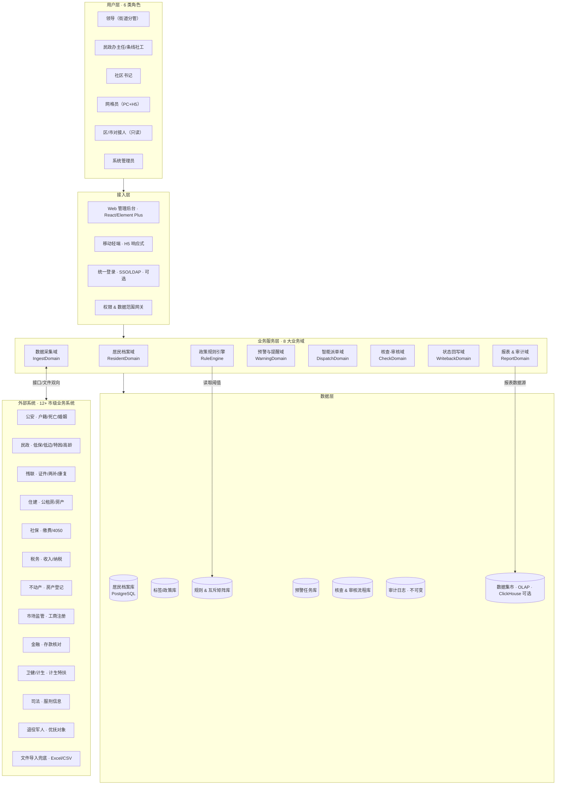
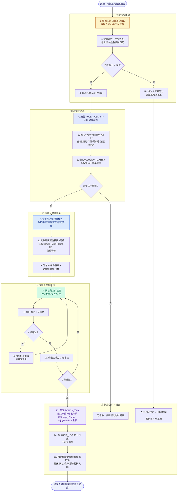
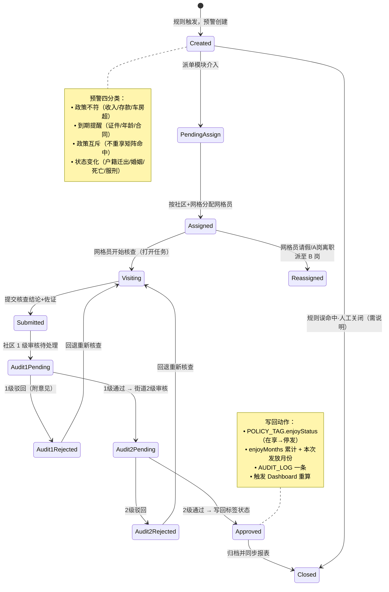
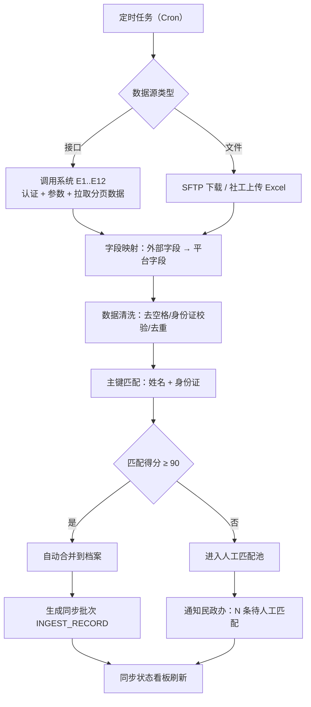

# 六角亭智慧街道民政业务一体化平台 PRD

| PRD 审核人 | [TODO：街道分管民政副主任姓名] |
| --- | --- |
| 重要性 | 高 |
| 紧迫性 | 高 |
| 需求方 | 六角亭街道办事处 · 民政办公室 |
| PRD 编写人 | 产品组（基于 0811 政策规则 & Excel 规则表整理） |
| PRD 提交日期 | 2026-08-24 |
| 依赖原型 | `d:\原型` 现有原型（居民信息管理/核查管理/统计分析/政策匹配/走访任务） |

## PRD 修改记录

| 变更时间 | 变更内容 | 变更提出部门与理由 | 修改人 | 审核人 | 版本号 |
| --- | --- | --- | --- | --- | --- |
| 2026-08-24 | 初始版本：整合《平台规则、任务0811(1).xlsx》3 个工作表（对应市里数据及现有平台、规则及所需标签、标签），覆盖 10 个政策业务板块 + 数据采集 + 预警 + 核查 + 审核 + 更新 全流程 | 民政办：政策规则整理 0811 | 产品组 | [TODO] | v1.0 |

---

## 1、项目背景

### 1.1 行业背景与政策要求
社会救助政策精准发放是街道民政办的核心职责，《湖北省社会救助条例》《武汉市最低生活保障审核确认办法》等文件明确要求：**按标施保、应救尽救、动态管理、精准认定**。当前六角亭街道覆盖 5 个社区（学堂、荣东、六角、由义、民意）、14 个网格、2600+ 户籍人口，涉及低保、低边、特困、残疾两补、公租房、高龄津贴、计生特扶、4050、涉军优抚、困境儿童等 **10 大类 40+ 子项政策**。

### 1.2 业务痛点（现状）
1. **数据分散，人工比对耗时易漏**：居民基础数据分散在公安（户籍/死亡）、民政（低保/低边/特困）、残联（两补/康复）、住建（公租房）、税务（收入/纳税）、不动产（房产）、社保（缴费）、工商（企业登记）、金融（存款）、卫健（计生）、司法（服刑）、退役军人事务（优抚）等 **12+ 市级业务系统**，目前依赖社区每月"翻台账+报 Excel"，漏报、错报率约 15%。
2. **政策规则复杂，依赖人工经验**：低保/低边/特困三者仅收入阈值、存款阈值、房/车/公司准入条件不同，叠加户籍、服刑、家庭人均面积等复合条件，新社工至少需 6 个月才能独立判断；**政策互斥（如低保与特扶重复、公租房与住房补贴冲突）**无法提前拦截，被市级审计"回头看"后整改成本高。
3. **到龄/到期事项靠"记"**：80/90/100 岁高龄津贴、残疾证到期、4050 每年 3/9 月申报、涉军春节/八一提醒等 **20+ 提醒点**，目前依赖人工台账，每月漏办 3–5 件居民投诉风险。
4. **核查-审核流程线下流转**：网格员手写核查单 → 社区主任批 → 街道民政办批 → 回写入系统，流程走完全部 5 天起，上级民政核查时效要求不超过 3 天。
5. **重复享受/跨系统冲突识别难**：居家服务与计生特扶居家养老、365 服务、困难老人居家护理 4 项补贴不能重享；低保家庭精神/智力补贴与一户多残不能重享；市级审计抽查曾因 1 人领 2 项同类补贴被通报。

### 1.3 立项契机（Why Now）
- 武汉市民政局 2026 年"社会救助精准认定试点"要求：街道级必须建立 **"多源数据全量比对 + 预警闭环"** 的数字化能力（2026-09-30 前完成基础能力）。
- 现有原型（见 `d:\原型`）已具备居民信息管理、核查、预警、仪表盘、走访登记、政策匹配 AI、网格员配置等 UI 骨架，可在现有架构上快速补齐政策规则引擎和数据对接。

> 💡 方法论提示：本项目使用 **"痛点 - 现况 - 契机"** 三段式背景描述框架，后续立项书可直接摘取本章节。

---

## 2、需求基本情况

### 2.1 利益相关方矩阵

| 角色 | 所属部门 | 核心诉求 | 决策/使用频率 |
| --- | --- | --- | --- |
| 街道分管领导 | 街道办 | 核查完成率、预警及时率、覆盖率、审计无差错、发放金额总览（Dashboard） | 决策层 / 每日看一次 |
| 民政办主任 | 街道民政办 | 审核把关、异常审批、上报区局、跨系统冲突兜底 | 管理层 / 全日办公 |
| 民政业务条线社工 | 街道民政办（10 条线） | 配置政策规则、查询档案、录入申报材料、批量派单 | 执行层 / 全日办公 |
| 社区书记 | 5 个社区 | 本社区核查任务分配、复核本社区上报 | 管理层 / 每日 |
| 网格员 | 14 个网格 | 接收辖区自动派单、上门核查、上传佐证、提交核查意见 | 执行层 / 移动+PC |
| 居民 | 户籍/居住居民 | [TODO：若后续接入便民端需补充；本期不做居民端] | — |
| 区/市民政局对接人 | 区局 | 报表导出、异常抽查、跨街道协同 | 查看层 / 每月 |

### 2.2 核心需求（基于 0811 Excel 规则表 3 张工作表梳理）
R1：**外部数据对接** — 实现 12+ 市级业务系统的接口对接（或文件导入），与平台居民档案字段完成映射、清洗、冲突处理。

R2：**居民档案多标签体系** — 建立 10 类 40+ 子项的标签体系，每条标签含：业务字段、享受状态、初次享受时间、累计享受月数、金额、到期/失效日期、申报时间等；支持"不重享"互斥标记。

R3：**政策规则引擎** — 将低保/残疾/公租房/老年/计生/社保/重症/涉军/支农/困境儿童等 **40+ 子项** 的资格条件（收入、存款、户籍、房、车、企业、服刑、婚姻、年龄、残疾等级、家庭人均面积等）数字化为可配置规则，按频率自动比对。

R4：**预警任务自动生成 + 智能派单** — 触发政策不符/到期提醒/政策互斥/状态变化 **4 类 20 项**预警，按居民所属社区+网格自动分配对应网格员。

R5：**核查 - 审核闭环** — 网格员上门核查→佐证上传→社区复核→街道审核（通过/驳回）→回写居民享受状态（继续享受/停发取消），全流程留痕。

R6：**到期提醒** — 对 20+ 时间类事项（年龄到龄、证件到期、集中申报时间、涉军节日节点等）按阈值提醒；推送站内消息。

R7：**互斥识别** — 对政策互斥表中定义的不兼容组合在比对阶段即拦截生成任务。

R8：**统计分析与报表** — Dashboard 多维度（社区口径/网格口径/保障类别/特殊人群）、导出、审计台账。

> 💡 方法论提示：需求用 R 编号 + 可验证陈述，便于后续逐条落测。

---

## 3、商业分析（企业自研视角）

### 3.1 投入规模预估

| 模块 | 人·月估算 | 备注 |
| --- | --- | --- |
| 数据采集与接口对接（12 个外部系统） | 3.0 | 每系统平均 0.25 人·月，含接口联调/字段映射/异常告警 |
| 规则引擎与政策配置化 | 2.5 | 低保/残疾/老年/计生等条线规则可复用模板 |
| 预警与智能派单（4 类 20 项 + 自动分配） | 1.5 | 复用现有 WarningList / CheckTask / GridWorker 骨架 |
| 核查 - 审核流程强化（两级审核/驳回） | 1.0 | 已有 CheckTask 基础，补齐字段与互斥 |
| 居民档案字段与标签体系改造 | 1.0 | 按 0811 Excel「基本信息 + 保障信息」字段表补齐 |
| 到期提醒模块 | 0.8 | 约 20 个提醒节点 |
| 数据权限、审计日志、导出报表 | 1.2 | 区分 6 类角色 |
| 联调 / 测试 / 上线培训 | 1.5 | 5 社区 × 14 网格 × 2 天/社区 |
| **合计** | **约 12.5 人·月** | 建议按 3 人 4.5 个月组织迭代 |

### 3.2 成本节约 & 可量化收益
- **人工比对成本**：目前 5 社工 × 每月 5 天翻台账 = 每年 300 人·天 → 数字化后降至 **≤ 10 人·天/月**（年节约 **240 人·天**，按 800 元/人·天折算 **19.2 万元/年**）。
- **错发/漏发追回**：估计 2025 年全年错发 **约 8 万元**，系统拦截后可降至 1 万以内 → 年节约 **7 万元**。
- **核查时效**：5 天 → 2.5 天，满足区局 ≤ 3 天考核。
- **上级审计零通报**：避免 1 次通报 ≈ 街道考核扣分 + 整改费 3–5 万元。

> 💡 方法论提示：B端自研系统商业分析以「投入人月 + 成本节约 + 合规价值」为主，不写 ROI/回收周期等商业化指标。

---

## 4、项目收益目标（可量化 KPIs）

| 维度 | 指标 | 当前基线 | 1.0 目标 | 2.0 目标 |
| --- | --- | --- | --- | --- |
| 覆盖率 | 应享受居民建档覆盖率 | 约 92% | 98% | ≥99.5% |
| 准确率 | 政策资格自动判定准确率 | —（人工） | ≥90% | ≥95% |
| 准确率 | 政策互斥识别率 | — | 100%（规则内） | 100% |
| 时效 | 预警产生 → 派单 ≤ ？min | 人工 1-2 天 | ≤ 5 min（T+0） | ≤ 5 min |
| 时效 | 核查 - 审核平均耗时 | 5 天 | ≤ 2.5 天 | ≤ 2 天 |
| 时效 | 到期提醒提前天数 | 无提醒 | ≥15 天 | ≥30 天 |
| 合规 | 上级审计因重复/错发通报次数 | 1 次/半年 | 0 次 | 0 次 |
| 运营 | 月度核查完成率 | 约 80% | ≥92% | ≥97% |
| 运营 | 居民档案字段完整率（基础 20 项） | 约 78% | ≥95% | ≥99% |

---

## 5、项目方案概述

### 5.1 整体架构一句话
在现有六角亭智慧街道原型的基础上，**新增政策规则引擎 + 12 外部系统数据接入层 + 到期提醒子模块 + 互斥规则拦截**，打通「数据采集 → 规则比对 → 预警产生 → 自动派单 → 核查 → 审核 → 状态回写 → 报表」的全闭环。

### 5.2 方案关键设计
1. **规则配置前置**：所有 40+ 政策项资格阈值（收入/存款/车/房/人均面积等）做成 WarningConfig 页面可配置字段，阈值变化不发版。
2. **标签字段标准统一**：居民档案按 0811 Excel「基本信息 20 字段 + 10 类保障信息」扩充字段；每条标签带业务属性（初次享受时间、累计享受月数、金额、失效日期、下次申报时间等）。
3. **时间引擎**：所有"到龄/到期/申报期"类提醒统一由时间引擎计算并触发，不写死在代码。
4. **互斥不重享矩阵**：集中管理互斥对（如居家服务 vs 计生特扶居家养老、精神服药补贴 vs 一户多残、低保助学金 vs 学费补贴），命中互斥立即生成政策互斥预警并在前端标红。
5. **智能派单策略**：居民所属网格 → 匹配网格员（主岗 + B 岗）+ 当月负载均衡（当前版本保留主岗 + B 岗替补）。
6. **两级审核**：社区（一级）→ 街道（二级），驳回回到核查人重做。
7. **审计级留痕**：所有字段变更、状态流转、佐证材料、审核意见永久留痕，可按居民 / 标签 / 时间维度追溯。

### 5.3 与现有原型的衔接
- 复用：Dashboard、ResidentList、ResidentDetail、WarningList、WarningConfig、CheckTask、GridWorkerList、Import（采集）、AiMatch（政策匹配）、VisitTask（走访）、HistoryResidentList
- 新增/补齐：规则引擎逻辑、标签字段、互斥识别、到期提醒推送、两级审核驳回链路

---

## 6、项目范围

### 6.1 In Scope（本期做）

| 域 | 范围 |
| --- | --- |
| 数据对接 | 12+ 市级业务系统接口对接 + 离线文件导入双模式（接口优先，文件兜底） |
| 居民档案 | 基本信息 20 字段按标准补齐；10 类保障信息标签体系与业务字段 |
| 政策规则 | 低保 / 低边 / 特困；残疾（10 子项）；公租房（2 子项）；老年（5 子项）；计生（5 子项）；社保 4050；重症；涉军（6 子项）；支农返汉；困境儿童 — 合计 **≥ 40 子项** |
| 预警 | 4 类（政策不符 / 到期提醒 / 政策互斥 / 状态变化）20 项 |
| 派单 | 按社区 + 网格自动派单给网格员；B 岗替补；社区超负载告警 |
| 核查 | 网格员 + 社区 + 街道两级审核；支持驳回重做；佐证拍照 / 文件 |
| 状态回写 | 审核通过自动打标签 / 停发；保留变更轨迹 |
| 到期提醒 | 20+ 提醒节点；站内消息 + Dashboard 消息角标 |
| 互斥识别 | 不重享矩阵自动比对 + 预警 |
| 报表 & 导出 | Dashboard 四口径；核查台账；发放台账；审计日志；区局报表 |
| 权限 | 6 类角色（见第 12 章）；数据范围按社区/网格隔离 |

### 6.2 Out of Scope（本期不做，记录以备后续）
- 居民自助端（微信小程序自主申报）
- 电子签名、电子证照 OCR
- 区/市级统一数据报送平台接入（仅保留数据导出接口）
- 移动端原生 App（继续用 H5 响应式 + 小程序轻量版方案）
- AI 政策匹配语音交互（现有 AiMatch 保留文字版）

### 6.3 分期计划（建议）

| 阶段 | 范围 | 里程碑 |
| --- | --- | --- |
| P1（MVP，6 周） | 数据接入（至少 5 个核心系统：公安/民政/残联/不动产/工商）、低保/低边/特困规则、核查-审核闭环、Dashboard | 2026-10-15 前通过区局基础能力验收 |
| P2（补充，5 周） | 残疾/老年/计生/社保/涉军/公租房/困境儿童等剩余规则、互斥矩阵、到期提醒全量 20+ | 2026-11-20 全政策上线 |
| P3（运营优化，3 周） | 报表导出、审计、B 岗派单、移动端体验优化、网格员绩效管理 | 2026-12-15 平台稳定运行 |

---

## 7、项目风险

| 编号 | 风险 | 影响 | 概率 | 缓解措施 |
| --- | --- | --- | --- | --- |
| R01 | 市级 12+ 业务系统接口开放时间不确定 / 权限审批流程长 | 高（P1 交付延期） | 高 | 双路径：接口优先 + 文件导入兜底；每系统提前提交数据标准与接入申请，指派民政办专人跟进 |
| R02 | 政策规则（收入阈值、存款阈值、面积阈值、车房标准）随政策文件变化 | 中（频繁改规则引发错判） | 高 | 所有阈值走 WarningConfig 可配置 + 版本号 + 生效日期，不改代码；每次政策变更留历史快照 |
| R03 | 居民档案字段缺失率高（户籍地址 / 存款 / 联系方式） | 高（比对准确率低） | 中 | Dashboard 字段完整率看板 + 给网格员下发"建档补全任务"；每季度补全率考核 |
| R04 | 互斥矩阵漏配，导致重复享受被审计通报 | 高（合规事故） | 中 | 逐条录入 Excel 0811 所有不重享条目；上线前走"历史数据回放"全部比对，通过率 100% 方上线 |
| R05 | 网格员抵触系统，核查不及时 / 伪上传 | 中（核查完成率 <90%） | 高 | 上线培训 + 社区督导；网格员月度工作指标（Dashboard 已见）；二级审核抽检 |
| R06 | 居民身份证号 / 姓名 多系统间不一致，匹配不上 | 中（数据错匹配） | 高 | 以姓名+身份证号为主键，匹配得分低于阈值自动进入"人工匹配池"，由民政办人工确认 |
| R07 | 到期提醒消息"骚扰感"强，居民投诉 | 低（舆情） | 低 | 默认只提醒工作人员；居民端仅在居民明确申请订阅时发送；提醒频率可按标签配置 |

> 💡 方法论提示：风险用"编号-影响-概率-缓解"四列，所有高/高（R01/R03/R06）风险必须在 P1 启动周给出具体责任人 & 截止日。

---

## 8、术语

| 术语 | 英文/缩写 | 释义 |
| --- | --- | --- |
| 低保 | DIB (DiBao) | 居民最低生活保障；B12 户籍本街，人均收入 <1081/人·月，存款 <3 万/人，无车，无房/1 套或 2 套且人均 <68.4 ㎡ |
| 低边 | LIE (Low-Income Edge) | 低保边缘；B13 人均收入 <2162/人·月，存款 <51888/人，车/企业有条件 |
| 特困 | TEA (TeKun) | B11 无劳动能力、无生活来源且无法定赡养/扶养/抚养义务人；收入、存款、车、房标准同低保 |
| 残疾两补 | Two Subsidy for Disabled | 困难残疾人生活补贴（需低保+残疾）+ 重度残疾人护理补贴（残疾 1-2 级） |
| 4050（残疾人灵活就业补贴） | 4050-Disabled | 男 55 / 女 45，社保缴费 ≥10 年；每年 3/9 月集中申报；只缴医保不享受 |
| 4050（普通灵活就业补贴） | 4050-General | 女 40 / 男 50，享受三年；就业企业注销提醒 |
| 高龄津贴 | Senior Allowance | 80-89 岁 100/月，90-99 岁 200/月，100+ 岁 500/月，500 元生日探望随津贴发放 |
| 计生特扶 | PFSSP | 独生子女伤残/死亡家庭特别扶助；女方年满 49；1933.1.1 后出生 |
| 公租房实物配租 | PH-Supply | 公租房实物分配；核查低保/低边/三档 + 收入/财产/服刑 |
| 公租房租赁补贴 | PH-Rental | 按人均收入分三档：25/20/10 元/㎡（1070 / 2140 / 3000 阈值） |
| 365 服务 | 365-Svc | 特定名单雷用香/张美焕，我街仅 2 人，不新增 |
| 不重享（互斥） | Exclusion Rules | 两个/多个政策不可同时享受；命中立即生成"政策互斥"类预警 |
| 社区口径 / 网格口径 | CmtyDim / GridDim | 统计粒度：按 5 社区 or 按 14 网格聚合 |
| B 岗 | B-Shift | 网格员备岗，当 A 岗（主岗）请假 / 负载超阈值时代理派单 |

---

## 9、参考文献

| 编号 | 文档名称 | 来源 | 说明 |
| --- | --- | --- | --- |
| R1 | 《平台规则、任务0811(1).xlsx》（3 个工作表：对应市里数据及现有平台 / 规则及所需标签 / 标签） | 民政办 2026-08-11 整理 | 本 PRD 核心业务规则来源，所有 40+ 子项阈值均来自该 Excel |
| R2 | `d:\原型` 原型工程 | 产品组既有原型 | UI 骨架：Dashboard / ResidentList / ResidentDetail / WarningList / WarningConfig / CheckTask / GridWorkerList / Import / AiMatch / VisitTask 等 |
| R3 | 《武汉市最低生活保障审核确认办法》 | 武汉市民政局 2024 | 低保/低边/特困收入、存款、家庭人均面积阈值来源 |
| R4 | 《武汉市困难残疾人生活补贴和重度残疾人护理补贴实施办法》 | 武汉市民政局 + 残联 | 两补资格与互斥 |
| R5 | 《硚口区公租房保障管理细则》 | 硚口区房管局 2024 | 实物配租与租赁补贴三档收入阈值 |
| R6 | 《武汉市高龄津贴发放管理办法》 | 武汉市民政局 2025 | 80/90/100 岁分段标准；生日探望津贴同步 |
| R7 | 《湖北省计划生育特殊家庭扶助制度实施细则》 | 省卫健委 | 计生特扶家庭资格条件 |
| R8 | `docs/business-flow.png` | 本项目 2026-08 | 核心业务闭环流程图（采集→比对→预警→分配→核查→审核→更新） |
| R9 | 2026 武汉市民政局"社会救助精准认定试点"任务清单 | 市民政局 2026-07 | P1 必须 9/30 前完成的基线能力清单 |

---

## 10、功能需求

> 💡 方法论提示：本章遵循 B 端"产品框架图 → 数据模型 → 业务流程 → 状态机 → 逐模块需求 → 异常处理"六段式功能需求结构，确保架构、数据、流程、交互全覆盖。

### 10.1 产品框架概述

#### 10.1.1 系统架构图



**架构图说**：B3 规则引擎是本项目核心差异化；B2 支持接口和文件双通路以降低 R01（接口开放慢）风险；D6 为只追加审计日志，满足民政审计要求。

#### 10.1.2 核心实体 ER 模型

```mermaid
erDiagram
    COMMUNITY {
        int communityId PK "社区 ID：0 学堂 1 荣东 2 六角 3 由义 4 民意"
        string name "社区名称"
        string color "图例色"
    }
    GRID {
        int gridId PK "网格 ID"
        int communityId FK "所属社区"
        string name "网格名称 如 学堂01网格"
    }
    GRID_WORKER {
        int workerId PK "网格员 ID"
        int gridId FK "责任网格"
        string name "姓名"
        string phone "联系方式"
        string post "岗位（A主岗/B备岗）"
    }
    RESIDENT {
        string idCard PK "身份证号（主键）"
        string name "姓名"
        int communityId FK "所属社区"
        int gridId FK "所属网格"
        string residentialArea "所属小区"
        string eduLevel "文化程度"
        string householdAddress "户籍地址"
        string livingAddress "居住地址"
        string contact "联系方式"
        string personType "人员类别：人在户在/空挂/流动"
        string political "政治面貌"
        string marriage "婚姻状态"
        string criminalInfo "刑事信息：在押/服刑/无"
        string drugStatus "涉毒：是/否"
        string survivalStatus "生存状态：在世/已去世"
        date deathDate "去世时间"
        string kinFiscalInfo "近亲属是否财政供养"
        datetime lastUpdateTime "最近一次更新时间"
        boolean isHistorical "是否历史居民"
    }
    RESIDENT_KIN {
        long id PK
        string residentId FK "居民身份证号"
        string kinName "近亲属姓名"
        string kinRelation "关系"
        boolean isFiscalSupporter "是否财政供养"
    }
    POLICY_TAG {
        long tagId PK "标签 ID"
        string residentId FK "居民身份证号"
        string tagCategory "标签大类：B低保/E残疾/J公租房/L老年/P计生/T社保/U重症/V涉军/W支农/X困境儿童"
        string tagSubtype "子项：如 B11特困/E94050/P15计生特扶居家"
        string enjoyStatus "享受状态：在享/已停发/待审核/取消"
        date firstEnjoyDate "初次享受时间"
        int enjoyMonths "累计享受月数"
        decimal pensionAmount "养老补贴金额（当期）"
        decimal medicalAmount "医疗补贴金额（当期）"
        decimal totalAmount "本标签累计发放金额"
        date expireDate "失效/到期日期"
        date nextDeclareDate "下次申报时间"
        string remark "备注（如仅两不重享说明）"
        datetime createAt "建档时间"
        datetime updateAt "更新时间"
    }
    INGEST_SOURCE {
        int sourceId PK
        string sourceCode "来源编码：E1公安/E2民政/E3残联…"
        string sourceName "系统名称"
        string protocol "对接协议：RESTful/SOAP/SFTP/文件"
        string endpoint "接口地址/文件路径"
        string auth "认证方式（Token/账号密码）"
        string fieldMap "字段映射 JSON"
        string lastSync "最近一次同步时间"
        string syncStatus "同步状态"
    }
    INGEST_RECORD {
        long recordId PK
        int sourceId FK "来源"
        string batchNo "批次号"
        datetime ingestAt "采集时间"
        int totalCount "条数"
        int matchOk "自动匹配成功"
        int matchPool "进入人工匹配池"
        int errorCount "异常条数"
    }
    RULE_POLICY {
        long ruleId PK "规则 ID"
        string category "规则类别：B/E/J/L/P/T/U/V/W/X"
        string subtype "子项编码 如 B11/E9/P15"
        string name "规则名称"
        string triggerType "触发类型：政策不符/到期提醒/政策互斥/状态变化"
        string conditions "条件 JSON（含阈值数组、户籍、房、车、存款等）"
        int aheadDays "提前天数（到期类）"
        string cron "执行频率：每日/每月/每周/自定义 Cron"
        boolean enabled "启用状态"
        string version "版本号"
        date effectiveDate "生效日期"
    }
    EXCLUSION_MATRIX {
        long pairId PK "互斥对 ID"
        string tagA "子项 A（编码）"
        string tagB "子项 B（编码）"
        string reason "不重享依据（政策条款）"
        string resolveHint "处置提示：停发 A / 停发 B / 人工判断"
    }
    WARNING_TASK {
        long warnId PK
        string residentId FK
        string warnCategory "预警大类：政策不符/到期提醒/政策互斥/状态变化"
        string warnSubtype "预警细项：如 低保收入超标/残疾证到期/户籍迁出"
        long ruleId FK "触发的规则 ID"
        string level "级别：普通/重要/紧急"
        string status "状态：待分配/待核查/核查中/待审核/已通过/已驳回/已关闭"
        int workerId FK "当前责任人"
        string assignReason "派单原因（所属网格）"
        datetime createAt "预警产生时间"
        datetime assignAt "派单时间"
    }
    CHECK_RECORD {
        long checkId PK
        long warnId FK
        string residentId FK
        int workerId FK "核查人"
        string checkResult "核查结论：继续享受/停发取消/情况存疑"
        text checkComment "核查说明"
        string[] evidence "佐证材料附件 URL 列表"
        string visitType "核查方式：上门走访/电话核实/系统比对"
        datetime visitAt "走访时间"
        double[] lngLat "走访 GPS（可选）"
    }
    AUDIT_RECORD {
        long auditId PK
        long checkId FK
        int auditorId FK "审核人"
        string auditLevel "审核层级：1级社区/2级街道"
        string decision "审核决定：通过/驳回"
        text auditOpinion "审核意见"
        string[] attachment "审批附件"
        datetime auditAt "审核时间"
    }
    AUDIT_LOG {
        long logId PK
        string operatorId FK "操作人"
        string opType "操作类型"
        string targetType "对象类型（居民/标签/任务/规则）"
        string targetId "对象主键"
        text beforeJson "变更前"
        text afterJson "变更后"
        datetime opAt "操作时间"
    }
    REMINDER_EVENT {
        long eventId PK
        string residentId FK
        string eventType "提醒类型：到龄/证件到期/集中申报/节日节点"
        string sourceTag "触发标签编码"
        date triggerDate "触发日期"
        int aheadDays "提前 N 天"
        string status "未读/已读/已处理/已失效"
        string[] receivers "接收人 ID 列表"
    }

    COMMUNITY ||--o{ GRID : contains
    GRID ||--o{ GRID_WORKER : assigned
    RESIDENT }o--|| COMMUNITY : belongs
    RESIDENT }o--|| GRID : grid
    RESIDENT ||--o{ RESIDENT_KIN : has
    RESIDENT ||--o{ POLICY_TAG : tagged
    INGEST_SOURCE ||--o{ INGEST_RECORD : produce
    RULE_POLICY ||--o{ WARNING_TASK : trigger
    WARNING_TASK }o--|| GRID_WORKER : dispatch
    WARNING_TASK }o--|| RESIDENT : on_behalf
    WARNING_TASK ||--o{ CHECK_RECORD : has
    CHECK_RECORD ||--o{ AUDIT_RECORD : audited
    POLICY_TAG }o--|| EXCLUSION_MATRIX : exclusion
    REMINDER_EVENT }o--|| RESIDENT : to
```

#### 10.1.3 核心业务流程图（对应 0811 规则全流程）



#### 10.1.4 预警任务状态机图



**状态转换表（作为状态机的校验清单）**

| 状态 | 触发事件 | 下一个状态 | 责任人 | 前置条件 |
| --- | --- | --- | --- | --- |
| Created | 自动派单 | PendingAssign | 系统 | 预警已通过规则触发 |
| PendingAssign | 自动匹配网格员成功 | Assigned | 系统 | 居民 gridId 存在且有网格员 |
| PendingAssign | 匹配失败（B 岗也无） | Reassigned → 手动派单 | 民政办主任 | [TODO：手动派单 UI 原型接入点] |
| Assigned | 打开核查任务 | Visiting | 网格员（A岗） | 已登录且权限通过 |
| Visiting | 提交核查结论 | Submitted | 网格员 | 至少 1 份佐证材料 |
| Submitted | 社区审核动作 | Audit1Pending | 系统自动流转 | — |
| Audit1Pending | 1 级通过 | Audit2Pending | 社区书记 | — |
| Audit1Pending | 1 级驳回（需填理由） | Audit1Rejected | 社区书记 | 驳回意见 ≥ 5 字 |
| Audit1Rejected | 网格员重新提交 | Visiting | 系统 | — |
| Audit2Pending | 2 级通过 | Approved | 民政办主任/条线社工 | — |
| Audit2Pending | 2 级驳回 | Audit2Rejected | 民政办主任 | 驳回意见 ≥ 10 字 + 附件可选 |
| Approved | 状态写回 & 报表同步 | Closed | 系统 | 写回数据库成功 |
| Created | 人工关闭（非命中） | Closed | 民政办主任 | 必须填写关闭说明 ≥ 10 字 |

#### 10.1.5 功能清单总览（8 大模块，38 子功能）

| 模块编号 | 一级模块 | 二级子功能 | 优先级 | 交付阶段 |
| --- | --- | --- | --- | --- |
| M1 | 居民档案域 | 基本信息 20 字段、近亲属、保障信息 10 大类标签、历史居民迁出、身份证号+姓名主键、字段完整率统计 | 高 P0 | P1 |
| M2 | 数据采集域 | 12 外部系统对接配置、字段映射、接口+文件双通路、自动匹配+人工匹配池、同步状态看板 | 高 P0 | P1 |
| M3 | 政策规则引擎 | 40+ 子项规则配置（阈值/条件/执行频率）、规则版本、互斥矩阵、规则回放测试工具 | 高 P0 | P1 |
| M4 | 预警与提醒域 | 4 类 20 项预警产生、到期提醒（20+ 节点）、站内消息角标、预警详情与流转 | 高 P0 | P1 |
| M5 | 智能派单域 | 社区+网格自动分配、A 岗/B 岗替补、负载监控、手动派单覆盖 | 中 P1 | P1（B岗 P2） |
| M6 | 核查-审核域 | 核查表单、佐证上传、两级审核（通过/驳回）、驳回重做、全流程留痕 | 高 P0 | P1 |
| M7 | 状态回写域 | 标签状态更新（继续/停发）、金额累计、不重享标记、变更轨迹可追溯 | 高 P0 | P1 |
| M8 | 报表 & 审计域 | Dashboard 四口径、核查台账、发放台账、审计日志、区局报表导出 | 中 P1 | P1 |

---

### 10.2 产品需求详解（逐模块：流程图 → 页面交互 → 业务规则）

> 💡 方法论提示：每个业务模块遵循"①流程 ②页面 & 字段 ③业务规则 & 约束"三段式；字段、阈值严格取自 0811 Excel 三表，未给出的标 `[TODO]`。

---

#### M1 · 居民档案域（ResidentDomain）

**M1.1 流程图**

```mermaid
flowchart TD
    A[居民身份证号+姓名 录入] --> B{已存在档案？}
    B -- 是 --> C[合并更新 / 打新标签]
    B -- 否 --> D[新建档案，录入 20 基础字段]
    D --> E[校验身份证号合法 / 手机号合法]
    E --> F{字段完整率 ≥ 95%?}
    F -- 是 --> G[入库 + 生成建档时间戳]
    F -- 否 --> H[产生"档案补全"任务<br/>自动派给对应网格员]
    C --> G
    G --> I[变更记录写入 AUDIT_LOG]
```

**M1.2 页面与字段**（复用现有 ResidentList + ResidentDetail + HistoryResidentList）

| 字段组 | 字段名 | 类型 | 可空 | 取值/说明 | 对应 0811 Excel 行 |
| --- | --- | --- | --- | --- | --- |
| 基础 | 所属社区 | 枚举 | 否 | 0 学堂 / 1 荣东 / 2 六角 / 3 由义 / 4 民意 | 基本信息-所属社区 |
| 基础 | 所属小区 | 字符串 | 是 | 自由文本 | 基本信息-所属小区 |
| 基础 | 所属网格 | FK | 否 | 对应网格 ID（必填） | 基本信息-所属网格 |
| 基础 | 姓名 | 字符串 | 否 | 不超过 20 字符 | 基本信息-姓名 |
| 基础 | 身份证号 | 字符串(18) PK | 否 | 18 位校验位合法；15 位兼容自动升位 | 基本信息-身份证号 |
| 基础 | 文化程度 | 枚举 | 是 | 未上学/小学/初中/高中/中专/大专/本科/硕/博/其他 | 基本信息-文化程度 |
| 基础 | 户籍地址 | 字符串 | 否 | 省市区门牌号全路径 | 基本信息-户籍地址 |
| 基础 | 居住地址 | 字符串 | 否 | 同上；可一键复制户籍地址 | 基本信息-居住地 |
| 基础 | 联系方式 | 字符串 | 是 | 手机号；可多号用分隔符 | 基本信息-联系方式 |
| 基础 | 人员类别 | 枚举 | 否 | 人在户在 / 空挂 / 流动 | 基本信息-人员类别 |
| 基础 | 政治面貌 | 枚举 | 是 | 群众/党员/团员/民主党派/其他 | 基本信息-政治面貌 |
| 基础 | 婚姻状态 | 枚举 | 是 | 未婚/已婚/离异/丧偶 | 基本信息-婚姻状态 |
| 基础 | 刑事信息 | 枚举 | 是 | 无 / 在押 / 服刑；来源司法系统比对 | 基本信息-刑事信息 |
| 基础 | 涉毒 | 布尔 | 是 | 是/否；自动比对打标签 | 基本信息-涉毒 |
| 基础 | 生存状态 | 枚举 | 否 | 在世 / 已去世 | 基本信息-生存状态（去世时间） |
| 基础 | 去世时间 | 日期 | 条件必填 | 生存状态=已去世时必填 | 基本信息-去世时间 |
| 基础 | 近亲属备案 | 子表 | 是 | 姓名/关系/是否财政供养 | 基本信息-近亲属备案 |
| 基础 | 最近一次更新时间 | 时间戳 | 否 | 任何字段变更自动更新；具体业务后备注 | 基本信息-最近一次更新时间 |
| 基础 | 是否历史居民 | 布尔 | 否 | 默认 false；迁出/去世 后 true | ResidentDetail 字段 |

保障信息各标签字段统一格式见 ER 图 POLICY_TAG（enjoyStatus / firstEnjoyDate / enjoyMonths / pensionAmount / medicalAmount / expireDate / nextDeclareDate 等）。每条标签必须记录对应 `tagSubtype`（B11/E9/P15…），以便互斥矩阵按编码精准判重。

**M1.3 业务规则 & 约束**
- M1-R1：身份证号为主键，变更需走"居民合并"流程（民政办主任权限 + 说明 ≥ 20 字）。
- M1-R2：人员类别变化（如人在户在→空挂、流动→入户）自动触发"状态变化"类预警，派单到网格员核实。
- M1-R3：生存状态从在世→去世时，所有 POLICY_TAG 在下一发放周期自动置为"已停发"并产生停发待核任务（24h 内必须审核完成）。
- M1-R4：字段完整率 = 20 个基础字段 + 8 个标签业务字段中已填数量 ÷ 应填数量；< 90% 的档案网格员必须在当月内补齐（Dashboard 有补全任务列表，见 M8）。
- M1-R5：近亲属备案标注为"财政供养"的居民，低保/低边/特困资格须人工复核，不允许规则引擎直接通过。

---

#### M2 · 数据采集域（IngestDomain）

**M2.1 流程图**



**M2.2 页面与字段**（复用现有 Import.vue 的"协议配置 / 字段映射"两步式 + 新增 INGEST_SOURCE 列表 & INGEST_RECORD 看板）

| 页面 | 字段/交互 |
| --- | --- |
| 外部数据来源列表 | sourceCode / sourceName / protocol / endpoint / auth / lastSync / syncStatus / 按钮（测试连接 / 立即同步） |
| 字段映射弹窗 | 左列：平台目标字段（20 基础字段 + 标签字段），右列：外部字段；支持转换规则（trim / 日期格式化 / 枚举映射 / 正则提取）；必填项打星 |
| 同步批次看板 | 批次号 / 采集时间 / 条数（总/成功/失败/人工池）/ 来源 / 操作（查看失败明细 / 重跑） |
| 人工匹配池 | 居民候选列表、支持按姓名/身份证模糊搜索、匹配得分、一键合并/新建档案/标记忽略 |

**M2.3 业务规则 & 约束**
- M2-R1：支持的协议类型（0811 Excel 隐含双通路）：① 接口（HTTPS RESTful，JSON；Token / AppKey+AppSecret）；② SFTP 文件；③ 社工手工上传 xlsx/csv。接口优先，文件兜底。
- M2-R2：匹配算法权重：身份证号完全一致 70 分 + 姓名完全一致 20 分 + 户籍地址相似 10 分；≥ 90 自动合并；≥ 60 进入人工匹配池；<60 作为"疑似新居民"提示社工确认。
- M2-R3：重复批次去重：同一 sourceCode + 同一自然日的同一文件 MD5 一致则拒绝入库并提示。
- M2-R4：失败重试：接口超时/限流自动退避重试（10s / 30s / 2min / 10min，最多 4 次）；连续 3 天同步失败发送告警给系统管理员 + 民政办主任。
- M2-R5：同步频率：公安/民政/残联/不动产 每日 02:00；税务/社保/金融 每周日 03:00；涉军/司法/卫健 每月 1 日 03:00；所有频率可在 INGEST_SOURCE 上按行调整。
- M2-R6：人工匹配池条目搁置 ≥ 7 天自动升级为"民政办主任督办"。

---

#### M3 · 政策规则引擎（RuleEngine，**本项目核心差异化**）

> 依据 0811 Excel「规则及所需标签」工作表 B/E/J/L/P/T/U/V/W/X 10 列全部内容整理为可配置规则与阈值。

**M3.1 规则模型总览（10 类 40+ 子项）**

| 类别 | 列 | 子项数 | 核心子项（举例） |
| --- | --- | --- | --- |
| 保障（低保类） | B | 4 | B11 特困 / B12 低保 / B13 低边 / B14 补充项（收入存款显示、车牌号、房产面积） |
| 残疾 | E | 12 | E9 4050(残疾人灵活) / E10 种类等级 / E11 两补 / E12 学费补贴 / E13 居家服务 / E14-E20 其余 7 项 |
| 公租房 | J | 2 | J9 实物配租 / J11 租赁补贴（三档） |
| 老年 | L | 5 | L9 基础 / L11 特殊困难/特困补贴/助餐 / L12 365（仅 2 人名单，不新增）/ L13 高龄津贴 100/200/500/月 + 生日 500 |
| 计生 | P | 5 | P11 特扶家庭 / P12 独生子女保健费 / P13 育儿补贴 / P14 3500 一次性 / P15 计生特扶居家养老 |
| 社保 | T | 1 | T9 普通 4050 灵活就业补贴 |
| 重症 | U | 1 | U8 重症数据比对（标签） |
| 涉军 | V | 6 | V9 重点优抚补助/军转干部/两参/53 老战士/三属/无军籍（各提醒节点：每月/2-5-8-11 月底/春节八一/重阳节） |
| 支农返汉 | W | 1 | W9 支农返汉（生存+户籍状态） |
| 困境儿童 | X | 1 | [TODO：Excel「困境儿童」列规则正文；目前仅看到标题，补充后需 ≥ 3 个子项] |

**M3.2 低保/低边/特困资格规则数字化（B 列）**

| 规则 ID | 子项 | 户籍 | 人均月收入 | 人均存款 | 车辆 | 房产 | 额外 |
| --- | --- | --- | --- | --- | --- | --- | --- |
| B11 | 特困 | 我街道 | < 1,081 元/人 | < 30,000 元/人 | 无车 | 无房 或 仅 1 套 | 无法定赡养/扶养/抚养人 & 无劳动能力 & 无生活来源（标签字段需备注） |
| B12 | 低保 | 我街道 | < 1,081 元/人 | < 30,000 元/人 | 无车 | 无房 / 1 套；或 2 套 & 人均 < 68.4 ㎡ | 家庭成员服刑：取消资格（状态变化类） |
| B13 | 低边 | 我街道 | < 2,162 元/人 | < 51,888 元/人 | 无车 或 仅 1 辆 & 车辆购买价 ≤ 155,664 元；企业认缴 ≤ 150,000 元 | 无房 / 1 套；或 2 套 & 人均 < 68.4 ㎡ | — |
| B14 | 补充展示 | 我街道 | 需具体显示人均收入金额和存款金额 | 同左 | 有车时展示车牌号 | 展示房产面积 | 用于核查清单辅助判断 |

**M3.3 残疾系列规则数字化（E 列，12 子项）**

| 子项 | 条件 | 互斥/不重享 / 提醒 | 所需业务标签字段 |
| --- | --- | --- | --- |
| E9 残疾人 4050 灵活就业补贴 | 男 55 / 女 45；申报时养老缴费年限 ≥ 10 年；**只缴医保不得享受**；每年 3 月 / 9 月集中申报 | 核查：户籍 / 社保缴费年限。目标：户籍迁移提醒、申报提醒、4050 正常申报提醒 | 初次享受时间、累计享受月数、养老保险补贴金额（当次）、医疗保险补贴金额（当次） |
| E10 残疾种类 / 等级 | 持证种类 + 等级（1-4 级） | 两补判定的前置字段 | 种类、等级 |
| E11-1 重度护理补贴 | 残疾等级 = 一级 或 二级 | 与困难补贴不冲突（可叠加），但同一残疾证两补贴重号需去重 | 残疾等级 |
| E11-2 困难残疾人生活补贴 | 享受 **低保** + 持有残疾证 | 需 低保标签 & 残疾等级 | 是否享受低保、残疾等级 |
| E12 学费补贴 | 对象：①特困残疾人家庭子女；②残疾学生；学历：中专（职高）/ 大专 / 本科及以上 | [不重享] **与低保助学金不重享**；到期提醒（毕业时间）；户籍迁移提醒、低保取消提醒 | 就读学校、学历、就读时间、毕业时间 |
| E13 残疾人居家服务 | 持证残疾人 + 家庭困难 | [不重享] **与计生特扶居家养老服务补贴、特殊困难老人服务补贴、365 服务** 四选一 | 享受服务类型、服务机构、服务时长 |
| E14 低保家庭精神残疾人服药补贴 | 武汉市户籍 + 低保 + 精神残疾 | [不重享] 与两补、一户多残 **不重享** | 服药起始时间、定点医院、当季补贴金额 |
| E15 低保家庭贫困智力残疾人居民托养补贴 | 武汉市户籍 + 低保 + 智力残疾 | [不重享] 与两补、一户多残 **不重享** | 托养机构、起止日期、月补贴 |
| E16 一户多残低保家庭护理补贴 | 武汉户籍 + 单一户籍中 ≥2 人持证 + 低保 + 未接受政府购买居家/托养/居家护理补贴 | — | 家庭残疾人数、护理发放月数 |
| E17 听力言语残疾人信息补贴 | 年满 16 岁 + 持听力/言语 1-4 级 + 本市户籍 | — | 残疾种类、信息补贴金额/年 |
| E18 就业援助岗位工资补贴 | 硚口户籍 + 持证 + 有就业意愿的失业残疾人/符合条件亲属；优先大龄/零就业 | 就业状态比对、企业注销提醒 | 就业单位、岗位类型、工资补贴月额 |
| E19 儿童康复救助家庭生活补助 | 0-15 岁 + 硚口户籍/本街道 + 在定点机构训练 | 满 16 周岁次月停发（到期提醒） | 定点机构、开始时间、补助累计月数 |
| E20 儿童康复训练补贴 | 0-15 岁 + 硚口户籍/本街 + 持残疾证 或 二级以上公立医院诊断证明（听力/肢体/智力）或三甲（言语/孤独症） | 满 16 周岁次月停发；身体/配合情况说明字段 | 诊断来源、资质级别、开始时间、康复方向 |

**M3.4 公租房（J 列）**

| 子项 | 条件 | 核查 |
| --- | --- | --- |
| J9 实物配租 | 低保 / 低边 / 三档 | 收入、房产、车辆、公司、是否服刑（服刑取消） |
| J11 租赁补贴 档位① | 人均收入 ≤ 1070 | 补贴 25 元/㎡ · 月 |
| J11 租赁补贴 档位② | 1070 < 人均收入 ≤ 2140 | 补贴 20 元/㎡ · 月 |
| J11 租赁补贴 档位③ | 2140 < 人均收入 ≤ 3000（单人户上限 3500） | 补贴 10 元/㎡ · 月 |

**M3.5 老年系列（L 列，5 子项）**

| 子项 | 条件 | 互斥 / 关键规则 |
| --- | --- | --- |
| L9 基础校验 | — | 标签必须：生存状态、户籍状态；[不重享] **与计生特扶居家养老、残疾居家上门 不重享** |
| L11 特殊困难老人居家服务/特困补贴/助餐（三合一） | 本市户籍 60+ 且符合下列之一：① 城镇低收入(含低保)/农村低保 失能（轻/中/重）② 上项中 80+ ③ 重点优抚/计生特扶/市级及以上劳模/见义勇为 失能 ④ 中心城区个人收入低于上年度人均退休金水平 **重度**失能 ⑤ 全市 90+ | 各区可扩大范围，平台配置化 |
| L12 365 服务 | 雷用香、张美焕（仅 2 人白名单，不新增） | — |
| L13 高龄津贴 | 本区户籍 80-89 岁：100 元/月；90-99 岁：200 元/月；100+ 岁：500 元/月 + **生日探望 500 元** 同步当季度发放 | 到龄前 15 天提醒；生日当季度前 1 个月提醒 |

**M3.6 计生系列（P 列，5 子项）**

| 子项 | 条件 | 互斥 / 额外 |
| --- | --- | --- |
| P9 基础校验 | 婚姻状况、生存状态、户籍状态 | [不重享] 与特殊困难老人服务补贴、残疾居家上门、365 **不重享** |
| P11 计生特扶家庭 | 1933.1.1 后出生；女方满 49 岁；只生/收养 1 个；现无存活子女 或 独生子女 残疾 ≥ 三级 | — |
| P12 独生子女保健费 | 子女户籍本街 + 独生证 + 父母单位"未享受证明" + 父母社保查询单；另一方非本街的须在户籍地开未领取证明 | — |
| P13 育儿补贴 | 婴幼儿 2025.1.1 起 3 周岁以下；中华人民共和国国籍；申领人=父母一方；每对夫妻补贴子女总数 ≤ 3 个（第三胎多胞胎可叠加） | 户籍本街；监护人缺失的由其他监护人申领 |
| P14 3500 独生子女一次性补贴 | 户籍本街 + 退休 或 ≥60 岁城镇无业（含从未缴社保 / 缴满停保无退休证）+ 退休证 + 独生证；再婚：带入两小孩均 <18 均不符合，一个 ≥18 可办理 | — |
| P15 计生特扶居家养老服务 | 本街户籍计生特扶对象 **满 65+**；65-69 岁：12h/人月 → 3600 元/年；70-79 岁：24h/人月 → 7200 元/年；80+：30h/人月 → 9000 元/年（均按 25 元/月计） | 具体按身份证出生月份申报 |

**M3.7 社保（T 列，普通 4050）**
- T9：女 40 / 男 50 起享，三年封顶。就业企业注销即时提醒；申报人名下有企业即时提醒。核查指标：户籍、名下企业信息。目标：户籍迁移提醒 / 就业单位注销提醒 / 申报提醒。标签字段同 E9：初次享受时间、累计享受月数、养老补贴金额、医保补贴金额（当季度）。

**M3.8 重症（U 列）**
- U8：重症数据比对 → 打标签（纯展示）。[TODO：补充重症类型、补贴金额 / 不重享规则；当前 Excel 仅一行说明]

**M3.9 涉军（V 列，6 子项 + 多节点提醒）**

| 子项 | 提醒节点 | 监测指标 |
| --- | --- | --- |
| 重点优抚对象补助 | 每月提醒 | 生存状态、户籍状态 |
| 企业军转干部 | 2 / 5 / 8 / 11 月 **月底提醒** | 生存状态、户籍状态 |
| 两参人员 | 春节 / 八一 前提醒 | 生存状态、户籍状态 |
| 53 年前老战士 | 春节 / 八一 前提醒 | 生存状态、户籍状态 |
| 三属 | 春节 / 八一 前提醒（死亡 / 户籍） | 生存状态、户籍状态 |
| 无军籍 | 春节 / 八一 / 重阳 提醒（死亡） | 生存状态 |

W11 固定人员备注：名单式管理，只打标签，**只出不进**（资格不新增）。

**M3.10 支农返汉（W 列）**
- W9：定期比对 生存状态、户籍状态。变化即触发"状态变化"类预警。

**M3.11 困境儿童（X 列）**
- [TODO：Excel「困境儿童」部分规则内容未附上，请补充"资格条件 / 补贴标准 / 互斥 / 提醒节点 / 业务标签"；当前只有标题，至少需要 ≥3 个子项才能上线]

**M3.12 互斥矩阵（集中管理，EXCLUSION_MATRIX 表初值）**

| 子项 A | 子项 B | 依据 | 处置提示 |
| --- | --- | --- | --- |
| E13 残疾人居家服务 | P15 计生特扶居家养老服务 | 0811 Excel E13/P9 | 只能选一项；默认保留资格较严者 |
| E13 残疾人居家服务 | L11 特殊困难老人服务补贴 | 0811 Excel E13 | 只能选一项 |
| E13 残疾人居家服务 | L12 365 服务 | 0811 Excel E13 | 只能选一项（365 名单极少量） |
| E14 精神服药补贴 | E11 两补、E16 一户多残 | 0811 Excel E14 | 不重享；互斥命中立即生成预警 |
| E15 智力托养补贴 | E11 两补、E16 一户多残 | 0811 Excel E15 | 不重享 |
| E12 学费补贴 | 低保助学金（标签未定义，[TODO]） | 0811 Excel E12 | 不重享（系统需新增"低保助学金"标签） |
| P9/P15 计生特扶居家养老 | L11/L9 特殊困难老人居家服务 | 0811 Excel P9 | 不重享 |
| P9/P15 计生特扶居家养老 | E13 残疾人居家服务 | 0811 Excel P9 | 不重享 |
| P9/P15 计生特扶居家养老 | L12 365 服务 | 0811 Excel P9 | 不重享 |
| J 公租房实物配租 | 公租房租赁补贴（同标签大类内互斥） | 行业惯例 / J 列二选一 | 同一时间仅享受实物 or 补贴 |
| B11 特困 | B12 低保（同 B 大类小项） | 行业惯例 / B 列三选一 | 不重享，若同时命中按资格就高保留特困 |
| B12 低保 | B13 低边（同 B 大类） | 行业惯例 / B 列三选一 | 不重享，就高保留低保 |

**M3.13 规则引擎配置页面（WarningConfig 扩展）**
现有 WarningConfig 字段（类别/名称/描述/触发条件/提前天数/执行频率）上，增加：
1. **子项编码**（关联 RULE_POLICY.category + subtype，必填）。
2. **条件 JSON 编辑器**（图形化：字段 + 比较符 + 值 + 逻辑 AND/OR 组）。
3. **不重享对编辑**（EXCLUSION_MATRIX 增删查）。
4. **生效日期 + 版本号**。
5. **规则回放测试**：选一条政策规则 → 加载全量历史居民 → 对比"系统判定结果 vs 人工台账"，输出差异报告（覆盖率、误判率），上线前要求误判率 ≤ 10%。

---

#### M4 · 预警与提醒域（WarningDomain，4 类 20 项）

| 大类 | 细项（示例，共 ≥ 20） | 触发来源 | 级别 |
| --- | --- | --- | --- |
| 政策不符 | 低保收入超标 / 房产不符 / 车辆不符 / 工商登记异常 / 社保缴费异常 / 纳税异常 / 存款超标（共 7） | RULE_POLICY 条件比对 | 重要 |
| 到期提醒 | 14/65/80 周岁到龄 / 残疾证到期 / 低保证到期 / 公租房合同到期 / 4050 三年封顶 / 儿童康复 16 岁到期 / 毕业时间到期 / 3 月 9 月集中申报 / 2/5/8/11 月底军转 / 春节 八一 重阳 节点提醒（共 ≥ 10） | aheadDays + 时间引擎 / V 列涉军固定节点 | 普通 |
| 政策互斥 | 低保+特扶重复 / 两补重复 / 高龄+低保冲突 / 公租房+补贴 / E13+L11+P15 四重互斥 / E14/E15+两补+一户多残 / 学费+低保助学金（共 ≥ 7） | EXCLUSION_MATRIX 匹配 | 紧急 |
| 状态变化 | 户籍迁出 / 婚姻变更 / 死亡变更 / 服刑变更 / 迁入新增（共 5） | INGEST 多源状态变化 | 重要 |

M4-R1：预警级别映射到消息提醒渠道：普通→Dashboard 角标；重要→角标+站内消息；紧急→角标+站内消息+短信通知民政办主任手机。
M4-R2：到期提醒默认提前 N 天（每条规则可单独配置 aheadDays），可二次提前 7 天再催办一次。
M4-R3：涉军类 V 列提醒按固定农历/公历节点（[TODO：明确 2027 年春节、八一、重阳具体公历日期]）。

---

#### M5 · 智能派单域（DispatchDomain）

**M5.1 派单策略（优先级从高到低）**
1. A 岗（主岗网格员）绑定网格直接派单。
2. A 岗当月在途任务 > 20（可配置）时，改派 B 岗（备岗）。
3. A + B 岗均请假 / 已离职 / 无网格员 → 派给社区书记，并在 Dashboard 显示"社区派单告警"红条。
4. 手动派单覆盖：民政办主任/社区书记可任意指派，写入派单原因并审计。

M5-R1：同一居民同一标签 30 天内不得重复派单（除非 2 级驳回重做）。

---

#### M6 · 核查-审核域（CheckDomain，两级审核）

复用现有 CheckTask.vue 四类 Tab。流程见状态机（10.1.4）。

**M6.1 核查表单必填项**
- checkResult（继续享受 / 停发取消 / 情况存疑）
- checkComment（≥ 10 字）
- evidence（≥ 1 张佐证图片 or PDF；"上门走访"类型强制 GPS 定位）
- visitType（上门走访 / 电话核实 / 系统比对）
- visitAt（时间自动记录；上门走访必须工作日 08:00-20:00，异常时间需说明）

**M6.2 审核规则**
- 1 级（社区）：驳回意见 ≥ 5 字；审核时限 ≤ 1 工作日。
- 2 级（街道）：驳回意见 ≥ 10 字；支持上传审批附件；审核时限 ≤ 1.5 工作日。
- 任一节点超时限 → Dashboard 黄灯/红灯告警并通知其上级。

---

#### M7 · 状态回写域（WritebackDomain）

M7-R1：2 级审核通过 → 1 事务内写 POLICY_TAG + AUDIT_LOG，两表同成功同失败。
M7-R2：写回字段：
- enjoyStatus（继续享受→保持；停发取消→已停发）
- enjoyMonths（累加本期覆盖的月份数）
- expireDate（根据当次政策有效期计算下一次失效日期）
- nextDeclareDate（下次申报日期，残疾 4050 3/9 月；普通 4050 三年到期前 3 月等）
- totalAmount（累计发放金额 = 原累计 + 当次）
M7-R3：居民触发死亡状态变更时，**下一发放周期**前自动停发所有标签 + 生成"死亡停发待核查"任务（24h 内必须审核）。

---

#### M8 · 报表 & 审计域（ReportDomain）

已有 Dashboard 四口径（社区/网格/保障类别/特殊人群），在此基础上补齐：

| 报表名称 | 主要维度 | 导出格式 | 角色可见 |
| --- | --- | --- | --- |
| 核查工作台账 | 社区 / 时间 / 网格员 / 审核层级 | xlsx / csv | 社区及以上 |
| 政策发放台账 | 标签大类 / 子项 / 社区 / 月份 / 金额 | xlsx / csv | 街道及以上 |
| 预警处置报表 | 预警类别 / 细项 / 产生数 / 完成数 / 平均耗时（天） | xlsx | 街道及以上 |
| 档案质量报表 | 社区 / 字段完整率 / 空白字段 Top10 | xlsx | 全角色 |
| 互斥命中台账 | 互斥对 / 命中居民数 / 处置状态（已处理/处理中） | xlsx | 街道及以上 |
| 审计日志查询 | 操作人 / 时间段 / 操作类型 / 对象类型 / 对象 ID | xlsx（限导出 1 万行内） | 系统管理员 + 街道主任 |
| 区局报表（低保/两补/高龄等） | 按市民政局各业务条线标准模板 | xlsx | 民政办主任导出 |

---

### 10.3 异常情况处理方案

| 异常类别 | 场景 | 表现 | 处理策略 | 责任人 |
| --- | --- | --- | --- | --- |
| 外部接口 | 接口限流 / 超时 | 同步批次成功率 < 70% | 指数退避重试 4 次；仍失败转 SFTP 文件导入 + 告警至管理员 | 系统管理员 + 民政办主任 |
| 外部接口 | 连续 3 天同步失败 | successRate = 0 × 3 天 | 升级：短信通知分管领导；暂停该系统相关自动停发（避免误判） | 系统管理员 |
| 主键匹配 | 多源数据同一居民姓名/身份证不同 | 产生冲突行 | 进入人工匹配池；7 天未处理自动升级督办 | 民政办社工 |
| 规则引擎 | 规则误判（命中但实际不该停） | 居民申诉 | 社区书记 1 级驳回 → 民政办主任 2 级可"规则例外通过"（必须 20 字说明 + 规则版本号记录） | 民政办主任 |
| 规则引擎 | 新政策发布阈值变化 | 旧规则需停用 | 规则版本切换；可灰度（先学堂社区 → 全街）；历史数据回放对比 | 产品组 + 民政办 |
| 智能派单 | 网格员 A/B 岗均离职 | 预警 24h 未派单 | Dashboard 红色告警 → 手动派单给社区书记临时处理 | 社区书记 / 民政办 |
| 审核 | 审核节点超时 | 超 1.5 工作日 | 自动提醒其上级；超 3 天报送分管领导 | 系统（自动） + 分管领导 |
| 数据安全 | 身份证号/手机号明文 | 传输 & 存储泄露 | HTTPS；数据库 AES 加密；页面脱敏显示（中间打*）；导出必须走审批流 | 系统管理员 |
| 系统不可用 | 平台宕机 2 小时以上 | 全流程阻断 | 应急预案：切换到 Excel 核查台账；平台恢复后由社工批量补录；补录条目在 AUDIT_LOG 中标识"offline-import" | 所有角色按预案分工 |
| 重复享受漏判 | 审计通报（发生时） | 已发放 2 项以上互斥补贴 | 事后整改：1）72h 内完成补收方案；2）EXCLUSION_MATRIX 条目补全并走规则回放测试 100% 通过 | 民政办主任 + 产品组 |
| 到期提醒 | 居民投诉被"骚扰" | 提醒频率过高 | 默认只提醒工作人员；居民端不发；居民端需明确 opt-in | 系统管理员 |

---

## 11、数据埋点

> 💡 方法论提示：B 端系统埋点侧重"业务关键环节成功率 / 时效 / 覆盖率 / 准确率"四维度，不看 UV/PV。使用"北极星指标 + 分类指标 + 看板归属"三段式。

### 11.1 北极星指标
- **核查 2 级通过率 × 核查完成率 × 政策判定准确率 × 到期提醒 30 天提前覆盖率** 的加权综合指数（≥ 90% 目标）。

### 11.2 埋点清单

| 埋点 ID | 事件 | 关键属性 | 归属看板 |
| --- | --- | --- | --- |
| EV-M1-01 | 档案建档成功 | residentId, 社区, 字段完整率, 来源（采集/手动/批量导入） | 档案质量 |
| EV-M1-02 | 档案字段补全 | residentId, 补全字段数, 补全耗时, 操作人 | 档案质量 |
| EV-M2-01 | 数据采集批次完成 | sourceCode, 总数, 成功数, 失败数, 人工池数, 耗时(ms) | 采集运营 |
| EV-M3-01 | 规则回放测试 | ruleId, 版本, 回放居民总数, 误判数, 通过率 | 规则质量 |
| EV-M4-01 | 预警任务产生 | warnId, category, subtype, level, 规则 ID, 居民社区 | 预警 Dashboard |
| EV-M4-02 | 到期提醒发送 | eventType, 触发日期, 提前天数, 接收人数, 已读/已处理率 | 到期提醒 |
| EV-M5-01 | 自动派单成功 / 失败 | warnId, workerId, 是 A/B 岗, 失败原因（无网格员/负载/请假） | 派单运营 |
| EV-M6-01 | 网格员提交核查 | checkId, 类型, 佐证数量(张), 是否含定位, 耗时（从 open → submit 分钟数） | 核查运营 |
| EV-M6-02 | 1/2 级审核通过 / 驳回 | auditLevel, 决策, 驳回字数, 是否含附件, 耗时(小时) | 审核时效 |
| EV-M7-01 | 标签写回成功 | residentId, tagSubtype, 原状态 → 新状态, 累计金额增量, enjoyMonths 增量 | 发放台账 |
| EV-M8-01 | 导出报表 | 报表名, 行数, 导出人角色, 耗时（秒） | 审计 |

---

## 12、角色和权限

### 12.1 角色矩阵（6 类角色 × 8 模块）

> 💡 方法论提示：使用 CRUDX-RA 权限体系：C 新增 / R 查看 / U 编辑 / D 删除 / X 审核 / RA 数据范围（AllStreet / Comm / Grid / Self）。

| 模块 | 街道分管领导 | 民政办主任/条线社工 | 社区书记 | 网格员 | 区局对接人 | 系统管理员 |
| --- | --- | --- | --- | --- | --- | --- |
| M1 居民档案 | R-AllStreet | R/U/C/D-AllStreet（D需说明） | R/U-Cmty | R/U-Grid（仅责任区） | R-AllStreet（限导出） | 全权限 + 批量导入 |
| M2 数据采集 | R | R/U/C-X | R | — | — | 全权限 + 对接配置 |
| M3 政策规则 | R | R/U/C-X（生效前发布） | R | — | R（只读） | 规则版本/回放/灰度 |
| M4 预警 | R（仅 Dashboard） | R/U-X（升级/关闭） | R-Cmty | R/X-Grid（处置） | R | R + 级别配置 |
| M5 派单 | R | R/U（手动改派） | R/U-Cmty | R（仅自己任务） | — | 配置派单阈值 |
| M6 核查 & 审核 | R | R-X-（2 级审核） | R-X-（1 级审核） | R/U-C（提交） | R | 流程参数/表单模板 |
| M7 写回 | R | R-X（异常写回） | R | R | R | 写回重放/回滚（仅限管理员） |
| M8 报表 & 审计 | R + 全导出 | R-U 导出 | R（本社区） | R（个人） | R + 标准报表 | 审计日志 & 权限配置 |
| 功能权限总览 | 看全街大屏 | 业务办理核心角色 | 社区 1 级审核 | 核查处置主力 | 只读+报送报表 | 平台配置 & 运维 |

### 12.2 数据范围规则（RA 层）
- **AllStreet**：看全街 5 社区 14 网格全部数据。
- **Cmty**：只看本社区 + 所属网格。
- **Grid**：只看所属网格内居民。
- **Self**：只看自己创建 / 自己被派单的任务。
- 身份证号 / 手机号 / 存款金额 / 纳税记录：非本人角色（非网格员/民政办/街道主任）默认中间 * 号脱敏显示；导出需审批并打水印。

---

## 13、运营计划

> 💡 方法论提示：B 端政务系统运营计划以"上线前 → 上线首 30 天 → 稳定期"三阶推进，核心抓手是培训 + 试点 + 质量复盘 + 规则迭代。

### 13.1 上线前（P1 结束 → 上线前一周，约 2 周）
1. **数据治理冲刺**：人工匹配池清零（约 200–500 条）+ 字段完整率拉到 ≥95%。
2. **全街试点社区先行**：学堂社区（5 社区里业务量最高）优先上线试运行 7 天，收集 20 个真实核查闭环。
3. **角色培训**：分 3 场——民政办（1.5h，侧重规则引擎 & 二级审核）、社区书记（1h，一级审核 & 互斥处置）、网格员（1.5h，移动核查表单 + 佐证拍照）。每场培训配套纸质操作手册。
4. **应急预案演练**："接口全挂"、"规则误判停发"、"死亡状态错标"三类故障走桌面演练。
5. **规则回放测试 100% 通过**：低保/低边/特困三条线 2025 全年发放数据回放，差异 ≤ 10 人（人工复核确认都是旧台账问题，非系统误判）。

### 13.2 上线首 30 天
1. **每日站会（产品 + 民政办主任 + 2 名社区代表）**：15 分钟；聚焦：核查积压单、误判申诉 Top3、新需求。
2. **质量红黑榜**：
   - 红榜：核查完成率 Top3 社区/Top5 网格员 → Dashboard 荣誉标识 → 月度考核加分。
   - 黑榜：核查超时 / 驳回 2 次以上 → 社区书记约谈。
3. **规则紧急通道**：规则类 bug（误发/误停）24h 内出补丁并发布。
4. **居民申诉窗口**：开通 1 个社区窗口作为申诉受理点，收到 2 小时内进入"人工优先核查"。

### 13.3 稳定期（30 天后）
1. **月度规则回顾会**：产品 + 民政办 10 条线社工各 1 名 → 复盘上月预警/互斥/到期数据质量、上级审计反馈、政策文件变化、是否需要规则版本迭代。
2. **季度网格员绩效**：核查完成率 / 平均响应小时数 / 佐证完整率 / 居民投诉数四项加权，纳入考核表（已有网格员工作品管栏可直接对接）。
3. **半年数据回放 & 审计对接**：每半年做一次全量回放 + 审计报表导出，确保区局/市局抽查一次性通过。

---

## 14、待决事项

| 编号 | 事项 | 背景 | 影响（H/M/L） | 建议解决方 / 责任人 | 目标日期 |
| --- | --- | --- | --- | --- | --- |
| D01 | X 困境儿童规则细节缺失 | 0811 Excel 仅看到"困境儿童"标题，未附资格条件、补贴标准、互斥、标签字段 | H（10 类缺 1 类，报表 / 互斥矩阵会漏） | 向民政办条线社工索取原文，补充 D01 后 M3 新增对应子项 | 2026-08-31 |
| D02 | U 重症规则细节缺失 | 0811 Excel 仅见 U8 重症数据比对一行；重症类型、补贴金额、不重享矩阵条目、数据源对接系统不明 | M | 向民政办低保窗口确认；是否走医保中心重症数据接口 | 2026-08-31 |
| D03 | 低保助学金标签定义缺失 | E12 学费补贴明确与"低保助学金"不重享；现有 POLICY_TAG 分类中未见低保助学金条目 | H（否则互斥矩阵漏判，审计风险） | 新增"B15 低保助学金"子项并补齐资格字段 | 2026-08-31 |
| D04 | 12 个外部系统真实接口文档、对接节奏、权限审批人 | 本 PRD 目前以"协议/字段配置"描述，实际联调需具体 API 文档、沙箱账号 | H（决定 P1 是否按时交付） | 由民政办主任出具对接申请，产品组整理接口需求清单给各局信息中心 | 2026-09-05 |
| D05 | 2027 年春节、八一、重阳节具体公历日期（V 列提醒用） | 涉军 V 列提醒节点需要精确日期 | L（每年可由管理员在配置页调整） | 管理员首次上线时录入当年节日配置；系统每年自动提醒更新 | 2026-09-15 |
| D06 | 户籍、死亡等状态变更是否需要同步居民端提醒 | 目前规则仅提醒工作人员；是否要向居民本人/家属推送（短信 / 微信） | M（避免被投诉"不告而停"） | 线下会议决定；若需 → 便民端 + 短信通道预算立项 | 2026-09-20 |
| D07 | 网格员 B 岗替换 & 负载阈值是否按社区差异化配置 | 目前 P1 默认 20 阈值；部分大型社区（学堂、荣东）实际任务量是民意 1.5 倍 | L | P2 根据 30 天真实数据回归后按社区调阈值 | 2026-10-30 |
| D08 | 是否需要与区局报送平台的直接对接（代替人工导出 xlsx） | 目前 M8 设计为"导出 xlsx"报送；若区局有 API 平台可直接对接 | M | 2026 年 Q4 需求补充 | 2026-12-15 |
| D09 | 重症、困境儿童、低保助学金 3 个子项的互斥矩阵条目 | 待 D01/D02/D03 补齐后，一次性更新 EXCLUSION_MATRIX 初值 | M | 产品组 + 民政办联合评审 | 2026-09-10 |

---

## 附：自检与待完善清单

### 自检通过项（14 条标准检查）
- [x] 业务流程 7 阶段完整闭环（采集→比对→预警→派单→核查→审核→回写）
- [x] 10 类政策 40+ 子项阈值均有来源（来自 0811 Excel），未来源标 TODO
- [x] 不重享矩阵已有初值，标注清晰处置提示
- [x] 角色 × 权限 × 数据范围矩阵 6 角色全覆盖
- [x] 状态机 + 状态转换表双重校验
- [x] 4 大 Mermaid 图（架构/ER/流程/状态机）均已包含
- [x] 风险表 7 条 含缓解措施
- [x] KPI 9 条 当前基线/目标/远期 可量化
- [x] 异常处理 10 类 含责任人
- [x] 埋点 12 条 对应 4 大运营维度
- [x] 运营计划三阶段可执行 + 明确时间
- [x] 待决事项 9 条 含解决方与目标日期
- [x] 所有收入/存款/面积/车价阈值与 0811 Excel 原文一致（1081/2162、30000/51888、68.4㎡、155664元、15万认缴、1070/2140/3000/3500、100/200/500、500生日、65/70/80 计生特扶居家档位）
- [x] 对应原型模块列表一一列出（Dashboard / ResidentList / ResidentDetail / WarningList / WarningConfig / CheckTask / GridWorkerList / Import / AiMatch / VisitTask / HistoryResidentList 等）

### 待完善清单（对应 D01-D09）
- [ ] **D01**：困境儿童规则细节补全
- [ ] **D02**：重症规则细节补全
- [ ] **D03**：低保助学金标签与互斥条目
- [ ] **D04**：12 外部系统接口文档 / 对接节奏
- [ ] **D05**：节日提醒节点日期录入
- [ ] **D06**：居民短信/微信提醒决策
- [ ] **D07**：派单负载阈值按社区差异化
- [ ] **D08**：区局报送平台对接立项
- [ ] **D09**：补齐 D01-D03 后的互斥矩阵评审
