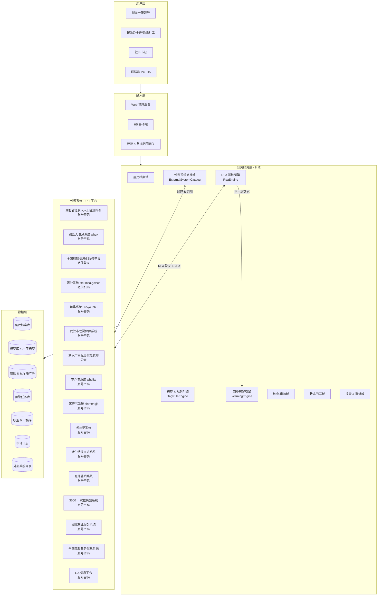
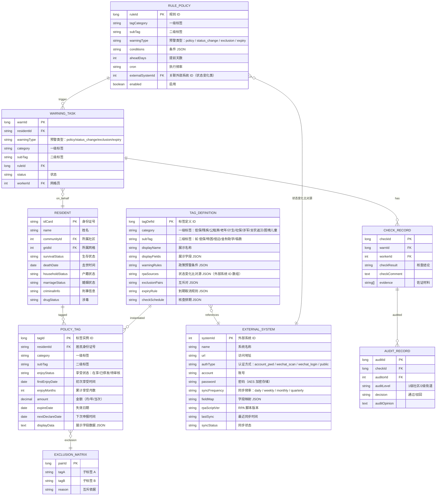
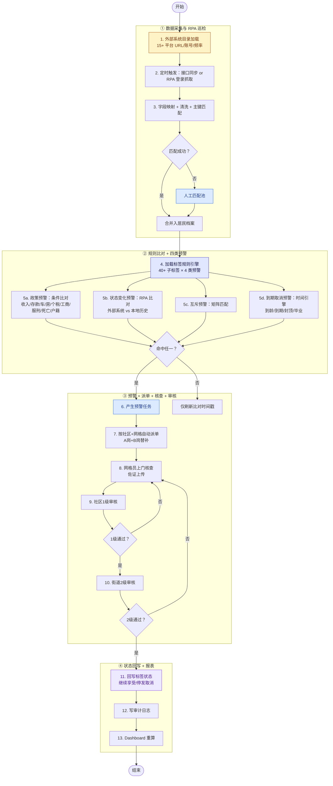
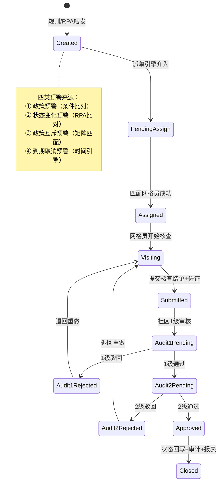

# 六角亭智慧街道民政业务一体化平台 PRD（数据来源与功能详解版）

| PRD 审核人 | [TODO：街道分管民政副主任] |
| --- | --- |
| 重要性 | 高 |
| 紧迫性 | 高 |
| 需求方 | 六角亭街道办事处 · 民政办公室 |
| PRD 编写人 | 产品组 |
| PRD 提交日期 | 2026-08-24 |
| 依赖文档 | 《平台规则、任务0811(1).xlsx》3 工作表；系统数据来源整理（2026-08-24） |
| 关联 PRD | liujiaoting-civil-affairs-PRD-0811.md（v1.0 全量平台 PRD） |

## PRD 修改记录

| 变更时间 | 变更内容 | 变更提出部门与理由 | 修改人 | 审核人 | 版本号 |
| --- | --- | --- | --- | --- | --- |
| 2026-08-24 | 初始版本：基于系统数据来源整理，覆盖 9 类 40+ 子标签的展示字段、四类预警规则、外部系统对接清单（含 URL/认证方式）、RPA 比对机制、互斥矩阵、核查任务排期 | 民政办：数据来源与规则细化 | 产品组 | [TODO] | v1.0 |

---

## 1、项目背景

### 1.1 现状
六角亭街道民政办管理 5 社区（学堂、荣东、六角、由义、民意）、14 网格、2600+ 户籍人口，涉及 **9 大类保障政策**（低保、残疾、公租房、老年、计生、社保、涉军、支农返汉、困境儿童）共 **40+ 子标签**。当前依赖社工人工翻查 **15+ 外部业务系统**（湖北省低收入人口监测平台、残疾人信息系统、全国残联平台、武汉市住房保障系统、市/区养老系统、计生系统、湖北就业服务系统、全国民政政务信息系统等），每月漏报/错报率约 15%。

### 1.2 核心矛盾
1. **外部系统多且异构**：15+ 平台分属民政部、省民政厅、市房管、区养老、卫健计生、人社等不同条线，登录方式涵盖账号密码、微信扫码、微信登录等 3 种认证模式。
2. **预警规则细碎**：每个子标签有 2–8 条政策预警 + 1–4 条状态变化预警 + 0–2 条互斥预警 + 0–2 条到期取消预警，合计 **200+ 规则节点**。
3. **RPA 比对需求**：状态变化预警要求"RPA 机器人抓取外部系统数据与系统历史信息比对，不一致时触发"，需要自动化巡检能力。
4. **互斥矩阵复杂**：15+ 对互斥关系跨 9 大类标签（如特困↔计生特扶死亡互斥、残疾居家↔计生特扶居家↔特殊困难老人↔365 四选一）。

### 1.3 立项契机
- 2026 年武汉市民政局"社会救助精准认定试点"要求街道级建立多源数据全量比对 + 预警闭环能力。
- 现有原型已具备 UI 骨架（Dashboard / ResidentList / WarningList / CheckTask / Import 等），可在此基础上补齐数据来源配置与预警规则引擎。

---

## 2、需求基本情况

### 2.1 核心需求（R 编号）

| 编号 | 需求 | 说明 |
| --- | --- | --- |
| R1 | 外部系统对接管理 | 统一管理 15+ 外部平台的 URL、认证方式、同步频率、字段映射 |
| R2 | RPA 自动巡检 | 定时登录外部系统抓取居民状态数据，与平台历史信息比对，不一致即触发状态变化预警 |
| R3 | 9 类 40+ 子标签体系 | 每个子标签定义展示字段、政策预警条件、状态变化比对源、互斥对、到期规则、核查排期 |
| R4 | 四类预警自动产生 | 政策预警（条件比对）/ 状态变化预警（RPA 比对）/ 政策互斥预警（矩阵匹配）/ 到期取消预警（时间引擎） |
| R5 | 核查-审核闭环 | 预警 → 智能派单 → 网格员核查 → 两级审核 → 状态回写 |
| R6 | 核查任务排期 | 年审（6 月大审 / 12 月小审）、季度核查、月度提醒、集中申报提醒等按子标签差异化排期 |

### 2.2 利益相关方

| 角色 | 核心诉求 |
| --- | --- |
| 民政办主任 / 10 条线社工 | 规则配置、外部系统账号管理、审核把关 |
| 社区书记 | 本社区核查任务分配、1 级审核 |
| 网格员 | 接收自动派单、上门核查、上传佐证 |
| 街道分管领导 | Dashboard 全街概览、审计合规 |

---

## 3、商业分析（企业自研视角）

### 3.1 投入预估

| 模块 | 人·月 |
| --- | --- |
| 外部系统对接配置（15+ 平台 × 字段映射 + 认证） | 3.5 |
| RPA 巡检引擎（登录 + 抓取 + 比对 + 告警） | 2.0 |
| 9 类 40+ 子标签规则配置 | 2.5 |
| 预警引擎（4 类 200+ 规则节点） | 1.5 |
| 核查-审核闭环（两级审核 + 驳回 + 回写） | 1.0 |
| 互斥矩阵 + 到期提醒 + 核查排期 | 1.0 |
| 权限 / 审计 / 报表 / 培训 | 1.5 |
| **合计** | **约 13 人·月** |

### 3.2 成本节约
- 人工查系统：5 社工 × 每月 5 天 × 15 系统 → 数字化后 ≤ 2 天/月 → 年节约 **240 人·天 ≈ 19.2 万元**。
- 错发追回：年节约约 7 万元。
- RPA 巡检替代人工：每月 15 系统 × 2 人·天 → 0 → 年节约 **36 人·天**。

---

## 4、项目收益目标

| 维度 | 指标 | 目标 |
| --- | --- | --- |
| 对接覆盖率 | 15+ 外部系统接入完成率 | ≥ 95% |
| RPA 巡检 | 状态变化预警自动触发率 | ≥ 90% |
| 预警准确率 | 政策预警条件比对准确率 | ≥ 95% |
| 互斥拦截 | 互斥对命中拦截率 | 100% |
| 核查时效 | 预警→派单 ≤ / 核查-审核平均 | ≤ 5 min / ≤ 2.5 天 |
| 核查排期 | 年审/季度/月度提醒按时触发率 | ≥ 98% |

---

## 5、项目方案概述

### 5.1 核心设计
1. **外部系统目录（ExternalSystemCatalog）**：统一管理 15+ 平台的 URL、认证方式、账号密码、Token、同步频率、字段映射规则。
2. **RPA 巡检引擎**：模拟登录外部系统 → 抓取居民状态 → 与本地标签历史比对 → 不一致触发状态变化预警。支持账号密码 / 微信扫码（人工辅助）/ 微信登录（人工辅助）三种模式。
3. **标签-规则-数据源三位一体**：每个子标签关联展示字段、4 类预警规则、外部比对源（可一对多）、互斥对、到期规则、核查排期。
4. **四类预警引擎**：
   - 政策预警：条件比对（收入/存款/车/房/个税/工商/服刑/死亡/户籍迁出）
   - 状态变化预警：RPA 抓取外部系统 → 与本地比对
   - 政策互斥预警：EXCLUSION_MATRIX 矩阵匹配
   - 到期取消预警：时间引擎计算（到龄/到期/封顶月数/毕业/年审未通过等）
5. **核查排期引擎**：按子标签配置年审（6 月大审 / 12 月小审）、季度核查、月度提醒、集中申报（3/6/9/12 月）等周期。

### 5.2 与现有原型衔接
复用 Import.vue（数据采集）、WarningList.vue（预警列表）、WarningConfig.vue（规则配置）、CheckTask.vue（核查任务）、GridWorkerList.vue（网格员）、Dashboard.vue（仪表盘）、ResidentDetail.vue（居民详情）等全部模块。

---

## 6、项目范围

### 6.1 In Scope
- 15+ 外部系统对接配置与 RPA 巡检
- 9 类 40+ 子标签体系（含展示字段、4 类预警、互斥、到期、核查排期）
- 预警 → 派单 → 核查 → 两级审核 → 回写全闭环
- 互斥矩阵 15+ 对
- 核查任务排期（年审/季度/月度/集中申报）
- Dashboard 四口径统计 + 报表导出

### 6.2 Out of Scope
- 居民自助端
- 区/市级统一报送平台直连（仅保留导出）
- 重症标签（数据来源仅"重症数据"一行，[TODO：需补充规则细节]）

### 6.3 分期

| 阶段 | 范围 | 里程碑 |
| --- | --- | --- |
| P1（6 周） | 低保 5 子标签 + 残疾 12 子标签 + 公租房 2 子标签；外部系统对接 ≥ 8 个 | 2026-10-15 |
| P2（5 周） | 老年 3 子标签 + 计生 5 子标签 + 社保 1 子标签 + 涉军 5 子标签 + 困境儿童 4 子标签 + 支农返汉 | 2026-11-20 |
| P3（3 周） | RPA 全量上线、互斥矩阵全量、核查排期全量、报表导出 | 2026-12-15 |

---

## 7、项目风险

| 编号 | 风险 | 影响 | 概率 | 缓解 |
| --- | --- | --- | --- | --- |
| R01 | 15+ 外部系统认证方式异构（账号密码/微信扫码/微信登录），RPA 自动登录受限 | 高 | 高 | 微信扫码/登录类系统采用"人工辅助登录 + Session 复用"模式，RPA 在 Session 有效期内自动巡检 |
| R02 | 外部系统页面结构变更导致 RPA 抓取失败 | 中 | 中 | RPA 脚本版本化管理；页面变更自动告警 + 人工修复 |
| R03 | 外部系统账号密码泄露风险 | 高 | 低 | 密码加密存储（AES-256）；页面脱敏显示；导出需审批；定期更换 |
| R04 | 互斥矩阵漏配导致重复享受 | 高 | 中 | 逐条录入用户提供的 15+ 对互斥；上线前历史数据回放 100% 通过 |
| R05 | RPA 巡检频率过高导致外部系统封 IP | 中 | 中 | 控制巡检频率（每日/每周/每月）；模拟人类操作间隔（随机 3-10 秒） |

---

## 8、术语

| 术语 | 释义 |
| --- | --- |
| 一级标签 | 保障大类：低保/残疾/公租房/老年/计生/社保/涉军/支农返汉/困境儿童（9 类） |
| 二级标签 | 子项：如低保下含 低保/特困/低边/金秋助学/临救（5 个子标签） |
| 政策预警 | 对接外部系统核查，与系统已登记信息不符时触发（条件比对型） |
| 状态变化预警 | RPA 机器人抓取外部系统数据与系统历史信息比对，不一致时触发 |
| 政策互斥预警 | 两个/多个标签不可同时享受，命中互斥矩阵即触发 |
| 到期取消预警 | 到龄/到期/封顶月数/毕业/年审未通过等时间驱动型提醒 |
| 大年审 | 6 月全量核查 |
| 小年审 | 12 月增量核查 |
| RPA | Robotic Process Automation，模拟登录外部系统自动抓取数据 |
| 不重享 | 互斥的同义词，命中即生成政策互斥预警 |

---

## 9、参考文献

| 编号 | 文档 | 说明 |
| --- | --- | --- |
| R1 | 系统数据来源整理（2026-08-24 用户提供） | 9 类 40+ 子标签的展示字段、预警规则、外部系统 URL/账号 |
| R2 | 《平台规则、任务0811(1).xlsx》3 工作表 | 资格认定细则、保障信息比对方式、网址及账号 |
| R3 | liujiaoting-civil-affairs-PRD-0811.md | v1.0 全量平台 PRD |
| R4 | docs/business-flow.png | 核心业务流程图 |

---

## 10、功能需求

> 💡 方法论提示：本章以"外部系统对接 → 标签体系 → 四类预警引擎 → 核查排期 → 互斥矩阵"为主线，逐标签详细描述功能与数据来源。

### 10.1 产品框架概述

#### 10.1.1 系统架构图

#### 10.1.2 核心实体 ER 模型

#### 10.1.3 核心业务流程图

#### 10.1.4 预警任务状态机

#### 10.1.5 功能清单

| 模块 | 子功能 | 优先级 |
| --- | --- | --- |
| M1 外部系统对接域 | 系统目录管理 / 字段映射 / 认证配置 / 同步状态看板 / 人工匹配池 | P0 |
| M2 RPA 巡检引擎 | 登录脚本 / 数据抓取 / Session 管理 / 比对逻辑 / 失败告警 | P0 |
| M3 标签体系 | 9 类 40+ 子标签定义 / 展示字段配置 / 规则绑定 | P0 |
| M4 四类预警引擎 | 政策预警 / 状态变化预警 / 互斥预警 / 到期取消预警 | P0 |
| M5 核查-审核 | 派单 / 核查 / 两级审核 / 驳回 / 回写 | P0 |
| M6 核查排期 | 年审 / 季度 / 月度 / 集中申报提醒 | P1 |
| M7 互斥矩阵 | 15+ 对互斥管理 / 命中拦截 | P0 |
| M8 报表 & 审计 | Dashboard / 核查台账 / 发放台账 / 审计日志 | P1 |

---
### 10.2 产品需求详解（逐标签：展示字段 → 四类预警 → 数据来源 → 核查排期）

> 💡 方法论提示：每个子标签遵循"展示字段 → 政策预警 → 状态变化预警（含外部系统） → 政策互斥预警 → 到期取消预警 → 核查排期"六段式结构，数据来源严格取自用户提供的系统数据来源整理。

---

#### M1 · 低保（一级标签，5 个二级标签）

##### M1.1 低保

| 维度 | 内容 |
| --- | --- |
| **展示信息字段** | 失效日期、月金额 |
| **政策预警**（对接外部系统核查，与系统已登记信息不符时触发） | 1. 死亡 2. 户籍迁出我街道 3. 社保信息高于 1081 元/人；存款高于 3 万/人 4. 有车 5. 房产数量大于 2；等于 2 时面积超过 68.4㎡/人 6. 有个税信息 7. 有工商信息 8. 有服刑信息 |
| **状态变化预警** | 与湖北省低收入人口监测平台信息不一致时触发 |
| **政策互斥预警** | —（与特困/低边三选一，就高保留） |
| **到期取消预警** | — |
| **核查任务排期** | 6 月大年审、12 月小年审 |
| **数据来源** | 湖北省低收入人口监测平台 `https://59.208.149.252:7080/hbdsr/login?redirect=/desk`（账号密码：黄梦媛 / Hbdsr@2024） |

##### M1.2 特困

| 维度 | 内容 |
| --- | --- |
| **展示信息字段** | 失效日期、月金额 |
| **政策预警** | 1. 死亡 2. 户籍迁出我街道 3. 社保信息高于 1081 元/人；存款高于 30000 元/人 4. 有车 5. 房产数大于等于 2 6. 有个税信息 7. 有工商信息 8. 有服刑信息 |
| **状态变化预警** | 与湖北省低收入人口监测平台信息不一致时触发 |
| **政策互斥预警** | **特困与计生特扶（死亡）互斥** |
| **到期取消预警** | — |
| **核查任务排期** | 6 月大年审、12 月小年审 |
| **数据来源** | 湖北省低收入人口监测平台（同上） |

##### M1.3 低边

| 维度 | 内容 |
| --- | --- |
| **展示信息字段** | 失效日期、年金额 |
| **政策预警** | 1. 死亡 2. 户籍迁出我街道 3. 社保信息高于 2162 元/人；存款高于 51888 元/人 4. 车辆数大于 1，等于 1 时车辆价格高于 155664 元、企业认缴出资额超过 15 万 5. 房产数量大于 2；等于 2 时面积超过 68.4㎡/人 6. 有个税信息 7. 有工商信息 8. 有服刑信息 |
| **状态变化预警** | 与湖北省低收入人口监测平台信息不一致时触发 |
| **核查任务排期** | 临时发布任务 |
| **数据来源** | 湖北省低收入人口监测平台（同上） |

##### M1.4 金秋助学

| 维度 | 内容 |
| --- | --- |
| **展示信息字段** | 就读学校、学历、就读时间、毕业时间、年金额 |
| **政策预警** | —（无条件比对型预警） |
| **状态变化预警** | 与湖北省低收入人口监测平台信息不一致时触发 |
| **政策互斥预警** | **与残疾人学费补贴、孤儿学费补贴互斥** |
| **到期取消预警** | 毕业到期提醒 |
| **数据来源** | 湖北省低收入人口监测平台（同上） |

##### M1.5 临救

| 维度 | 内容 |
| --- | --- |
| **展示信息字段** | 生效日期、失效日期、月金额 |
| **政策预警 — 支出型** | 1. 死亡 2. 户籍迁出我街道 3. 社保信息高于 1081 元/人；存款高于 3 万/人 4. 有车 5. 房产数量大于 2；等于 2 时面积超过 68.4㎡/人 6. 有个税信息 7. 有工商信息 8. 有服刑信息 |
| **政策预警 — 过渡型** | 1. 死亡 2. 户籍迁出我街道 3. 社保信息高于 1081 元/人；存款高于 3 万/人 4. 有车 5. 房产数量大于 2；等于 2 时面积超过 68.4㎡/人 6. 有个税信息 7. 有工商信息 8. **服刑：释放 2 年以上** |
| **状态变化预警** | 支出型 & 过渡型均与湖北省低收入人口监测平台信息不一致时触发 |
| **到期取消预警** | **过渡型仅发放六个月**（从发放日期计算） |
| **数据来源** | 湖北省低收入人口监测平台（同上） |

---

#### M2 · 残疾（一级标签，12 个二级标签）

##### M2.1 4050（残疾）

| 维度 | 内容 |
| --- | --- |
| **展示信息字段** | 1. 初次享受时间 2. 累计享受月数 3. 养老保险补贴金额 4. 医疗保险补贴金额（当次） |
| **政策预警** | 1. 死亡 2. 户籍迁出我街 3. 有服刑信息 |
| **到期取消预警** | **60 个月封顶、退休** |
| **状态变化预警** | 与残疾人信息系统 `https://whqk.cdpf-bt.cn`（账号：18627142455@qq.com，密码：QK*18627142455）、全国残联信息化服务平台 `https://portal.cdpf.org.cn/`（微信登录）信息不一致时触发 |
| **核查任务排期** | **3 月、9 月提醒申报** |
| **资格条件** | 男 55 周岁，女 45 周岁；申报时缴费年限已满 10 年；只缴医保不能享受 |

##### M2.2 残疾两补

| 维度 | 内容 |
| --- | --- |
| **展示信息字段** | 重度护理补贴或困难生活补贴、月金额、失效 |
| **政策预警** | 1. 死亡 2. 户籍迁出我街 3. 有服刑信息 |
| **政策互斥预警** | **与特困互斥** |
| **状态变化预警 — 重度护理补贴** | 与全国残联信息化服务平台 `https://portal.cdpf.org.cn/`（微信登录）、残疾人信息系统 `https://whqk.cdpf-bt.cn`（账号：18627142455@qq.com，密码：QK*18627142455）信息不一致时触发 |
| **状态变化预警 — 困难生活补贴** | 与湖北省低收入人口监测平台 `https://59.208.149.252:7080/hbdsr/login?redirect=/desk`（账号：黄梦媛，密码：Hbdsr@2024）信息不一致时触发 |
| **资格条件** | 重度护理补贴：残疾等级 1-2 级；困难生活补贴：享受低保的残疾人 |

##### M2.3 残疾学费补贴

| 维度 | 内容 |
| --- | --- |
| **展示信息字段** | 特困残疾人家庭或残疾学生（小标题）、就读学校、学历、就读时间、毕业时间、年金额 |
| **政策预警** | 1. 死亡 2. 户籍迁出我街 3. 特困残疾人家庭低保取消 4. 有服刑信息 5. 社保信息显示有就业 |
| **到期取消预警** | 毕业 |
| **政策互斥预警** | **与低保助学金（金秋助学）互斥** |
| **状态变化预警** | 与残疾人信息系统 `https://whqk.cdpf-bt.cn`（账号：18627142455@qq.com，密码：QK*18627142455）、全国残联信息化服务平台 `https://portal.cdpf.org.cn/`（微信登录）信息不一致时触发 |
| **核查任务排期** | **9 月提醒申报** |

##### M2.4 残疾居家服务

| 维度 | 内容 |
| --- | --- |
| **展示信息字段** | 残疾类别、等级、低保享受情况 |
| **政策预警**（备注：非低保、未持有重度肢体/智力/视力/多重残疾证；非硚口户籍、未满 65 周岁、不属于重度视力持证残疾人的群体） | 1. 死亡 2. 户籍迁出我街道 3. 社保信息高于 1081 元/人；存款高于 3 万/人 4. 有车 5. 房产数量大于 2；等于 2 时面积超过 68.4㎡/人 6. 有个税信息 7. 有工商信息 8. 有服刑信息 |
| **政策互斥预警** | **与计生特扶和特殊困难老人服务补贴、365 服务互斥** |
| **状态变化预警** | 与残疾人信息系统 `https://whqk.cdpf-bt.cn`（账号：18627142455@qq.com，密码：QK*18627142455）、全国残联信息化服务平台 `https://portal.cdpf.org.cn/`（微信登录）、湖北省低收入人口监测平台 `https://59.208.149.252:7080/hbdsr/login?redirect=/desk`（账号：黄梦媛，密码：Hbdsr@2024）信息不一致时触发 |

##### M2.5 精神服药补贴

| 维度 | 内容 |
| --- | --- |
| **展示信息字段** | 失效日期、月金额 |
| **政策预警**（备注：低保停止，精神残疾） | 1. 死亡 2. 户籍迁出我街 3. 社保信息高于 1081 元/人；存款高于 3 万/人 4. 有车 5. 房产数量大于 2；等于 2 时面积超过 68.4㎡/人 6. 有个税信息 7. 有工商信息 8. 有服刑信息 |
| **政策互斥预警** | **与两补、一户多残互斥** |
| **状态变化预警** | 与两补系统 `https://lxbt.mca.gov.cn/cjrlb/pages/login/login.jsp`（微信扫码登录，由区民政局设置）、残疾人信息系统 `https://whqk.cdpf-bt.cn`（账号：18627142455@qq.com，密码：QK*18627142455）、全国残联信息化服务平台 `https://portal.cdpf.org.cn/`（微信登录）、湖北省低收入人口监测平台 `https://59.208.149.252:7080/hbdsr/login?redirect=/desk`（账号：黄梦媛，密码：Hbdsr@2024）信息不一致时触发 |

##### M2.6 贫困智力补贴

| 维度 | 内容 |
| --- | --- |
| **展示信息字段** | 失效日期、月金额 |
| **政策预警**（备注：低保、智力残疾） | 1. 死亡 2. 户籍迁出我街 3. 社保信息高于 1081 元/人；存款高于 3 万/人 4. 有车 5. 房产数量大于 2；等于 2 时面积超过 68.4㎡/人 6. 有个税信息 7. 有工商信息 8. 有服刑信息 |
| **政策互斥预警** | **与重度护理补贴、一户多残低保家庭居家护理补贴互斥** |
| **状态变化预警** | 与两补系统（同 M2.5）、残疾人信息系统（同 M2.5）、全国残联信息化服务平台（同 M2.5）、湖北省低收入人口监测平台（同 M2.5）信息不一致时触发 |

##### M2.7 一户多残护理补贴

| 维度 | 内容 |
| --- | --- |
| **展示信息字段** | 失效日期、月金额 |
| **政策预警** | 1. 死亡 2. 户籍迁出我街 3. 单一户籍中家庭成员持证数量小于 2 提醒 |
| **政策互斥预警** | **与各类居家服务（含困难老人居家养老护理服务）互斥** |
| **状态变化预警** | 与两补系统、残疾人信息系统、全国残联信息化服务平台、湖北省低收入人口监测平台（均同 M2.5）信息不一致时触发 |
| **资格条件** | 武汉户籍 + 单一户籍 ≥2 人持证 + 低保 + 未接受政府购买居家/托养/居家护理补贴 |

##### M2.8 听力补贴

| 维度 | 内容 |
| --- | --- |
| **展示信息字段** | 失效日期、年金额 |
| **政策预警** | 1. 死亡 2. 户籍迁出我街 3. 年龄未满 16 周岁 |
| **状态变化预警** | 与残疾人信息系统 `https://whqk.cdpf-bt.cn`（账号：18627142455@qq.com，密码：QK*18627142455）、全国残联信息化服务平台 `https://portal.cdpf.org.cn/`（微信登录）信息不一致时触发 |
| **资格条件** | 年满 16 周岁 + 持听力/言语残疾证 1-4 级 + 本市户籍 |

##### M2.9 就业援助岗

| 维度 | 内容 |
| --- | --- |
| **展示信息字段** | 失效日期、月金额 |
| **政策预警** | 1. 死亡 2. 户籍迁出我街 3. 社保参保变动 4. 领取失业金 5. 个税信息 6. 有工商信息 7. 有服刑信息 |
| **状态变化预警** | 与残疾人信息系统、全国残联信息化服务平台（均同 M2.8）信息不一致时触发 |
| **资格条件** | 硚口户籍 + 持证 + 有就业意愿的失业残疾人/符合条件亲属 |

##### M2.10 燃油补贴

| 维度 | 内容 |
| --- | --- |
| **展示信息字段** | 失效日期、年金额 |
| **政策预警** | 1. 死亡 2. 户籍迁出我街 |
| **状态变化预警** | 与残疾人信息系统、全国残联信息化服务平台（均同 M2.8）信息不一致时触发 |

##### M2.11 辅具适配

| 维度 | 内容 |
| --- | --- |
| **展示信息字段** | 享受年度、辅具类型、辅具名称（含使用年限） |
| **政策预警** | 1. 死亡 2. 户籍迁出我街 |
| **到期取消预警** | **年度申请限制：1 年内达到 2 次及以上提醒** |
| **政策互斥预警** | **与民政局、退役军人事务局等部门惠残辅具项目互斥；工伤保险赔偿的残疾人（含伤残军人、伤残人民警察和未满 1 周岁的残疾儿童等）互斥** |
| **状态变化预警** | 与残疾人信息系统、全国残联信息化服务平台（均同 M2.8）、辅具系统 `https://middle.365youzhu.com/admin/#/hblogin`（账号密码相同：18672980821）信息不一致时触发 |

##### M2.12 残疾儿童家庭生活补助

| 维度 | 内容 |
| --- | --- |
| **展示信息字段** | 失效日期、康复训练机构名称 |
| **政策预警** | 1. 死亡 2. 户籍迁出我街 |
| **到期取消预警** | **年满 16 岁** |
| **资格条件** | 在定点康复训练机构训练 + 0-15 岁 + 硚口区户籍/本街道残疾儿童家庭 |

---

#### M3 · 公租房（一级标签，2 个二级标签）

##### M3.1 实物配租（低保、低边、三档）

| 维度 | 内容 |
| --- | --- |
| **展示信息字段** | 失效日期、配租地址 |
| **政策预警** | 1. 死亡 2. 户籍迁出我街道 3. 社保信息高于 1081 元/人；存款高于 3 万/人 4. 有车 5. **人均住房面积超过 16㎡** 6. 有个税信息 7. 有工商信息 8. 有服刑信息 |
| **状态变化预警** | 与武汉市住房保障信息管理系统 `http://202.103.39.38/whbz/OuterLogin.aspx`（账号：硚口区六角亭街道，密码：12301230DY）、武汉市公共租赁住房信息发布 `http://202.103.39.38/Pub/EligiblePublicity.aspx`（公开）、湖北省低收入人口监测平台（同 M1.1）信息不一致时触发 |

##### M3.2 租赁补贴

| 维度 | 内容 |
| --- | --- |
| **展示信息字段** | 失效日期、月金额 |
| **政策预警** | 1. 死亡 2. 户籍迁出我街道 3. 社保信息高于 1081 元/人；存款高于 3 万/人 4. 有车 5. 人均住房面积超过 16㎡ 6. 有个税信息 7. 有工商信息 8. 有服刑信息 |
| **状态变化预警** | 与武汉市住房保障信息管理系统、武汉市公共租赁住房信息发布、湖北省低收入人口监测平台（均同 M3.1）信息不一致时触发 |
| **补贴档位** | ①人均收入 ≤ 1070 → 25 元/㎡·月；②1070 < 人均收入 ≤ 2140 → 20 元/㎡·月；③2140 < 人均收入 ≤ 3000（单人户 3500）→ 10 元/㎡·月 |

---

#### M4 · 老年（一级标签，3 个二级标签）

##### M4.1 特殊困难老人服务补贴（养老院、助残、居家服务）

| 维度 | 内容 |
| --- | --- |
| **展示信息字段** | 失效日期、月金额 |
| **政策预警** | 1. 死亡 2. 户籍迁出我街 |
| **政策互斥预警** | **与计生特扶居家服务、残疾居家服务、365 服务互斥** |
| **状态变化预警** | 与市养老系统 `http://wh.whylfw.cn/#/home`（账号：420104010，密码：whyl@mz）、区养老系统 `https://dream.xinmengjk.com/#/login`（账号：420104010，密码：whyl@mz123）信息不一致时触发 |
| **资格条件** | 本市户籍 60+ 岁且符合：① 低保失能 ② 低保 80+ ③ 优抚/特扶/劳模/见义勇为 失能 ④ 中心城区个人收入低于上年度人均退休金 重度失能 ⑤ 全市 90+ |

##### M4.2 365 服务（白名单：雷用香、张美焕，仅 2 人，不新增）

| 维度 | 内容 |
| --- | --- |
| **展示信息字段** | 未填写 |
| **政策预警** | 1. 死亡 2. 户籍迁出我街 |
| **政策互斥预警** | **与计生特扶和残疾居家上门和特殊困难老人居家服务不重享** |
| **状态变化预警** | 与区养老系统 `https://dream.xinmengjk.com/#/login`（账号：420104010，密码：whyl@mz123）信息不一致时触发 |

##### M4.3 高龄津贴

| 维度 | 内容 |
| --- | --- |
| **展示信息字段** | 年龄、月金额 |
| **政策预警** | 1. 死亡 2. 户籍迁出我街 |
| **状态变化预警** | 与市养老系统 `http://wh.whylfw.cn/#/home`（账号：420104010，密码：whyl@mz）信息不一致时触发 |
| **核查任务排期** | **每季度末月 1-10 日内核实** |
| **发放标准** | 80-89 岁：100 元/月；90-99 岁：200 元/月；100+ 岁：500 元/月 + 生日探望 500 元（随生日当季度津贴同步发放） |

---

#### M5 · 计生（一级标签，5 个二级标签）

##### M5.1 计生特扶家庭

| 维度 | 内容 |
| --- | --- |
| **展示信息字段**（8 项子补贴，分别显示失效日期和金额） | 1. 计生特殊家庭 2026 年春节、端午节、中秋节慰问 2. 计生特殊家庭独生子女一次性奖励（第二个 3500） 3. 计生特扶对象扶助金补发 4. 计生特殊家庭一次性 2000 元抚慰金 5. 失独对象生日卡 6. 特别扶助失独对象医疗爱心包 7. 特别扶助本年扶助对象特扶金 8. 独生子女死亡计生特殊家庭一次性抚慰金 |
| **政策预警** | 1. 死亡 2. 户籍迁出我街 3. 年龄未满 49 岁 4. 子女残疾证 3 级以下（含独生子女死亡信息提醒；子女残疾等级、类别） |
| **政策互斥预警** | **特困与计生特扶（死亡）互斥** |
| **资格条件** | 1933.1.1 后出生；女方年满 49 岁；只生/收养 1 个；现无存活子女或独生子女残疾 ≥ 三级 |

##### M5.2 独生子女保健费

| 维度 | 内容 |
| --- | --- |
| **展示信息字段** | 失效日期、年金额 |
| **政策预警** | 1. 死亡 2. 户籍迁出我街 3. 婚姻 |
| **到期取消预警** | **14 周岁到期取消** |
| **核查任务排期** | **每年 7 月审核** |

##### M5.3 育儿补贴

| 维度 | 内容 |
| --- | --- |
| **展示信息字段** | 失效日期、领取次数、年金额 |
| **政策预警** | 1. 死亡 2. 户籍迁出我街已领取补贴提示 3. 享受子女总数超过 3 提示 4. 非婚生子 |
| **到期取消预警** | **仅 3 岁内可申报（按年度）** |
| **状态变化预警** | 与育儿补贴信息管理系统 `http://10.32.32.238:14352/subsidy.html#/login`（账号：J420104007，密码：h@b2Y0e2b6q）、计生特扶家庭系统 `http://10.32.32.236:40014/family/subsystem/index?t=jzfz`（账号：J420104007，密码：Ljtjd@1234567）比对；居民上传出生证与计生系统是否一致 |

##### M5.4 3500（独生子女一次性补贴）

| 维度 | 内容 |
| --- | --- |
| **展示信息字段** | 申报时间 |
| **政策预警** | 1. 死亡 2. 户籍迁出我街 |
| **政策匹配** | 退休人员或年满 60 周岁以上城镇无业居民提醒；再婚家庭双方带入小孩均 <18 岁双方都不符合，有一方小孩 ≥18 岁可办理 |
| **状态变化预警** | 与武汉市落实企业退休职工城镇独生子女年老父母计划生育一次性奖励政策系统 `http://10.32.32.101:8080/once/frame/main`（账号：372，密码：8888）信息不一致时触发 |

##### M5.5 计生特扶居家养老服务

| 维度 | 内容 |
| --- | --- |
| **展示信息字段** | 户籍、分段显示享受时长和金额 |
| **政策预警** | 1. 死亡 2. 户籍迁出我街 |
| **到期取消预警** | **仅年满 65 周岁可申报** |
| **政策互斥预警** | **与特殊困难老人居家服务、365 服务、残疾居家上门服务互斥** |
| **档位** | 65-69 岁：12h/人·月 → 3600 元/年；70-79 岁：24h/人·月 → 7200 元/年；80+ 岁：30h/人·月 → 9000 元/年 |

---

#### M6 · 社保（一级标签，1 个二级标签）

##### M6.1 4050（灵活就业补贴）

| 维度 | 内容 |
| --- | --- |
| **展示信息字段** | 初次享受时间、累计享受月数、养老保险补贴金额、医疗保险补贴金额（当季度） |
| **政策预警** | 1. 死亡 2. 户籍迁出我街 3. 就业企业注销 4. 申报人担任企业法人、监事、财务管理人、股东 5. 退休（社保系统） 6. 有服刑信息 |
| **到期取消预警** | **36 个月封顶**（女 40、男 50 岁申报时）；**60 个月封顶**（女 45、男 55 申报时） |
| **状态变化预警** | 与湖北就业服务信息系统 `http://10.128.37.41:7003/hbhr/index/mainframe/frame.html`（账号及密码：C0900 / whld123456）信息不一致时触发 |
| **核查任务排期** | **3 月、6 月、9 月、12 月申报提醒** |

---

#### M7 · 涉军（一级标签，5 个二级标签）

> 备注：固定人员，**只打标签，只出不进**。

| 二级标签 | 展示信息字段 | 政策预警 | 核查任务排期 |
| --- | --- | --- | --- |
| 重点优抚对象补助 | 区局发放待遇 | 1. 死亡 2. 户籍迁出我街 3. 有服刑信息 | 重点优抚对象年审 |
| 两参人员 | 春节八一待遇金额 | 同上 | 春节、八一前核查 |
| 53 年前老战士 | 春节八一待遇金额 | 同上 | 春节、八一前核查 |
| 三属 | 春节八一待遇金额 | 同上 | 春节、八一前核查（死亡、户籍） |
| 企业军转干部 | 节日慰问金、体检、医疗救助 | 同上 | 每季度核查；4 月、11 月提醒申报医疗救助 |

**提醒节点汇总**：重点优抚（每月）、企业军转干部（2/5/8/11 月月底）、两参/53 年老战士/三属（春节/八一前）。

---

#### M8 · 支农返汉（一级标签，1 个二级标签）

| 维度 | 内容 |
| --- | --- |
| **展示信息字段** | 月金额 |
| **政策预警** | 1. 死亡 2. 户籍迁出我街 |

---

#### M9 · 困境儿童（一级标签，4 个二级标签）

##### M9.1 孤儿生活补助

| 维度 | 内容 |
| --- | --- |
| **展示信息字段** | 父母情况（生存）、孤儿证、学历、月金额 |
| **政策预警** | 1. 死亡 2. 户籍迁出我街 3. 学历（毕业取消） |
| **到期取消预警** | **仅年满 18 岁可申报** |
| **状态变化预警** | 与全国民政政务信息系统 `https://mzzwxt.mca.gov.cn/idp/authcenter/ActionAuthChain?entityId=apphub&authnLcKey=23014429-24f3-40db-a35f-d41c1636d135`（账号：zj1234，密码：19860207@Qq）信息不一致时触发 |
| **发放标准** | 2025 年标准：2140 元/人·月（武民政[2025]14 号） |

##### M9.2 事无儿童生活补助

| 维度 | 内容 |
| --- | --- |
| **展示信息字段** | 父母情况（生存、刑事）、残疾、事无儿童认定证明标签、学历、月金额 |
| **政策预警** | 1. 死亡 2. 户籍迁出我街 |
| **到期取消预警** | **仅年满 18 岁可申报** |
| **状态变化预警** | 与全国民政政务信息系统（同 M9.1）信息不一致时触发 |

##### M9.3 孤儿助学

| 维度 | 内容 |
| --- | --- |
| **展示信息字段** | 就读情况、学历、年金额 |
| **政策预警** | 1. 死亡 2. 户籍迁出我街 3. 年满 18 周岁提醒、毕业时间提醒 |
| **状态变化预警** | 与全国民政政务信息系统（同 M9.1）信息不一致时触发 |
| **发放标准** | 年满 18 周岁后在全日制本科/专科/高等职业/中等职业学校就读：每人每学年 1 万元助学金 |

##### M9.4 事无儿童助学

| 维度 | 内容 |
| --- | --- |
| **展示信息字段** | 就读情况、学历、年金额 |
| **政策预警** | 1. 死亡 2. 户籍迁出我街 3. 年满 18 周岁提醒、毕业时间提醒 |
| **状态变化预警** | 与全国民政政务信息系统（同 M9.1）信息不一致时触发 |
| **发放标准** | 第一年省民政厅一次性 1 万元；后续学年市民政局参照孤儿标准每人每年 1 万元直到毕业 |
| **政策互斥预警** | **与残疾助学金不重享** |
---

### 10.2.1 外部系统对接目录（ExternalSystemCatalog）

> 以下 16 个外部系统为本平台所有标签的状态变化预警比对来源，需在 ExternalSystemCatalog 中统一管理。

| 编号 | 系统名称 | 访问地址 | 认证方式 | 账号 | 密码 | 关联标签 | 同步频率 |
| --- | --- | --- | --- | --- | --- | --- | --- |
| E01 | 湖北省低收入人口监测平台 | `https://59.208.149.252:7080/hbdsr/login?redirect=/desk` | 账号密码 | 黄梦媛 | Hbdsr@2024 | 低保/特困/低边/金秋助学/临救/两补(困难)/残疾居家/精神服药/贫困智力/一户多残/公租房 | 每日 |
| E02 | 残疾人信息系统 | `https://whqk.cdpf-bt.cn` | 账号密码 | 18627142455@qq.com | QK*18627142455 | 4050(残疾)/两补/学费补贴/残疾居家/精神服药/贫困智力/一户多残/听力/就业援助/燃油/辅具 | 每日 |
| E03 | 全国残联信息化服务平台 | `https://portal.cdpf.org.cn/` | 微信登录 | —（微信） | — | 同 E02（与 E02 交叉比对） | 每周 |
| E04 | 两补系统 | `https://lxbt.mca.gov.cn/cjrlb/pages/login/login.jsp` | 微信扫码 | —（区民政局设置） | — | 精神服药/贫困智力/一户多残 | 每周 |
| E05 | 辅具系统 | `https://middle.365youzhu.com/admin/#/hblogin` | 账号密码 | 18672980821 | 18672980821 | 辅具适配 | 每月 |
| E06 | 武汉市住房保障信息管理系统 | `http://202.103.39.38/whbz/OuterLogin.aspx` | 账号密码 | 硚口区六角亭街道 | 12301230DY | 实物配租/租赁补贴 | 每日 |
| E07 | 武汉市公共租赁住房信息发布 | `http://202.103.39.38/Pub/EligiblePublicity.aspx` | 公开 | — | — | 实物配租/租赁补贴 | 每日 |
| E08 | 市养老系统 | `http://wh.whylfw.cn/#/home` | 账号密码 | 420104010 | whyl@mz | 特殊困难老人/高龄津贴 | 每日 |
| E09 | 区养老系统 | `https://dream.xinmengjk.com/#/login` | 账号密码 | 420104010 | whyl@mz123 | 特殊困难老人/365 服务 | 每日 |
| E10 | 老年证系统 | `http://58.48.74.206:7019/oldcard/indexAction.do` | 账号密码 | 420104010 | Ljtj889092 | 老年证办理 | [TODO：关联标签待确认] |
| E11 | 计生特扶家庭系统 | `http://10.32.32.236:40014/family/subsystem/index?t=jzfz` | 账号密码 | J420104007 | Ljtjd@1234567 | 计生特扶家庭/育儿补贴 | 每周 |
| E12 | 育儿补贴信息管理系统 | `http://10.32.32.238:14352/subsidy.html#/login` | 账号密码 | J420104007 | h@b2Y0e2b6q | 育儿补贴 | 每周 |
| E13 | 3500 一次性奖励系统 | `http://10.32.32.101:8080/once/frame/main` | 账号密码 | 372 | 8888 | 3500 独生子女一次性补贴 | 每月 |
| E14 | 湖北就业服务信息系统 | `http://10.128.37.41:7003/hbhr/index/mainframe/frame.html` | 账号密码 | C0900 | whld123456 | 4050 社保 | 每日 |
| E15 | 全国民政政务信息系统 | `https://mzzwxt.mca.gov.cn/idp/authcenter/ActionAuthChain?entityId=apphub&authnLcKey=23014429-24f3-40db-a35f-d41c1636d135` | 账号密码 | zj1234 | 19860207@Qq | 孤儿生活补助/事无儿童/孤儿助学/事无儿童助学 | 每周 |
| E16 | OA 信息平台 | `https://oa.yarknet.com/table_fill` | 账号密码 | 13554302278 | Ljtj123456 | [TODO：关联标签待确认] | [TODO] |

#### RPA 巡检认证模式说明

| 认证模式 | 适用系统 | RPA 策略 |
| --- | --- | --- |
| 账号密码（自动） | E01/E02/E05/E06/E08/E09/E10/E11/E12/E13/E14/E15/E16 | RPA 自动填写账号密码 → 登录 → 抓取数据 |
| 微信扫码（半自动） | E04 两补系统 | 人工扫码登录获取 Session → RPA 在 Session 有效期内自动巡检（约 2-4 小时） |
| 微信登录（半自动） | E03 全国残联平台 | 人工微信登录获取 Session → RPA 在 Session 有效期内自动巡检 |
| 公开访问（自动） | E07 公租房信息发布 | RPA 直接抓取公开页面 |

---

### 10.2.2 政策互斥矩阵（EXCLUSION_MATRIX）

> 所有互斥对在比对阶段命中即生成"政策互斥预警"，级别为**紧急**。

| 编号 | 标签 A | 标签 B | 互斥依据 |
| --- | --- | --- | --- |
| X01 | 特困 | 计生特扶（死亡） | 0811 规则表 |
| X02 | 残疾两补 | 特困 | 0811 规则表 |
| X03 | 残疾学费补贴 | 低保助学金（金秋助学） | 0811 规则表 E12 |
| X04 | 金秋助学 | 残疾学费补贴、孤儿学费补贴 | 用户提供 |
| X05 | 残疾居家服务 | 计生特扶居家养老服务 | 0811 规则表 E13/P9 |
| X06 | 残疾居家服务 | 特殊困难老人服务补贴 | 0811 规则表 E13/L9 |
| X07 | 残疾居家服务 | 365 服务 | 0811 规则表 E13 |
| X08 | 精神服药补贴 | 残疾两补、一户多残护理补贴 | 0811 规则表 E14 |
| X09 | 贫困智力补贴 | 重度护理补贴、一户多残护理补贴 | 0811 规则表 E15 |
| X10 | 一户多残护理补贴 | 各类居家服务（含困难老人居家养老护理服务） | 0811 规则表 E16 |
| X11 | 辅具适配 | 民政局/退役军人事务局惠残辅具项目 | 用户提供 M2.11 |
| X12 | 辅具适配 | 工伤保险赔偿的残疾人（伤残军人/伤残人民警察/未满 1 周岁残疾儿童） | 用户提供 M2.11 |
| X13 | 计生特扶居家养老服务 | 特殊困难老人居家服务、365 服务、残疾居家上门服务 | 0811 规则表 P9/P15 |
| X14 | 365 服务 | 计生特扶和残疾居家上门和特殊困难老人居家服务 | 用户提供 M4.2 |
| X15 | 事无儿童助学 | 残疾助学金 | 0811 规则表 困境儿童 |
| X16 | 低保 | 特困、低边（同类三选一，就高保留） | 行业惯例 |

---

### 10.2.3 核查任务排期汇总

| 排期类型 | 关联标签 | 触发时间 | 说明 |
| --- | --- | --- | --- |
| 6 月大年审 | 低保、特困 | 每年 6 月 | 全量核查 |
| 12 月小年审 | 低保、特困 | 每年 12 月 | 增量核查 |
| 临时任务 | 低边 | 临时发布 | 不固定周期 |
| 季度核查 | 高龄津贴 | 每季度末月 1-10 日 | 核实生存状态 |
| 年审 | 重点优抚对象 | 每年 | 资格复核 |
| 节日前核查 | 两参/53 年老战士/三属 | 春节、八一前 | 生存+户籍 |
| 季度核查 | 企业军转干部 | 每季度 | 生存+户籍 |
| 4 月/11 月申报 | 企业军转干部 | 4 月、11 月 | 医疗救助申报提醒 |
| 3 月/9 月申报 | 4050（残疾） | 3 月、9 月 | 集中申报 |
| 3 月/6 月/9 月/12 月申报 | 4050（社保） | 3 月、6 月、9 月、12 月 | 季度申报 |
| 9 月申报 | 残疾学费补贴 | 9 月 | 申报提醒 |
| 7 月审核 | 独生子女保健费 | 每年 7 月 | 资格审核 |

---

### 10.3 异常情况处理方案

| 异常类别 | 场景 | 处理策略 | 责任人 |
| --- | --- | --- | --- |
| RPA 登录失败 | 账号密码失效 / 验证码变更 / 页面结构变更 | 3 次重试 → 告警至系统管理员 + 民政办主任；Session 过期类提示人工重新扫码 | 系统管理员 |
| RPA 抓取为空 | 外部系统维护 / 接口返回空 | 跳过本次巡检，标记 syncStatus=empty，不产生误报；连续 2 次空 → 告警 | 系统管理员 |
| 微信扫码 Session 过期 | 两补系统 / 全国残联平台 Session 超时 | 系统提前 30 分钟告警民政办社工 → 人工重新登录 → RPA 继续 | 民政办社工 |
| 外部系统页面改版 | RPA 脚本选择器失效 | 自动检测页面变化 → 标记 rpaScriptVer=needs_update → 告警 | 系统管理员 |
| 密码泄露 | 外部系统账号密码被非授权人员获取 | AES-256 加密存储 + 页面脱敏 + 导出审批 + 定期更换 | 系统管理员 |
| 互斥漏判 | 上级审计发现重复享受 | 72h 内补收方案 + EXCLUSION_MATRIX 补全 + 历史数据回放 100% | 民政办主任 + 产品组 |
| RPA 被封 IP | 巡检频率过高 | 模拟人类操作间隔（随机 3-10 秒）；控制每日巡检 ≤ 1 次/系统 | 系统管理员 |
| 规则误判 | 居民实际符合条件但系统预警 | 社区 1 级驳回 → 街道 2 级"规则例外通过"（≥ 20 字说明 + 规则版本号） | 民政办主任 |

---

## 11、数据埋点

| 埋点 ID | 事件 | 关键属性 | 归属看板 |
| --- | --- | --- | --- |
| EV-EXT-01 | 外部系统同步完成 | systemId, 总数, 成功数, 失败数, 耗时 | 采集运营 |
| EV-RPA-01 | RPA 巡检完成 | systemId, 巡检居民数, 不一致数, Session 状态 | RPA 运营 |
| EV-RPA-02 | RPA 登录失败 | systemId, 失败原因, 重试次数 | RPA 运营 |
| EV-TAG-01 | 标签预警产生 | category, subTag, warningType, level, residentId | 预警 Dashboard |
| EV-EXC-01 | 互斥命中 | pairId, tagA, tagB, residentId, 处置状态 | 互斥台账 |
| EV-CHK-01 | 核查提交 | checkId, 类型, 佐证数, 耗时(min) | 核查运营 |
| EV-AUD-01 | 审核通过/驳回 | auditLevel, decision, 耗时(h) | 审核时效 |
| EV-SCH-01 | 排期任务触发 | scheduleType, 关联标签, 触发日期, 完成率 | 核查排期 |

---

## 12、角色和权限

| 模块 | 街道分管领导 | 民政办主任/社工 | 社区书记 | 网格员 | 系统管理员 |
| --- | --- | --- | --- | --- | --- |
| 外部系统目录 | R | R/U/C/X | — | — | 全权限 |
| RPA 巡检 | R | R | — | — | 全权限 + 脚本管理 |
| 标签 & 规则 | R | R/U/C-X | R | — | 规则版本/回放 |
| 四类预警 | R | R/U-X | R-Cmty | R/X-Grid | 级别配置 |
| 核查-审核 | R | R-X(2级) | R-X(1级) | R/U-C(提交) | 流程参数 |
| 互斥矩阵 | R | R/U/C | — | — | 全权限 |
| 核查排期 | R | R/U | R | R | 全权限 |
| 报表 & 审计 | R+全导出 | R-U导出 | R(本社区) | R(个人) | 审计日志+权限 |

**数据脱敏规则**：外部系统账号密码 AES-256 加密存储，页面显示为 `****`，仅系统管理员可查看明文（需二次身份验证）。导出外部系统目录需街道分管领导审批。

---

## 13、运营计划

### 13.1 上线前（2 周）
1. **外部系统全量联调**：16 个系统逐一验证 RPA 登录 + 抓取 + 比对。
2. **密码安全审查**：所有账号密码加密入库；页面脱敏验证。
3. **规则回放测试**：低保/特困/低边 3 条线 2025 全年数据回放，误判率 ≤ 5%。
4. **互斥矩阵回放**：15+ 对互斥全量历史数据匹配，命中率 100%。
5. **培训**：分 3 场（民政办 RPA + 规则配置 / 社区审核 / 网格员核查）。

### 13.2 上线首 30 天
1. 每日站会聚焦 RPA 巡检成功率、预警准确率、核查积压。
2. 质量红黑榜：核查完成率 Top3 社区 / 网格员。
3. RPA 脚本紧急通道：页面变更 24h 内出补丁。

### 13.3 稳定期
1. 月度规则回顾：产品 + 民政办 10 条线社工复盘。
2. 季度 RPA 脚本巡检：检查 16 个外部系统页面是否改版。
3. 半年数据回放 + 审计对接。

---

## 14、待决事项

| 编号 | 事项 | 影响 | 责任人 | 目标日期 |
| --- | --- | --- | --- | --- |
| D01 | E10 老年证系统关联标签待确认 | L | 民政办 | 2026-09-15 |
| D02 | E16 OA 信息平台关联标签待确认 | L | 民政办 | 2026-09-15 |
| D03 | 重症标签规则细节缺失（仅有"重症数据"一行） | M | 民政办 | 2026-08-31 |
| D04 | 微信扫码/登录类系统（E03/E04）Session 有效期精确测量 | H | 系统管理员 | 2026-09-10 |
| D05 | RPA 脚本版本化管理与灰度发布机制 | M | 产品组 | 2026-09-20 |
| D06 | 外部系统密码定期更换周期（建议每季度） | M | 系统管理员 | 2026-09-30 |
| D07 | 互斥矩阵 X15 事无儿童助学 vs 残疾助学金 — 残疾助学金标签尚未定义 | H | 产品组 + 民政办 | 2026-08-31 |
| D08 | 支农返汉标签缺少状态变化预警外部系统 | L | 民政办 | 2026-09-15 |

---

## 附：自检与待完善清单

### 自检通过项
- [x] 9 类一级标签全覆盖（低保/残疾/公租房/老年/计生/社保/涉军/支农返汉/困境儿童）
- [x] 40+ 二级标签逐条描述展示字段、政策预警、状态变化预警、互斥、到期、排期
- [x] 16 个外部系统 URL + 认证方式 + 账号全部列出
- [x] 3 种 RPA 认证模式（账号密码/微信扫码/微信登录）说明
- [x] 15+ 对互斥矩阵完整列出
- [x] 核查排期汇总表覆盖所有有时间节点的标签
- [x] 4 大 Mermaid 图（架构/ER/流程/状态机）
- [x] 异常处理 8 类含责任人
- [x] 权限矩阵 5 角色 × 8 模块
- [x] 待决事项 8 条含目标日期
- [x] 所有收入/存款/面积/车价阈值与用户原文一致

### 待完善清单
- [ ] **D01**：老年证系统关联标签
- [ ] **D02**：OA 信息平台关联标签
- [ ] **D03**：重症标签规则细节
- [ ] **D04**：微信扫码/登录 Session 有效期
- [ ] **D05**：RPA 脚本版本化
- [ ] **D06**：密码定期更换周期
- [ ] **D07**：残疾助学金标签定义（互斥 X15 依赖）
- [ ] **D08**：支农返汉状态变化预警外部系统
