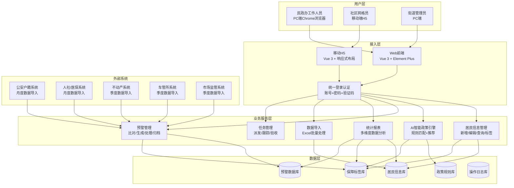

# 城运街道综合管理平台 PRD

| PRD 审核人 | [TODO: 街道办负责人/信息科主任] |
| --- | --- |
| 重要性 | 高 |
| 紧迫性 | 中 |
| 需求方 | 六角亭街道民政办 |
| PRD 编写人 | [TODO: 产品经理姓名] |
| PRD 提交日期 | 2026-08-04 |

## PRD 修改记录

| 变更时间 | 变更内容 | 变更提出部门与理由 | 修改人 | 审核人 | 版本号 |
| --- | --- | --- | --- | --- | --- |
| 2026-08-04 | 初始版本 | — | [TODO: 编写人] | [TODO: 审核人] | v1.0 |

---

## 1、项目背景

### 1.1 行业背景

街道民政工作承担着辖区内困难群众救助、特殊群体保障、社会福利发放等重要职能。随着"精准救助""智慧民政"政策的推进，传统的Excel表格管理、人工核对的工作模式面临以下痛点：

- **居民信息分散**：低保、特困、残疾、老龄等各类保障信息分散在不同业务系统中，信息孤岛严重
- **人工核对效率低**：每月需要人工比对公安（户籍）、人社（生存状态）、不动产（房产）、车管所（车辆）等多部门数据，耗时耗力且容易遗漏
- **政策匹配不精准**：居民对可享受政策不了解，工作人员凭经验推荐政策，存在错配、漏配情况
- **预警发现不及时**：保障对象资格条件变化（如收入超标、户口迁出）无法及时发现，造成资金错发风险

### 1.2 业务痛点

| 痛点 | 影响 | 严重程度 |
|------|------|---------|
| 多系统数据不打通 | 无法全景掌握居民保障情况 | 高 |
| 人工比对耗时易错 | 每月核对需3-5个工作日，误差率约15% | 高 |
| 政策到期无人提醒 | 部分补贴逾期未年审自动停发，引发居民投诉 | 中 |
| 一人多政策难管理 | 同一居民享受多项政策时，难以核查政策互斥关系 | 高 |
| 预警处理无留痕 | 预警核实处理过程缺乏记录，无法追溯审计 | 中 |

### 1.3 建设目标

建设一套面向街道民政办的综合管理平台，实现：**居民信息一体化、政策匹配智能化、风险预警自动化、业务处理流程化**。

---

## 2、需求基本情况

### 2.1 需求概述

本项目为六角亭街道民政办定制开发的综合管理平台，涵盖居民信息管理、保障标签管理、AI智能政策推荐、预警监测与处理、统计报表等核心功能，并配套移动端供网格员入户核查使用。

### 2.2 干系人

| 角色 | 部门/岗位 | 核心诉求 |
|------|----------|---------|
| 业务决策人 | 街道办主任 | 数据可视化、全局掌握、风险预警 |
| 业务执行人 | 民政办工作人员 | 居民管理便捷、政策匹配准确、预警处理高效 |
| 一线执行 | 社区网格员 | 移动端入户核查、信息采集、任务上报 |
| 系统管理员 | 信息科 | 账号权限、数据安全、系统运维 |
| 服务对象 | 辖区居民 | 政策知情权、办事便捷性 |

### 2.3 使用场景

| 场景 | 描述 | 使用频率 |
|------|------|---------|
| 日常居民管理 | 新增/修改居民信息、维护保障标签 | 每日多次 |
| 月度数据核对 | 导入外部数据、自动比对、生成预警 | 每月1次 |
| 预警处理 | 核实预警信息、记录处理结果、上传佐证 | 每日 |
| 政策匹配 | 输入居民信息，AI推荐可享受政策 | 按需 |
| 统计报表 | 查看各类数据统计、生成月度/季度报表 | 每月/每季度 |

---

## 3、商业分析

> 💡 方法论提示：本项目为政府内部自研系统，采用"社会效益+管理效益"双维度分析框架，而非传统ROI分析。

### 3.1 社会效益

| 效益点 | 说明 |
|--------|------|
| 精准救助 | 通过AI政策匹配，确保困难群众"应享尽享"，避免遗漏 |
| 资金安全 | 通过多维度数据比对预警，防止骗保、错保，节约财政资金 |
| 服务升级 | 政策到期提醒、到龄提醒，变"群众申请"为"主动服务" |
| 廉政风险防控 | 全流程留痕、可追溯，减少人为干预空间 |

### 3.2 管理效益

| 效益点 | 现状 | 预期 |
|--------|------|------|
| 数据核对效率 | 人工3-5工作日/月 | 自动比对，1小时内完成 |
| 信息完整度 | 多系统分散，约60% | 一体化平台，约95%+ |
| 预警响应时间 | 次月发现，滞后30天+ | 实时/次日发现 |
| 政策匹配准确率 | 人工约70% | AI推荐约90%+ |

---

## 4、项目收益目标

### 4.1 量化目标

| 目标 | 指标 | 基线（现状） | 目标值 | 达成周期 |
|------|------|-------------|--------|---------|
| 效率提升 | 月度数据核对耗时 | 3-5工作日 | < 1工作日 | 上线即达成 |
| 准确率 | 政策匹配准确率 | ~70% | ≥90% | 上线后3个月 |
| 时效性 | 预警发现时延 | 30天+ | ≤3天 | 上线即达成 |
| 覆盖率 | 居民信息完整度 | ~60% | ≥95% | 上线后6个月 |

### 4.2 定性目标

- 建立街道民政数据资产，打破信息孤岛
- 实现民政业务全流程数字化、可追溯
- 为"智慧民政"建设奠定数据基础和技术基础

---

## 5、项目方案概述

### 5.1 总体方案

本项目采用**B/S架构**，分为后台管理端（PC端）和移动应用端（H5/小程序）两部分。核心能力包括：

1. **一体化居民信息库**：整合居民基本信息、保障标签、操作记录
2. **AI智能政策引擎**：基于规则+机器学习的政策匹配模型
3. **多源数据比对预警**：对接户籍、生存、财产等外部数据，自动比对生成预警
4. **全流程业务处理**：预警发现→核实→处理→归档全链路闭环

### 5.2 技术方案（摘要）

| 层面 | 选型 |
|------|------|
| 前端框架 | Vue 3 + Vite |
| UI组件库 | Element Plus |
| 数据可视化 | ECharts |
| 路由管理 | Vue Router |
| 样式预处理 | SCSS |

### 5.3 数据集成方案

| 数据源 | 对接方式 | 数据内容 | 更新频率 |
|--------|---------|---------|---------|
| 公安户籍系统 | 离线导入/接口 | 户籍信息、户籍变动 | 月度 |
| 人社/医保系统 | 离线导入/接口 | 生存状态、社保缴纳 | 月度 |
| 不动产系统 | 离线导入/接口 | 房产登记信息 | 季度 |
| 车管所系统 | 离线导入/接口 | 车辆登记信息 | 季度 |
| 市场监管 | 离线导入/接口 | 工商注册信息 | 季度 |

---

## 6、项目范围

### 6.1 功能范围

| 模块 | 包含功能 | 是否本期 |
|------|---------|---------|
| 首页仪表盘 | 数据概览、预警分类统计、趋势图表 | ✅ 本期 |
| 居民信息管理 | 居民列表、居民详情、标签管理、历史居民 | ✅ 本期 |
| AI智能政策推荐 | 居民详情页AI推荐、一键添加标签 | ✅ 本期 |
| 数据导入 | Excel批量导入居民数据 | ✅ 本期 |
| 预警管理 | 预警列表（卡片/列表视图）、预警详情、核实处理 | ✅ 本期 |
| 预警规则配置 | 预警规则的配置与管理 | ✅ 本期 |
| 统计报表 | 多维度数据统计分析 | ✅ 本期 |
| 政策匹配 | AI智能匹配可享受政策 | ✅ 本期 |
| AI智能助手 | 政策问答、数据查询、操作指引 | ✅ 本期 |
| 移动端（网格员） | 居民信息、签到打卡、探访记录 | ✅ 本期 |
| 任务管理 | 任务派发、进度跟踪 | ❌ 下期 |
| 外部系统接口对接 | 与公安、人社等系统实时对接 | ❌ 下期 |
| 多级组织架构 | 区-街-社区三级权限管理 | ❌ 下期 |

### 6.2 用户范围

- 本期：六角亭街道民政办工作人员、社区网格员
- 下期：区民政局、其他街道

### 6.3 数据范围

- 本期：六角亭街道辖区内居民数据（约1-2万户）
- 历史数据：近3年保障信息

---

## 7、项目风险

| 风险类别 | 风险描述 | 影响 | 概率 | 应对措施 |
|---------|---------|------|------|---------|
| **数据风险** | 外部数据获取困难，无法按时完成对接 | 高 | 中 | 本期先采用离线导入方案，接口对接留待下期 |
| **数据风险** | 居民数据质量不高（缺字段、不准确） | 中 | 高 | 设计数据校验规则，支持人工补录修正 |
| **业务风险** | AI政策推荐准确率不达预期 | 中 | 中 | 先以规则引擎为主，机器学习模型逐步迭代优化 |
| **业务风险** | 工作人员习惯原有流程，系统使用率低 | 中 | 中 | 加强培训、简化操作、设置考核指标 |
| **技术风险** | 多浏览器兼容性问题 | 低 | 低 | 明确以Chrome为主，适配Edge，其他浏览器降级 |
| **进度风险** | 需求变更频繁导致延期 | 中 | 高 | 采用敏捷开发，小步快跑，重大变更走变更流程 |
| **安全风险** | 居民敏感信息泄露 | 极高 | 低 | 数据脱敏显示、操作日志留痕、权限严格控制 |

---

## 8、术语定义

| 术语 | 定义 |
|------|------|
| 保障标签 | 居民享受的各类保障政策标识，如低保、特困、残疾等 |
| 预警 | 系统通过数据比对发现的异常情况或风险提示 |
| 政策互斥 | 两项及以上政策不能同时享受的规则约束 |
| 到龄提醒 | 居民即将达到享受某政策的年龄时的提前提示 |
| 通铺比对 | 将所有比对指标（户籍、生存、收入、房产等）一次性全部铺开展示 |
| 一人多预警 | 同一居民存在多条预警信息的情况 |
| 网格员 | 社区负责入户走访、信息采集的一线工作人员 |

---

## 9、参考文献

| 序号 | 文档名称 | 说明 |
|------|---------|------|
| 1 | 《关于推进新时代民政事业高质量发展的意见》 | 政策依据 |
| 2 | 《社会救助暂行办法》 | 业务法规 |
| 3 | 《"十四五"民政事业发展规划》 | 规划依据 |
| 4 | [TODO: 补充街道办业务流程文档] | 业务现状 |
| 5 | [TODO: 补充数据标准规范] | 数据规范 |

---

## 10、功能需求

### 10.1 产品框架概述

#### 10.1.1 系统架构图

#### 10.1.5 功能清单

| 模块 | 子模块 | 功能点 | 优先级 | 本期 |
|------|--------|--------|--------|------|
| **登录** | 登录 | 账号密码登录+验证码 | P0 | ✅ |
| **首页仪表盘** | 数据概览 | 预警总数/待处理/已处理/今日预警统计卡 | P0 | ✅ |
| | 分类统计 | 财产/生存状态/户籍异动分类预警统计 | P1 | ✅ |
| | 趋势图表 | 预警趋势折线图、标签分布饼图 | P1 | ✅ |
| **居民信息管理** | 居民列表 | 分页展示、搜索筛选 | P0 | ✅ |
| | 居民详情 | 基本信息、保障标签、操作记录 | P0 | ✅ |
| | 标签管理 | 添加/移除标签、折叠/展开标签详情 | P0 | ✅ |
| | 历史居民 | 已迁出/注销居民查询 | P2 | ✅ |
| **AI智能推荐** | 政策推荐 | 根据居民信息推荐可享受政策，显示匹配度 | P1 | ✅ |
| | 一键添加 | 推荐结果一键添加为居民标签 | P1 | ✅ |
| **数据导入** | Excel导入 | 批量导入居民数据 | P1 | ✅ |
| **预警管理** | 预警列表 | 卡片视图：一人一卡，政策标签+通铺比对 | P0 | ✅ |
| | | 列表视图：一人一行，紧凑展示 | P0 | ✅ |
| | | 多维筛选：预警数量/类型/状态 | P1 | ✅ |
| | 预警详情 | 以标签为核心组织，标签下展示关联预警 | P0 | ✅ |
| | 核实处理 | 填写备注、上传佐证图片、记录处理人 | P0 | ✅ |
| | 批量处理 | 同一居民多条预警批量处理 | P1 | ✅ |
| **规则配置** | 规则管理 | 预警规则的增删改查、启用/禁用 | P1 | ✅ |
| **统计报表** | 多维统计 | 按社区/标签/预警类型/时间维度统计 | P1 | ✅ |
| **AI助手** | 智能问答 | 政策问答、数据查询、操作指引 | P2 | ✅ |
| **移动端** | 网格员端 | 居民信息、签到打卡、探访记录 | P1 | ✅ |

---

### 10.2 产品需求详解

#### 10.2.1 登录模块

| 元素 | 类型 | 规则 |
|------|------|------|
| 账号 | 输入框 | 必填，支持回车提交 |
| 密码 | 输入框 | 必填，密文显示，支持回车提交 |
| 验证码 | 输入框+图片 | 必填，点击图片可刷新 |
| 登录按钮 | 按钮 | 校验通过后跳转首页仪表盘 |
| 记住密码 | 复选框 | 可选，默认不勾选 |

**业务规则：**
- 密码连续错误5次锁定账号15分钟
- 登录成功后记录登录日志（IP、时间、浏览器）
- Session超时30分钟需重新登录
- 默认测试账号：admin / admin

---

#### 10.2.2 预警管理模块（核心）

##### 10.2.2.1 预警列表 - 卡片视图

**页面布局：**
- 统计卡片：预警总数、待处理、已处理、今日预警
- 预警分类统计：财产预警、生存状态预警、户籍异动预警
- 筛选条件：预警数量、预警类型、处理状态
- 居民卡片（一人一卡）：
  - 顶部：姓名+预警数徽章、社区网格
  - 享受政策：所有标签，最多显示4个，超出+N
  - 比对结果：通铺展示（户籍、生存、收入、房产、车辆、存款、工商、服刑、政策互斥），绿点正常、红点异常
  - 预警明细：每条预警展示，支持处理、详情
  - 批量处理：同一居民多条待处理预警

**业务规则：**
- 排序：按待处理预警数量降序，相同按最新预警时间降序
- 一人多预警标识：预警数>1时左侧红色竖条，姓名旁预警数徽章
- 比对结果颜色：●绿色=正常，●红色=异常（带光晕动效）

##### 10.2.2.2 预警列表 - 列表视图

**表格列：** 序号、居民信息、享受政策、比对结果、预警数、操作

**业务规则：**
- 比对结果鼠标悬停显示具体数值和异常原因
- 有异常的行左侧显示红色竖条标识
- 预警数徽章按等级配色：≥3红色，=2橙色，=1黄色

##### 10.2.2.3 预警详情弹窗（以标签为核心）

**页面布局：**
- 居民信息卡（顶部）：头像、姓名、身份证号、社区网格、预警统计
- 标签区块（多个）：
  - 标签头部：类型、子类型、享受状态、预警数量统计
  - 标签元信息：补贴金额、有效期、生效日期
  - 该标签下的预警列表：状态圆点、类型标签、内容、比对来源
  - 每条预警右侧："核实处理"和"详情"按钮
- 无预警的标签：显示绿色对勾"该标签暂无预警信息"

**业务规则：**
- 标签排序：有待处理预警的标签排最前，其次按标签类型排序
- 有待处理预警的标签：浅红背景+红色渐变头部，突出显示
- 核实处理按钮：直接打开处理弹窗，处理该标签下的具体预警

##### 10.2.2.4 预警核实处理弹窗

**字段：**
- 预警类型（只读）
- 预警内容（只读）
- 处理方式（单选）：核实无误、有误需停发
- 处理备注（必填，≥10字）
- 佐证图片（可选，≤9张，单张≤5MB）

**业务规则：**
- 提交后状态变为"已处理"，记录处理人、处理时间、操作日志
- 需审批的预警：状态变为"审批中"，通知管理员审批

---

#### 10.2.3 居民信息管理模块

##### 居民详情页

**三区域布局：**
1. 基本信息：姓名、性别、出生日期、身份证号等
2. 保障信息：所有标签列表，支持折叠/展开
   - 点击标签展开详情
   - 有预警的标签显示"核实处理"按钮
   - 收起时页面间距更紧凑
3. 操作记录：时间、操作人、操作类型、操作内容

**AI智能推荐：**
- 基于居民年龄、性别、健康状况等分析
- 推荐可享受政策及匹配度（≥90%高度推荐）
- 支持一键添加为居民标签

---

### 10.3 异常情况处理方案

| 异常场景 | 触发条件 | 处理方案 |
|---------|---------|---------|
| **外部数据导入失败** | 文件格式错误、字段不匹配、数据量过大 | 友好提示具体错误行及原因；提供错误文件下载；建议分批导入（≤500条） |
| **预警关联错误** | 预警与标签关联不准确（漏关联/错关联） | 支持人工手动调整关联；关联算法持续迭代优化；记录人工调整数据用于模型训练 |
| **AI推荐不准确** | 推荐政策不符合实际情况 | 提供"不推荐"反馈入口；可调整规则引擎参数；积累反馈数据用于模型优化 |
| **系统性能问题** | 大数据量查询慢、页面卡顿 | 分页加载（默认10条/页）；关键字段加索引；前端虚拟滚动优化 |
| **数据安全异常** | 敏感数据泄露、越权访问 | 身份证号脱敏显示（仅显示前6后4）；操作日志全记录；权限严格控制 |

---

## 11、数据埋点与非功能性需求

### 11.1 数据埋点

#### 11.1.2 核心埋点清单

| 埋点类型 | 事件名称 | 触发时机 | 采集参数 |
|---------|---------|---------|---------|
| **页面访问** | `page_view` | 页面加载完成 | 页面ID、停留时长、用户ID、角色 |
| **登录** | `login` | 登录成功/失败 | 账号、IP、浏览器、是否成功、失败原因 |
| **居民操作** | `resident_create` | 新增居民 | 操作人、居民ID、字段信息 |
| | `resident_edit` | 编辑居民 | 操作人、居民ID、修改字段、前后值 |
| | `resident_view` | 查看居民详情 | 操作人、居民ID、查看来源 |
| **标签操作** | `tag_add` | 添加标签 | 操作人、居民ID、标签类型、标签名称 |
| | `tag_remove` | 移除标签 | 操作人、居民ID、标签类型、移除原因 |
| **预警操作** | `warning_view` | 查看预警详情 | 操作人、预警ID、预警类型 |
| | `warning_resolve` | 处理预警 | 操作人、预警ID、处理方式、处理备注 |
| | `warning_batch_resolve` | 批量处理预警 | 操作人、预警ID列表、处理数量 |
| **AI功能** | `ai_recommend_view` | 查看AI推荐 | 操作人、居民ID、推荐结果数量 |
| | `ai_recommend_accept` | 采纳AI推荐 | 操作人、居民ID、采纳标签ID |
| **数据导入** | `data_import` | Excel数据导入 | 操作人、文件名、导入总数、成功数、失败数 |

### 11.2 性能需求

| 指标 | 要求 | 说明 |
|------|------|------|
| **页面首屏加载** | ≤ 3秒 | 常规网络环境下 |
| **列表查询响应** | ≤ 1秒 | 1万条数据内分页查询 |
| **预警比对** | ≤ 30分钟 | 全量居民月度数据比对 |
| **并发用户** | ≥ 50 | 同时在线用户数 |
| **接口可用性** | ≥ 99.5% | 月度可用率 |

### 11.3 兼容性需求

| 类别 | 要求 |
|------|------|
| **PC浏览器** | Chrome 90+（推荐）、Edge 90+、Firefox 88+ |
| **移动端浏览器** | iOS Safari 13+、Android Chrome 80+、微信内置浏览器 |
| **分辨率** | 最小支持 1366×768，推荐 1920×1080 及以上 |

### 11.4 安全需求

| 类别 | 要求 |
|------|------|
| **身份认证** | 账号密码+图形验证码，密码错误5次锁定15分钟 |
| **密码强度** | ≥8位，包含字母+数字，90天强制修改 |
| **数据传输** | 生产环境启用HTTPS加密传输 |
| **数据脱敏** | 身份证号仅显示前6后4位，手机号仅显示前3后4位 |
| **权限控制** | 基于角色的访问控制（RBAC），越权操作自动拦截 |
| **操作日志** | 所有增删改操作记录操作人、时间、IP、操作内容 |
| **会话超时** | 30分钟无操作自动退出登录 |

---

## 12、角色和权限

### 12.1 角色定义

| 角色编号 | 角色名称 | 所属部门 | 核心职责 |
|---------|---------|---------|---------|
| R01 | 超级管理员 | 信息科 | 系统配置、账号管理、全功能权限 |
| R02 | 街道管理员 | 街道民政办 | 全局数据查看、预警审批、统计报表 |
| R03 | 民政办工作人员 | 街道民政办 | 居民信息管理、预警处理、数据导入 |
| R04 | 社区网格员 | 各社区 | 本社区居民查看、入户核查、信息采集 |
| R05 | 只读用户 | 领导/其他部门 | 仅查看统计报表和预警概览 |

### 12.2 权限矩阵

| 功能模块 | 超级管理员R01 | 街道管理员R02 | 民政办R03 | 网格员R04 | 只读R05 |
|---------|:---:|:---:|:---:|:---:|:---:|
| 首页仪表盘 | ✅ | ✅ | ✅ | ✅仅本社区 | ✅仅概览 |
| 居民列表查看 | ✅ | ✅ | ✅ | ✅仅本社区 | ❌ |
| 居民新增/编辑 | ✅ | ✅ | ✅ | ❌ | ❌ |
| 居民详情查看 | ✅ | ✅ | ✅ | ✅仅本社区 | ❌ |
| 标签添加/移除 | ✅ | ✅ | ✅ | ❌ | ❌ |
| AI政策推荐 | ✅ | ✅ | ✅ | ✅ | ❌ |
| 数据导入 | ✅ | ✅ | ✅ | ❌ | ❌ |
| 预警列表查看 | ✅ | ✅ | ✅ | ✅仅本社区 | ❌ |
| 预警核实处理 | ✅ | ✅ | ✅ | ❌ | ❌ |
| 预警审批 | ✅ | ✅ | ❌ | ❌ | ❌ |
| 规则配置 | ✅ | ✅ | ❌ | ❌ | ❌ |
| 统计报表 | ✅ | ✅ | ✅ | ✅仅本社区 | ✅ |
| 账号管理 | ✅ | ❌ | ❌ | ❌ | ❌ |

---

## 13、运营计划

### 13.1 上线计划

| 阶段 | 时间 | 内容 |
|------|------|------|
| **系统测试** | 上线前2周 | 功能测试、性能测试、安全测试 |
| **数据迁移** | 上线前1周 | 历史居民数据清洗、导入、校验 |
| **用户培训** | 上线前3天 | 分角色培训 |
| **试运营** | 第1-2周 | 各社区选2-3人试用，收集反馈 |
| **正式上线** | 第3周 | 全街道推广使用，驻场支持1周 |

### 13.2 培训计划

| 培训对象 | 培训内容 | 培训时长 |
|---------|---------|---------|
| 系统管理员 | 账号管理、系统配置、日志查看、问题排查 | 4小时 |
| 民政办工作人员 | 居民管理、标签维护、预警处理、数据导入、统计报表 | 3小时 |
| 社区网格员 | 移动端使用、居民信息查看、入户核查上报 | 2小时 |

---

## 14、待决事项

| 编号 | 事项 | 优先级 | 待确认方 |
|------|------|:---:|---------|
| D01 | 外部数据对接方案（实时接口还是离线导入） | 高 | 街道办+信息科 |
| D02 | 预警审批流程：哪些预警需要上级审批 | 高 | 民政办 |
| D03 | 是否需要区分多个街道/社区的数据权限 | 高 | 街道办 |
| D04 | AI政策推荐的具体规则清单 | 中 | 民政办 |
| D05 | 移动端方案：H5还是小程序 | 中 | 信息科 |
| D06 | 数据安全等级：是否需要等保三级认证 | 中 | 信息科 |
| D08 | 与现有业务系统的关系定位 | 高 | 民政办+信息科 |
